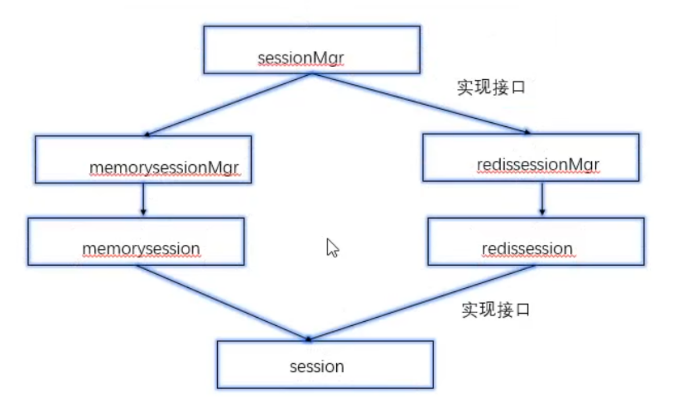

# Session 中间件开发

> 设计一个通用的 Session 服务，支持内存存储和 redis 存储

## session 模块设计

> 本质上 k-v 系统，通过key 进行增删改查

> session 可以存储在内存或者redis(2个版本)

### Session接口设计

- [x] Set()

- [x] Get()

- [x] De1()

- [x] Save():session存储，redis 的实现延迟加载

### SessionMgr接口设计

- [x] Init():初始化，加载redis 地址

- [x] CreateSeesion():创建一个新的session

- [x] GetSession():通过 sessionId获取对应的 session 对象

### MemorySeesion设计

- [x] 定义MemorySeesion对象(字段:sessionld、存kv的map，读写锁)

- [x] 构造函数，为了获取对象

- [x] Set()

- [x] Get()

- [x] Del()

- [x] Save()

### MemorySeesionMgr设计

- [ ] 定义 MemorySeesionMyr对象(字段:存放所有 session的 map，读写锁)

- [ ] 构造函数

- [ ] Init()

- [ ] CreateSeesion()

- [ ] GetSession()

### RedisSession设计

- [ ] 定义 RedisSeesion对象(字段:sessionld，存kv的map，读写锁，redis 连接池，记录内存中 map是否被修改的标记)

- [ ] 构造函数

- [ ] Set():将 session 存到内存中的 map

- [ ] Get():职数据，实现延迟加载

- [ ] De1()

- [ ] Save():将session存到redis

### RedisSessionMgr设计

- [ ] 定义 RedisSessionMgr对象(字段:redis 地址、redis 密码、连接池、读写锁大map)

- [ ] 构造函数

- [ ] InitO

- [ ] CreateSeesion

- [ ] GetSession