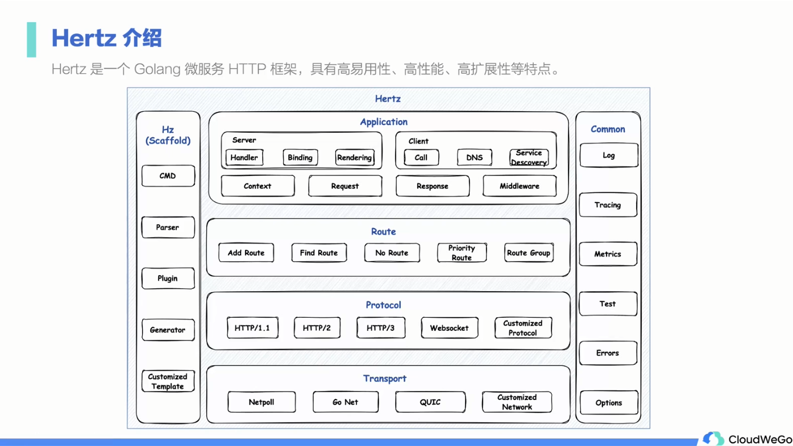
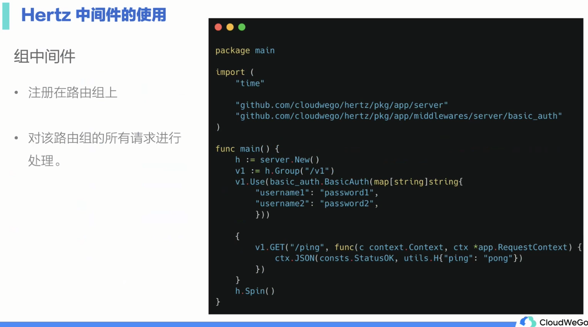
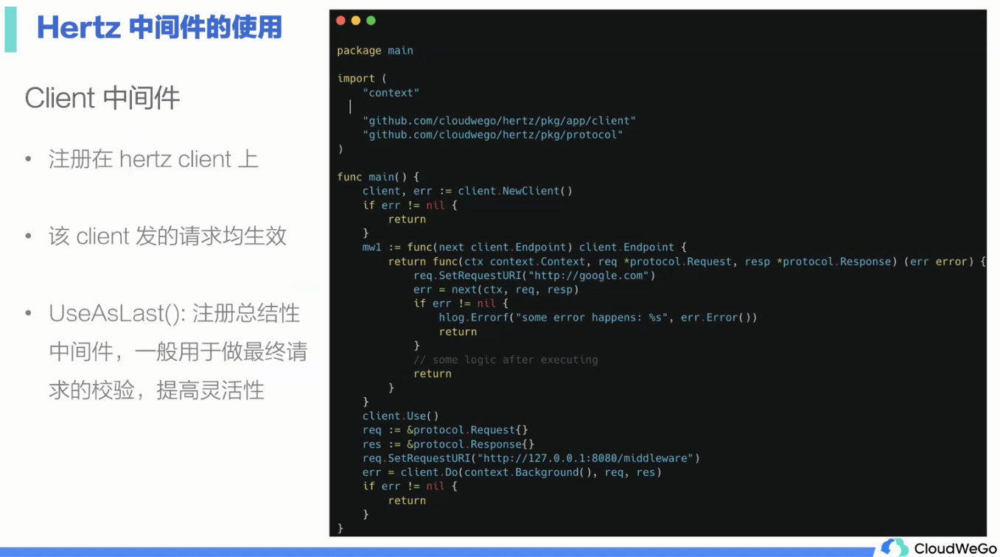
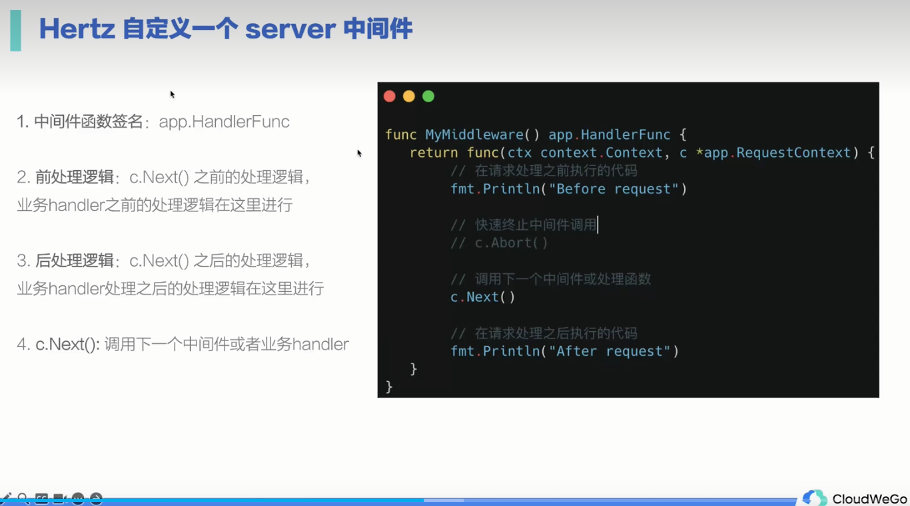
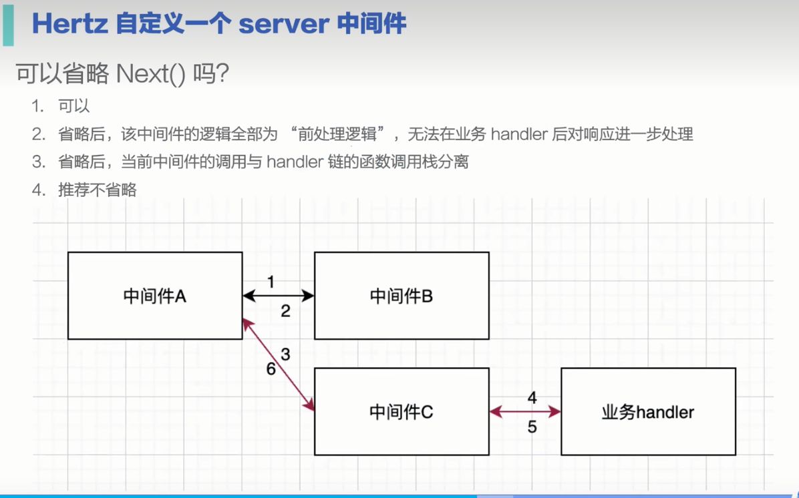
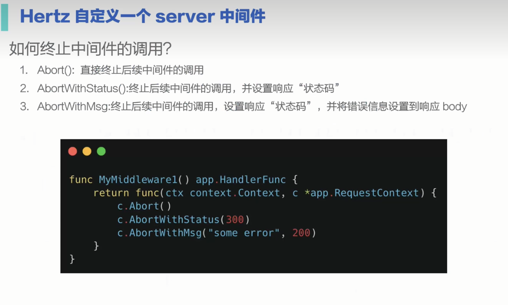

# Hertz

## 介绍



## 中间件






## Hertz拓展中间件








# BUG

## consul注册问题


在配置文件中的address不可写为127.0.0.1,否则会出现注册失败(使用docker运行consul)
注意：kitex中的端口号，在同一主机下的多个服务的端口号不能相同
```yaml
kitex:
  service: "demo_proto"
  address: "192.168.0.104:8080"
```

## 注意类型断言的使用.(类型)

如果类型断言出错,程序会停止

## 依赖问题

### go.mod中replace的使用

**注意require中有时候会有残留的不需要的依赖,手动清除即可**

```go.mod
module github.com/CloudWeGo/gomall/app/cart

go 1.23.2

replace (
	github.com/CloudWeGo/gomall/common => ../../common
	github.com/CloudWeGo/gomall/rpc_gen => ../../rpc_gen
	github.com/apache/thrift => github.com/apache/thrift v0.13.0
)

require (
	github.com/CloudWeGo/gomall/common v0.0.0-00010101000000-000000000000
	github.com/CloudWeGo/gomall/rpc_gen v0.0.0-00010101000000-000000000000
    ...
)
```
