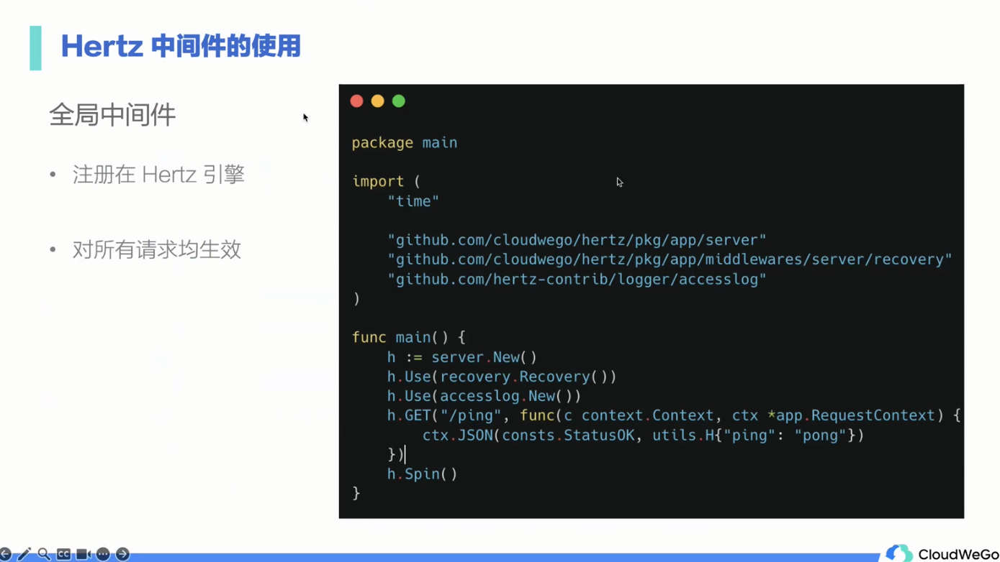

# Hertz

## 介绍


## 中间件




## Hertz拓展中间件


# BUG

## consul注册问题


在配置文件中的address不可写为127.0.0.1,否则会出现注册失败(使用docker运行consul)
```yaml
kitex:
  service: "demo_proto"
  address: "192.168.0.104:8080"
```

## 注意类型断言的使用.(类型)

如果类型断言出错,程序会停止