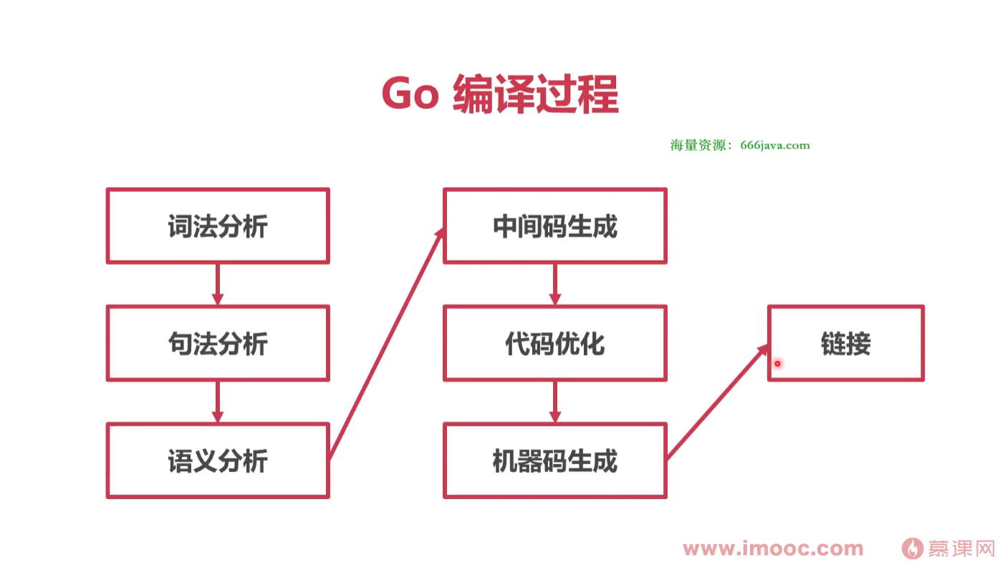
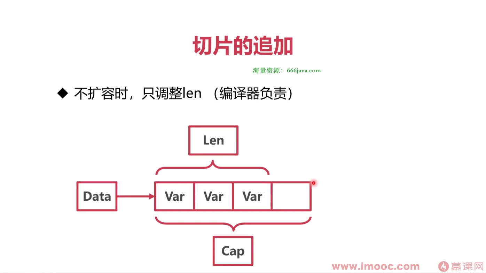
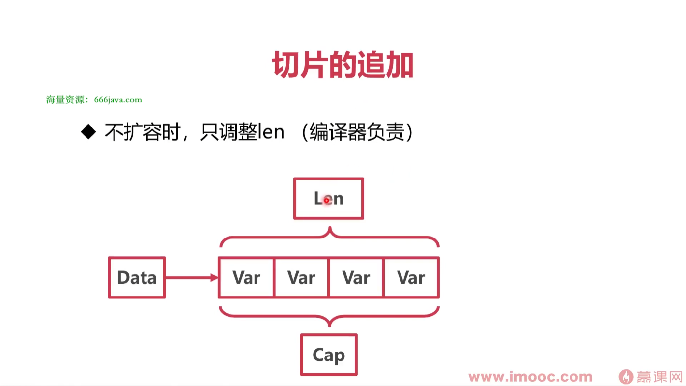
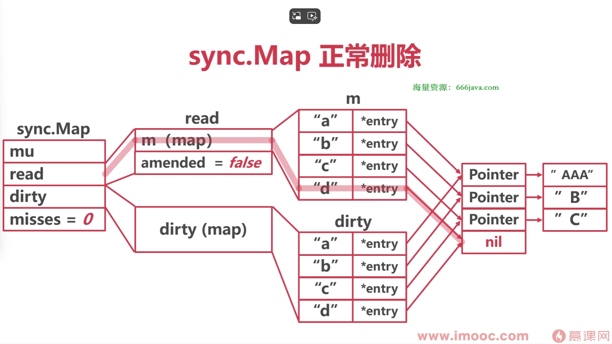
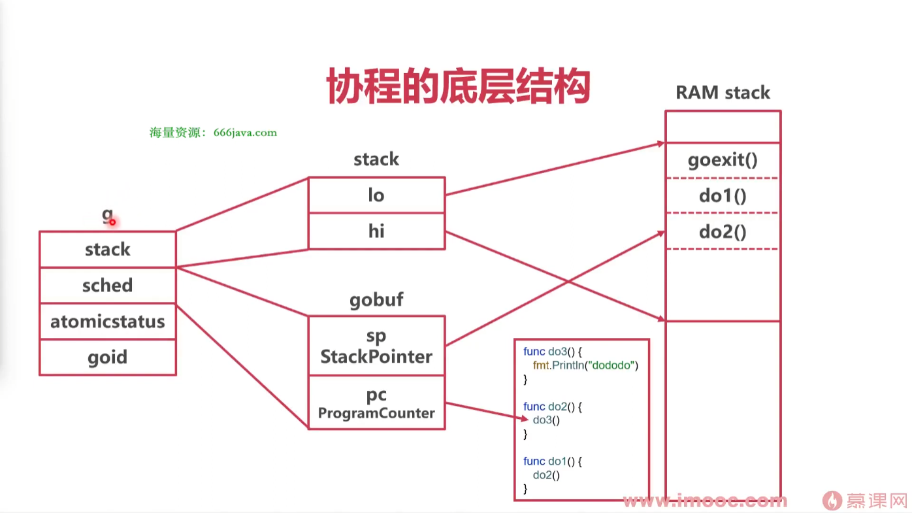

# go语言的特点


汇编代码:`go build -gcflags -S main.go`

# Runtime

## Runtime是什么呢? 

Runtime就是程序的运行环境,作为程序的一部分打包进二进制产物,随用户程序一起运行,与用户程序没有明显界限，直接通过函数调用

## Runtime 的能力

- 内存管理能力
- 垃圾回收能力(GC)
- 超强的并发能力(协程调度)

## Runtime 其他特点

- Runtime 有一定的屏蔽系统调用能力
- 一些 go 的关键字其实是 Runtime 下的函数

# Go程序是如何编译的?

**查看编译指令:**`go build -n`



## 词法分析

- 将源代码翻译成 Token
- Token 是代码中的最小语义结构

## 句法分析

- Token序列经过处理，变成语法树

## 语义分析

- 类型检查
- 类型推断
- 查看类型是否匹配
- 函数调用内联
- 逃逸分析

## 中间码生成(SSA)

- 为了处理不同平台的差异，先生成中间代码(SSA)
- 查看从代码到SSA中间码的整个过程
.png)

## 机器码生成

- 先生成Plan9汇编代码
- 最后编译为机器码
- 输出的机器码为.a文件
- 查看 Plan9 汇编代码


## 链接

- 将各个包进行链接，包括runtime

## 总结


# Go 程序是如何运行的?

## go程序的入口

-  runtime/rt0 XXX.s

## 读取命令行参数

- 复制参数数量 argc 和参数值 argv 到栈上

## 初始化 g0 执行栈

- g0 是为了调度协程而产生的协程
- g0 是每个 Go 程序的第一个协程

## 运行时检测

- 检查各种类型的长度
- 检查指针操作
- 检查结构体字段的偏移量
- 检査 atomic 原子操作
- 检查 CAS 操作
- 检查栈大小是否是 2 的幂次

## 参数初始化 runtime.args

- 对命令行中的参数进行处理
- 参数数量赋值给 argc int32
- 参数值复制给 argv **byte

## 调度器初始化 runtime.schedinit

- 全局栈空间内存分配
- 加载命令行参数到 os.Args
- 堆内存空间的初始化
- 加载操作系统环境变量
- 初始化当前系统线程
- 垃圾回收器的参数初始化
- 算法初始化(map、hash)
- 设置 process 数量

## 创建主协程

- 创建一个新的协程，执行runtime.main
- 放入调度器等待调度

## 初始化 M

- 初始化一个 M，用来调度主协程

## 主协程执行主函数

- 执行 runtime 包中的 init 方法
- 启动 GC 垃圾收集器
- 执行用户包依赖的 init 方法
- 执行用户主函数 main.main()

## 总结

- Go 启动时经历了检查、各种初始化、初始化协程调度的过程
- main.main()也是在协程中运行的

# Go语言是面向对象的吗?

## "Yes and No"

- Go允许OO的编程风格
- Go的Struct可以看作其他语言的Class
- Go缺乏其他语言的继承结构
- Go的接口与其他语言有很大差异

## Go 的“类”

- 其他语言中，往往用class表示一类数据
- class的每个实例称作“对象
- Go中用struct表示一类数据
- struct每个实例并不是“对象”，而是此类型的“值
- struct也可以定义方法

## Go的继承

- Go并没有继承关系
- 所谓Go的继承只是组合
- 组合中的匿名字段，通过语法糖达成了类似继承的效果

## Go的接口

- 接口可以定义Go中的一组行为相似的struct
- struct并不显式实现接口，而是隐式实现

## 总结

- Go没有对象、没有类、没有继承
- Go通过组合匿名字段来达到类似继承的效果
- 通过以上手段去掉了面向对象中复杂而冗余的部分
- 保留了基本的面向对象特性

# 企业级 Go 项目包管理方法

## Go Modules

- 本质上，一个 Go 包就是一个项目的源码
- gomod 的作用:将 Go 包和 Git 项目关联起来
- Go 包的版本就是 git 项目的 Tag
- gomod 就是解决 "需要哪个 git 项目的什么版本"

## 使用 Modules

go get github.com/delve/delve

## Github 无法访问怎么办

- 使用goproxy.cn作为代理:`go env -w GOPROXY=https://goproxy.cn,direct`

## 想用本地文件替代怎么办

- go.mod 文件追加:`replace github.com/Jeffail/tunny => xxx/xxx`
- go vender 缓存到本地
`go mod vendor //不是之前的 go vendor`
`go build -mod vendor`

## 创建 Go Module

- 删除本地go.mod
go mod init github.com/imooc/moody
- 推送至代码仓库
- 增加新版本时，在仓库打新 Tag

## 总结

- Go Modules 将每个包视为一个git项目
- gomod 就是解决“需要哪个 git 项目的什么版本
- 无法连接远程仓库时，使用重定向或者mod vender方案

# 高并发下的数据结构

- Go常见类型的底层原理
- 字符串、切片、map
- 接口、结构体

## 什么变量的大小是0字节

### 基本类型的字节数

- int 大小跟随系统字长
- 指针的大小也是系统字长

### 空结构体

- 空结构体的地址均相同(不被包含在其他结构体中时)
- 空结构体主要是为了节约内存
  - 结合map
  - 结合channel

### 总结

- Go中部分数据的长度与系统字长有关
- 空结构体不占用空间
- 空结构体与map结合可以实现hashset
- 空结构体与channel结合可以当作纯信号

## 数组，字符串，切片底层是一样的吗?

### 字符串

#### 字符串

```go
type stringStruct struct {
    str unsafe.Pointer
    len int
}
```
- 字符串本质是个结构体
- Data指针指向底层Byte数组
- Len表示Byte数组的长度?字符个数?答案:Len表示Byte数组的长度(字节数),UTF-8


#### 字符编码问题

- 所有的字符均使用Unicode字符集
- 使用UTF-8编码

#### Unicode

- 一种统一的字符集
- 囊括了159种文字的144679个字符
- 14万个字符至少需要3个字节表示
- 英文字母均排在前128个

#### UTF-8

- Unicode的一种变长格式
- 128个US-ASCII字符只需一个字节编码
- 西方常用字符需要两个字节
- 其他字符需要3个字节，极少需要4个字节

#### 字符串的访问

- 对字符串使用len方法得到的是字节数不是字符数
- 对字符串直接使用下标访问，得到的是字节
- 字符串被range遍历时，被解码成rune类型的字符
- UTF-8 编码解码算法位于 runtime/utf8.go

#### 字符串的切分

- 需要切分时:`s = string([]rune(s)[:3])`
  - 转为rune数组
  - 切片
  - 转为 string

### 切片

#### 切片的本质是对数组的引用

```go
type slice struct {
    array unsafe.Pointer
    len int
    cap int
}
```


#### 切片的创建

- 根据数组创建:`arr[0:3] or slice[0:3]`
- 字面量:编译时插入创建数组的代码:`slice := []int{1, 2, 3}`
- make: 运行时创建数组:`slice := make([]int, 10)`


#### 切片的访问

- 下标直接访问元素
- range 遍历元素
- len(slice)查看切片长度
- cap(slice)查看数组容量

#### 切片的追加


- 不扩容时，只调整len(编译器负责)

- 扩容时，编译时转为调用 runtime.growslice()

- 如果期望容量大于当前容量的两倍就会使用期望容量
 - 如果当前切片的长度小于 1024，将容量翻倍
- 如果当前切片的长度大于 1024，每次增加 25%
- 切片扩容时，并发不安全，注意切片并发要加锁

### 总结

- 字符串与切片都是对底层数组的引用
- 字符串有UTF-8变长编码的特点
- 切片的容量和长度不同
- 切片追加时可能需要重建底层数组


# map:重写 Redis 能用它吗?

## HashMap 的基本方案

- 开放寻址法
- 拉链法

### HashMap 的基本方案:开放寻址法


### HashMap 的基本方案:拉链法


## Go 的 map


### map 的初始化

#### make


#### 字面量


### map 的访问


### 总结

- Go 语言使用拉链实现了 hashmap
- 每一个桶中存储键哈希的前 8位
- 桶超出 8个数据，就会存储到溢出桶中

## map扩容

### map的扩容

- map 溢出桶太多时会导致严重的性能下降
- runtime.mapassign()可能会触发扩容的情况
  - 装载因子超过 6.5(平均每个槽6.5个key)
  - 使用了太多溢出桶(溢出桶超过了普通桶)

### map的扩容的类型

- 等量扩容:数据不多但是溢出桶太多了(整理)
- 翻倍扩容:数据太多了

### map扩容步骤

#### map扩容:步骤1

- 创建一组新桶
- oldbuckets 指向原有的桶数组
- buckets 指向新的桶数组
- map标记为扩容状态


#### map扩容:步骤2

- 将所有的数据从旧桶驱逐到新桶
- 采用渐进式驱逐
- 每次操作一个旧桶时，将旧桶数据驱逐到新桶
- 读取时不进行驱逐，只判断读取新桶还是日桶


#### map扩容:步骤3

- 所有的日桶驱逐完成后
- oldbuckets回收


### 总结

- 装载系数或者溢出桶的增加，会触发map扩容
- “扩容”可能并不是增加桶数，而是整理
- map扩容采用渐进式，桶被操作时才会重新分配

## 怎么解决map的并发问题?

### map 的并发问题

- map的读写有并发问题
- A 协程在桶中读数据时，B协程驱逐了这个桶
- A 协程会读到错误的数据或者找不到数据


### map 并发问题解决方案

- 给map加锁(mutex)
- 使用 sync.Map

### sync.Map

#### sync.Map 正常读写


#### sync.Map追加


##### sync.Map追加后读写


#### sync.Map—dirty提升


#### sync.Map—dirty提升后追加


#### sync.Map 删除

- 相比于查询、修改、新增，删除更麻烦
- 删除可以分为正常删除和追加后删除
- 提升后，被删 key 还需特殊处理




## 总结

- map 在扩容时会有并发问题
- sync.Map 使用了两个map，分离了扩容问题
- 不会引发扩容的操作(查、改)使用 read map
- 可能引发扩容的操作(新增)使用 dirty map

# 接口:隐式更好还是显式更好

## Go隐式接口特点

- 只要实现了接口的全部方法，就是自动实现接口
- 可以在不修改代码的情况下抽象出新的接口

## 接口值的底层表示

- 接口数据使用 runtime.iface 表示
- iface记录了数据的地址
- iface 中也记录了接口类型信息和实现的方法

## 类型断言

- 类型断言是一个使用在接口值上的操作
- 可以将接口值转换为其他类型值(实现或者兼容接口)
- 可以配合 switch 进行类型判断

## 结构体和指针实现接口

| 类型                 | 结构体实现接口 | 结构体初始化变量 |
| -------------------- | -------------- | ---------------- |
| 结构体指针初始化变量 | 通过           | 不通过           |
| 结构体指针实现接口   | 通过           | 通过             |

## 空接口值

- runtime.eface 结构体
- 空接口底层不是普通接口
- 空接口值可以承载任何数据

## 空接口的用途

- 空接口的最大用途是作为任意类型的函数入参
- 函数调用时，会新生成一个空接口，再传参

## 总结

- Go的隐式接口更加方便系统的扩展和重构
- 结构体和指针都可以实现接口
- 空接口值可以承载任何类型的数据

# nil，空接口，空结构体有什么区别

## nil

- nil 是空，并不一定是“空指针”
- nil 是6种类型的“零值”(Type must be a pointer,channel, func, interface, map, or slice type)
- 每种类型的nil是不同的，无法比较

## 空结构体

- 空结构体是Go中非常特殊的类型
- 空结构体的值不是nil
- 空结构体的指针也不是nil，但是都相同(zerobase)

## 空接口

- 空接口不一定是“nil接口”
- 两个属性都nil才是nil接口

## 总结

- nil是多个类型的零值，或者空值
- 空结构体的指针和值都不是nil
- 空接口零值是nil，一旦有了类型信息就不是nil

# 内存对齐是如何优化程序效率的?

## 非内存对齐:内存的原子性与效率受到影响

 

## 内存对齐:提高内存操作效率，有利于内存原子性


## 对齐系数

- 为了方便内存对齐，Go提供给了对齐系数`unsafe.Alignof()`
- 对齐系数的含义是:变量的内存地址必须被对齐系数整除
- 如果对齐系数为4，表示变量内存地址必须是4的倍数

## 基本类型对齐


## 结构体对齐

- 结构体对齐分为内部对齐和结构体之间对齐
- 内部对齐:考虑成员大小和成员的对齐系数
- 结构体长度填充:考虑自身对齐系数和系统字长

### 结构体内部对齐

- 指的是结构体内部成员的相对位置(偏移量)
- 每个成员的偏移量是自身大小与其对齐系数较小值的倍数


### 结构体长度填充

- 指的是结构体通过增加长度，对齐系统字长
- 结构体长度是最大成员长度与系统字长较小的整数倍


### 节约结构体空间

- 可以尝试通过调整成员顺序，节约空间


### 结构体对齐系数

- 为什么string的对齐系数是8?
- 刚才的Demo结构体，对齐系数是多少?
- 结构体的对齐系数是其成员的最大对齐系数

### 空结构体的对齐

- 空结构体单独出现时，地址为 zerobase
- 空结构体出现在结构体末尾时，需要补齐字长


### 总结

- 提高内存操作效率，变量之间需要内存对齐
- 基本类型考虑对齐系数
- 结构体既需要内部对齐，又需要外部填充对齐
- 空结构体作为最后一个成员，需要填充对齐

# 高并发的核心工具:协程

## 为什么要有协程，线程不好用吗?

### 进程

- 操作系统“程序”的最小单位
- 进程用来占用内存空间
- 进程相当于厂房，占用工厂空间

### 线程

- 每个进程可以有多个线程
- 线程使用系统分配给进程的内存，线程之间共享内存
- 线程用来占用CPU时间
- 线程的调度需要由系统进行，开销较大
- 线程相当于工厂的生产线，占用工人的工时
- 线程里跑的程序就是生产流程

### 线程的问题

- 线程本身占用资源大
- 线程的操作开销大
- 线程切换开销大

### 协程

- 协程就是将一段程序的运行状态打包，可以在线程之间调度
- 将生产流程打包，使得流程不固定在生产线上
- 协程并不取代线程，协程也要在线程上运行
- 线程是协程的资源，协程使用线程这个资源

### 协程的优势

- 资源利用
- 快速调度
- 超高并发

### 总结

- 进程用分配内存空间
- 线程用来分配CPU时间
- 协程用来精细利用线程
- 协程的本质是一段包含了运行状态的程序

## 协程的本质是什么?

### 协程的底层结构



- runtime 中，协程的本质是一个 g 结构体
- stack:堆栈地址
- gobuf:目前程序运行现场
- atomicstatus:协程状态 

### 线程的抽象

-  runtime 中将操作系统线程抽象为 m 结构体
-  90:g0协程，操作调度器
-  curg:currentg，目前线程运行的g
-  mOS:操作系统线程信息

## 协程是如何执行的：线程循环

- 操作系统并不知道Goroutine的存在
- 操作系统线程执行一个调度循环，顺序执行Goroutine
- 调度循环非常像线程池

### 单线程循环


### 多线程循环


### 问题

- 协程顺序执行，无法并发
- 多线程并发时，会抢夺协程队列的全局锁

### 总结

- 协程的本质是一个 g 结构体
- g 结构体记录了协程栈、PC信息
- 最简情况下，线程执行标准调度循环，执行协程

## 为什么要有GMP调度模型

### 本地队列


### P结构体


### G-M-P 模型


### P的作用

- M与G之间的中介(送料器)
- P持有一些G，使得每次获取G的时候不用从全局找
- 大大减少了并发冲突的情况

### 任务窃取,窃取式工作分配机制

- 如果在本地或者全局队列中都找不到G
- 去别的P中"偷"
- 增强了线程的利用率

### 新建协程

- 随机寻找一个
- 将新协程放入P的 runnext(插队)
- 若P本地队列满，放入全局队列

## 如何实现协程并发

### 协程饥饿问题


### 全局队列饥饿问题


### 切换时机

#### 主动挂起(runtime.gopark)


#### 系统调用完成时


### 总结

- 如果协程顺序执行，会有饥饿问题
- 协程执行中间，将协程挂起，执行其他协程
- 完成系统调用时挂起，也可以主动挂起
- 防止全局队列饥饿，本地队列随机抽取全局队列

## 抢占式调度解决了什么问题

### 问题

- 永远都不主动挂起
- 永远都不系统调用

### 思路

- 有没有一个地方，经常会被调用?
- runtime.morestack()

### runtime.morestack()

- morestack的本意是检查协程栈是否有足够空间
- 调用方法时，会被编译器插入morestack()

### 标记抢占

- 系统监控到 Goroutine 运行超过 10ms
- 将 g.stackguard0 置为 Oxfffffade

### 抢占

- 执行morestack0时判断是否被抢占
- 如果被抢占，回到schedule()

### 基于协作的抢占式调度


### 线程信号

- 操作系统中，有很多基于信号的底层通信方式
- 比如SIGPIPE/SIGURG/SIGHUP
- 线程可以注册对应信号的处理函数

### 基于信号的抢占式调度

- 注册 SIGURG 信号的处理函数
- GC工作时，向目标线程发送信号
- 线程收到信号，触发调度


### 总结

- 基于系统调用和主动挂起，协程可能无法调度
- 基于协作的抢占式调度:业务主动调用morestack()
- 基于信号的抢占式调度:强制线程调用doSigPreempt()

## 实战:协程太多有什么问题?

### 文件打开数限制

- 内存限制
- 调度开销过大
- 协程太多的问题

### 处理协程太多的方案

- 优化业务逻辑
- 利用 channel 的缓存区
- 协程池
- 调整系统资源

#### 利用 channel 的缓存区

- 利用channel的缓存机制
- 启动协程前，向channel送入一个空结构体
- 协程结束，取出一个空结构体

#### 协程池(tunny)

- 预创建一定数量的协程
- 将任务送入协程池队列
- 协程池不断取出可用协程，执行任务

##### 协程池


##### 慎用协程池

- Go语言的线程，已经相当于池化了
- 二级池化会增加系统复杂度
- Go语言的初衷是希望协程即用即毁，不要池化

### 总结

- 太多的协程会给程序运行带来性能和稳定性问题
- 牺牲并发特性，利用channel缓冲

# 高并发下的锁

- sync.Mutex:互斥锁
- sync.RWMutex:读写锁
- sync.WaitGroup:等待组
- sync.Once:初始化

## 锁的基础是什么?

### atomic 操作

- 原子操作是一种硬件层面加锁的机制
- 保证操作一个变量的时候，其他协程/线程无法访问
- 只能用于简单变量的简单操作

### sema 锁

- 也叫信号量锁/信号锁
- 核心是一个uint32值，含义是同时可并发的数量
- 每一个sema 锁都对应-个SemaRoot结构体
- SemaRoot中有一个平衡二叉树用于协程排队


### sema操作(uint32>0)

- 获取锁:uint32减一，获取成功
- 释放锁: uint32加一，释放成功

### sema操作(uint32==0)

- 获取锁: 协程休眠，进入堆树等待
- 释放锁: 从堆树中取出一个协程，唤醒
- sema锁退化成一个专用休眠队列

### 总结

- 原子操作是一种硬件层面加锁的机制
- 数据类型和操作类型有限制
- sema锁是runtime的常用工具
- sema 经常被用作休眠队列

## sync.Mutex

- Go的互斥锁
- Go中用于并发保护最常见方案


### 正常模式 加锁

- 尝试CAS直接加锁
- 若无法直接获取，进行多次自旋尝试
- 多次尝试失败，进入sema队列休眠

### 正常模式 解锁

- 尝试CAS直接解锁
- 若发现有协程在sema中休眠，唤醒一个协程

### 总结

- mutex正常模式:自自旋加锁+sema休眠等待
- mutex正常模式下，可能有锁饥饿的问题

## Mutex饥饿模式

- 当前协程等待锁的时间超过了1ms，切换到饥饿模式
- 饥饿模式中，不自旋，新来的协程直接sema休眠
- 饥饿模式中，被唤醒的协程直接获取锁
- 没有协程在队列中继续等待时，回到正常模式

### 总结

- 锁竞争严重时，互斥锁进入饥饿模式
- 饥饿模式没有自旋等待，有利于公平

## 使用经验

- 减少锁的使用时间
- 善用defer确保锁的释放
