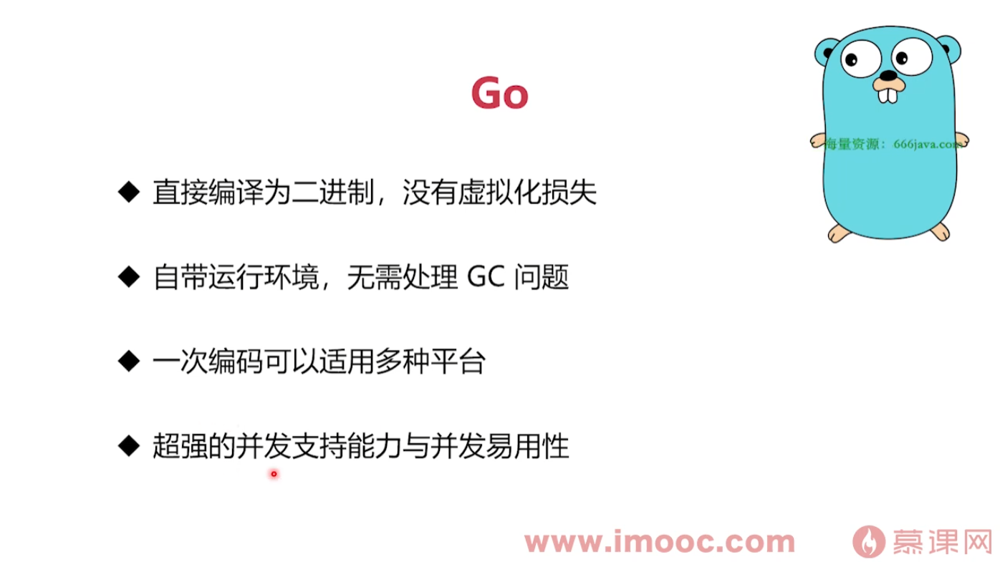
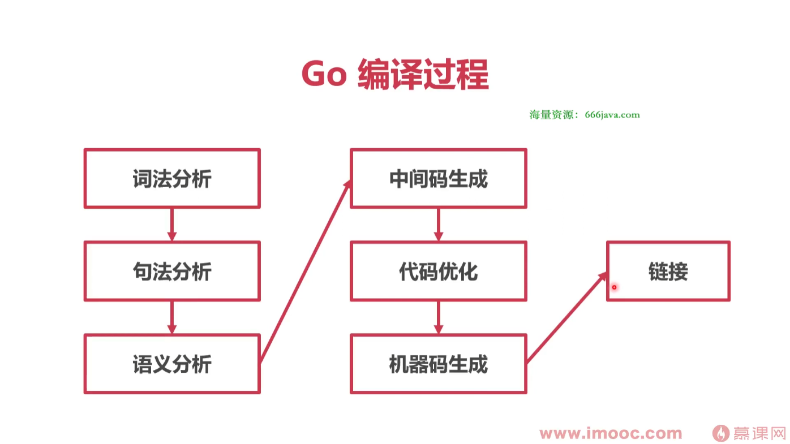
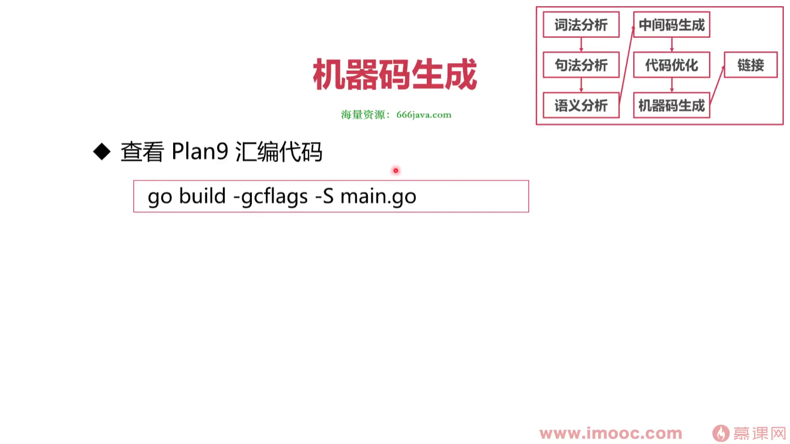
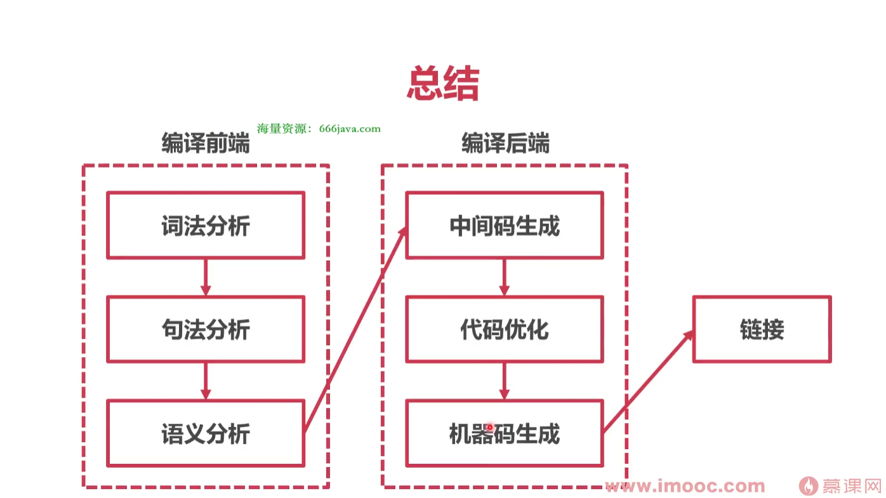
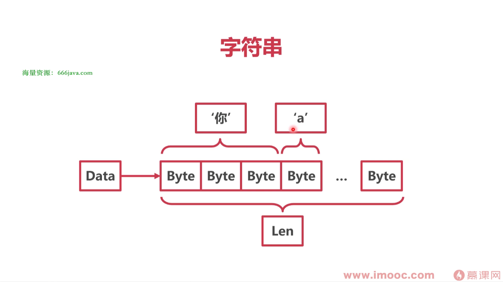
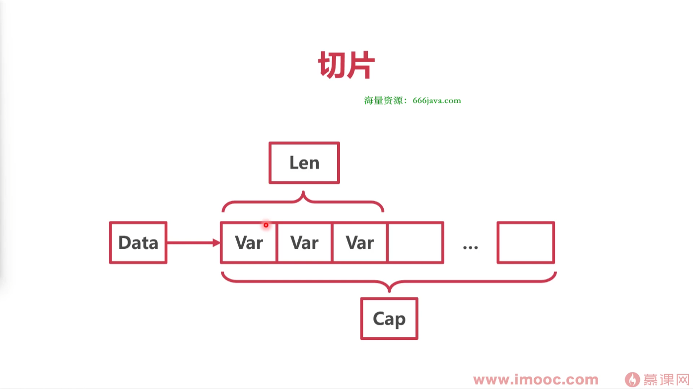
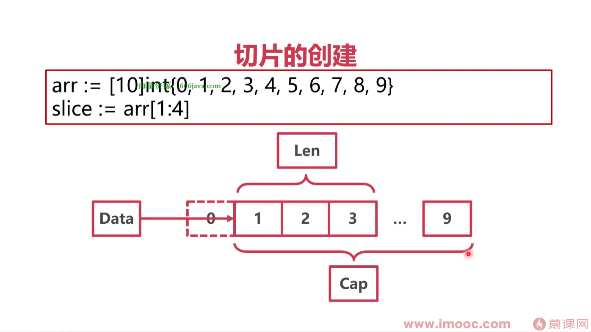
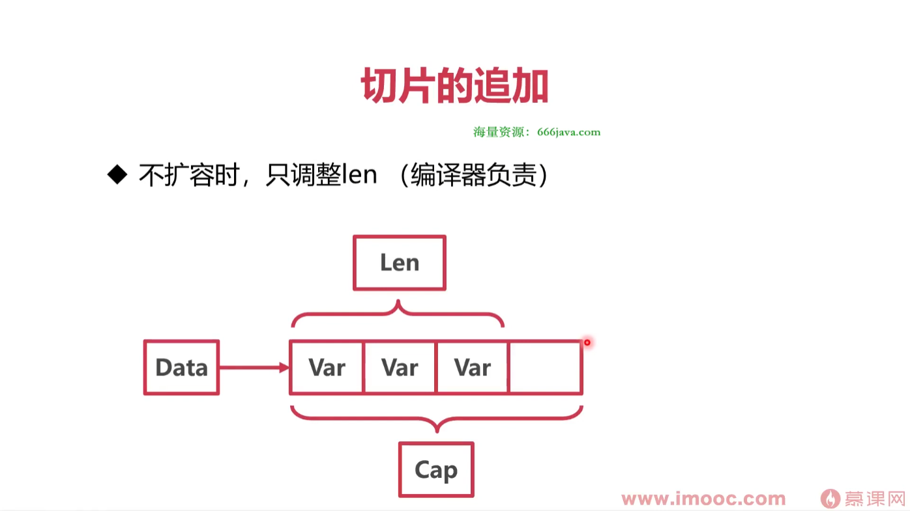
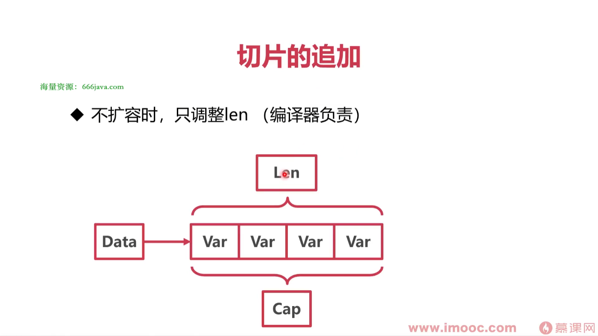
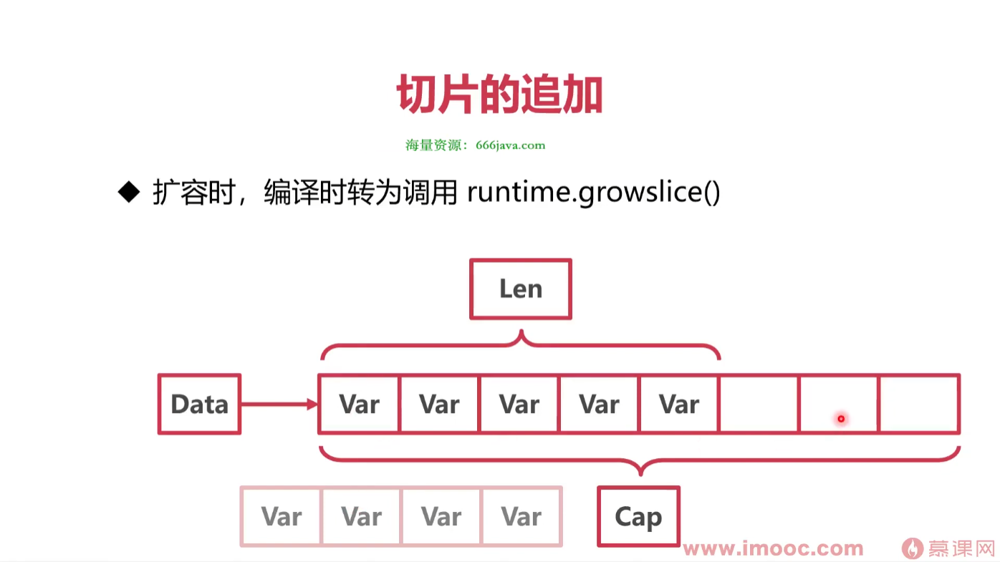

# go语言的特点



汇编代码:`go build -gcflags -S main.go`

# Runtime

## Runtime是什么呢? 

Runtime就是程序的运行环境,作为程序的一部分打包进二进制产物,随用户程序一起运行,与用户程序没有明显界限，直接通过函数调用

## Runtime 的能力

- 内存管理能力
- 垃圾回收能力(GC)
- 超强的并发能力(协程调度)

## Runtime 其他特点

- Runtime 有一定的屏蔽系统调用能力
- 一些 go 的关键字其实是 Runtime 下的函数

# Go程序是如何编译的?

**查看编译指令:**`go build -n`



## 词法分析

- 将源代码翻译成 Token
- Token 是代码中的最小语义结构

## 句法分析

- Token序列经过处理，变成语法树

## 语义分析

- 类型检查
- 类型推断
- 查看类型是否匹配
- 函数调用内联
- 逃逸分析

## 中间码生成(SSA)

- 为了处理不同平台的差异，先生成中间代码(SSA)
- 查看从代码到SSA中间码的整个过程
.png)

## 机器码生成

- 先生成Plan9汇编代码
- 最后编译为机器码
- 输出的机器码为.a文件
- 查看 Plan9 汇编代码


## 链接

- 将各个包进行链接，包括runtime

## 总结



# Go 程序是如何运行的?

## go程序的入口

-  runtime/rt0 XXX.s

## 读取命令行参数

- 复制参数数量 argc 和参数值 argv 到栈上

## 初始化 g0 执行栈

- g0 是为了调度协程而产生的协程
- g0 是每个 Go 程序的第一个协程

## 运行时检测

- 检查各种类型的长度
- 检查指针操作
- 检查结构体字段的偏移量
- 检査 atomic 原子操作
- 检查 CAS 操作
- 检查栈大小是否是 2 的幂次

## 参数初始化 runtime.args

- 对命令行中的参数进行处理
- 参数数量赋值给 argc int32
- 参数值复制给 argv **byte

## 调度器初始化 runtime.schedinit

- 全局栈空间内存分配
- 加载命令行参数到 os.Args
- 堆内存空间的初始化
- 加载操作系统环境变量
- 初始化当前系统线程
- 垃圾回收器的参数初始化
- 算法初始化(map、hash)
- 设置 process 数量

## 创建主协程

- 创建一个新的协程，执行runtime.main
- 放入调度器等待调度

## 初始化 M

- 初始化一个 M，用来调度主协程

## 主协程执行主函数

- 执行 runtime 包中的 init 方法
- 启动 GC 垃圾收集器
- 执行用户包依赖的 init 方法
- 执行用户主函数 main.main()

## 总结

- Go 启动时经历了检查、各种初始化、初始化协程调度的过程
- main.main()也是在协程中运行的

# Go语言是面向对象的吗?

## "Yes and No"

- Go允许OO的编程风格
- Go的Struct可以看作其他语言的Class
- Go缺乏其他语言的继承结构
- Go的接口与其他语言有很大差异

## Go 的“类”

- 其他语言中，往往用class表示一类数据
- class的每个实例称作“对象
- Go中用struct表示一类数据
- struct每个实例并不是“对象”，而是此类型的“值
- struct也可以定义方法

## Go的继承

- Go并没有继承关系
- 所谓Go的继承只是组合
- 组合中的匿名字段，通过语法糖达成了类似继承的效果

## Go的接口

- 接口可以定义Go中的一组行为相似的struct
- struct并不显式实现接口，而是隐式实现

## 总结

- Go没有对象、没有类、没有继承
- Go通过组合匿名字段来达到类似继承的效果
- 通过以上手段去掉了面向对象中复杂而冗余的部分
- 保留了基本的面向对象特性

# 企业级 Go 项目包管理方法

## Go Modules

- 本质上，一个 Go 包就是一个项目的源码
- gomod 的作用:将 Go 包和 Git 项目关联起来
- Go 包的版本就是 git 项目的 Tag
- gomod 就是解决 "需要哪个 git 项目的什么版本"

## 使用 Modules

go get github.com/delve/delve

## Github 无法访问怎么办

- 使用goproxy.cn作为代理:`go env -w GOPROXY=https://goproxy.cn,direct`

## 想用本地文件替代怎么办

- go.mod 文件追加:`replace github.com/Jeffail/tunny => xxx/xxx`
- go vender 缓存到本地
`go mod vendor //不是之前的 go vendor`
`go build -mod vendor`

## 创建 Go Module

- 删除本地go.mod
go mod init github.com/imooc/moody
- 推送至代码仓库
- 增加新版本时，在仓库打新 Tag

## 总结

- Go Modules 将每个包视为一个git项目
- gomod 就是解决“需要哪个 git 项目的什么版本
- 无法连接远程仓库时，使用重定向或者mod vender方案

# 高并发下的数据结构

- Go常见类型的底层原理
- 字符串、切片、map
- 接口、结构体

## 什么变量的大小是0字节

### 基本类型的字节数

- int 大小跟随系统字长
- 指针的大小也是系统字长

### 空结构体

- 空结构体的地址均相同(不被包含在其他结构体中时)
- 空结构体主要是为了节约内存
  - 结合map
  - 结合channel

### 总结

- Go中部分数据的长度与系统字长有关
- 空结构体不占用空间
- 空结构体与map结合可以实现hashset
- 空结构体与channel结合可以当作纯信号

## 数组，字符串，切片底层是一样的吗?

### 字符串

#### 字符串

```go
type stringStruct struct {
    str unsafe.Pointer
    len int
}
```
- 字符串本质是个结构体
- Data指针指向底层Byte数组
- Len表示Byte数组的长度?字符个数?答案:Len表示Byte数组的长度(字节数),UTF-8


#### 字符编码问题

- 所有的字符均使用Unicode字符集
- 使用UTF-8编码

#### Unicode

- 一种统一的字符集
- 囊括了159种文字的144679个字符
- 14万个字符至少需要3个字节表示
- 英文字母均排在前128个

#### UTF-8

- Unicode的一种变长格式
- 128个US-ASCII字符只需一个字节编码
- 西方常用字符需要两个字节
- 其他字符需要3个字节，极少需要4个字节

#### 字符串的访问

- 对字符串使用len方法得到的是字节数不是字符数
- 对字符串直接使用下标访问，得到的是字节
- 字符串被range遍历时，被解码成rune类型的字符
- UTF-8 编码解码算法位于 runtime/utf8.go

#### 字符串的切分

- 需要切分时:`s = string([]rune(s)[:3])`
  - 转为rune数组
  - 切片
  - 转为 string

### 切片

#### 切片的本质是对数组的引用

```go
type slice struct {
    array unsafe.Pointer
    len int
    cap int
}
```


#### 切片的创建

- 根据数组创建:`arr[0:3] or slice[0:3]`
- 字面量:编译时插入创建数组的代码:`slice := []int{1, 2, 3}`
- make: 运行时创建数组:`slice := make([]int, 10)`


#### 切片的访问

- 下标直接访问元素
- range 遍历元素
- len(slice)查看切片长度
- cap(slice)查看数组容量

#### 切片的追加


- 不扩容时，只调整len(编译器负责)

- 扩容时，编译时转为调用 runtime.growslice()

- 如果期望容量大于当前容量的两倍就会使用期望容量
 - 如果当前切片的长度小于 1024，将容量翻倍
- 如果当前切片的长度大于 1024，每次增加 25%
- 切片扩容时，并发不安全，注意切片并发要加锁

### 总结

- 字符串与切片都是对底层数组的引用
- 字符串有UTF-8变长编码的特点
- 切片的容量和长度不同
- 切片追加时可能需要重建底层数组


