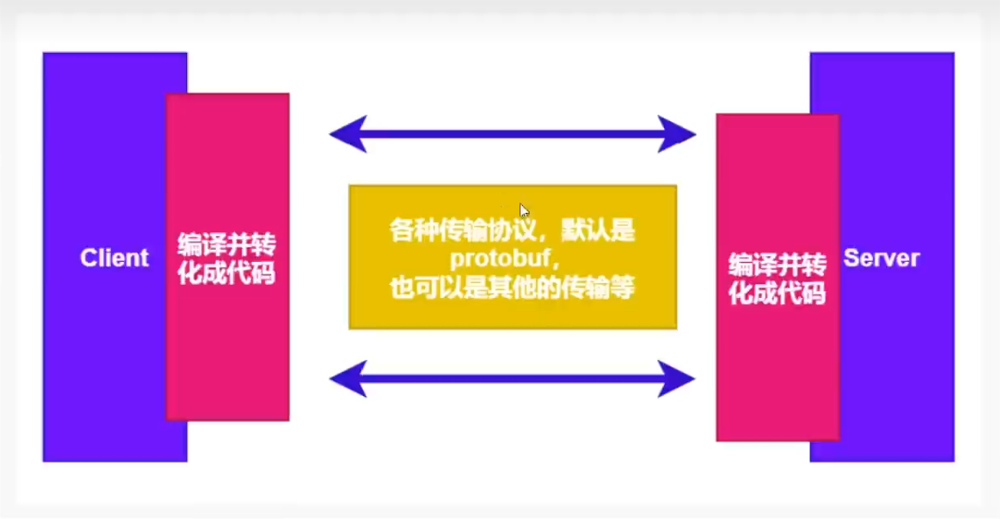

# 认证-安全传输

gRPC 是一个典型的C/S模型，需要开发客户端 和 服务端，客户端与服务端需要达成协议，使用某一个确认的传输协议来传输数据，gRPC通常默
认是使用protobuf来作为传输协议，当然也是可以使用其他自定义的。

那么，客户端与服务端要通信之前，
客户端如何知道自己的数据是发给哪一个明确的服务端呢?反过来，服务端是不是也需要有一种方式来弄个
清楚白己的数据要返回给谁呢?

处说到的认证，不是用户的身扮认证，而是指多个server和多个client之间，如何识别对方是谁，并且可以安全的进行数据传输

SSL/TLS认证方式(采用http2协议)
基于Token的认证方式(基于安全连接)
不采用任何措施的连接，这是不安全的连接(默认采用http1)
自定义的身份认证

客户端和服务端之间调用，我们可以通过加入证书的方式，实现调用的安全性

TLS(Transport Laver Security，安全传输层)，TLS是建立在传输层TCP协议之上的协议，服务于应用层，它的前身是SSL(Secure Socket Layer，安全套接字层)，它实现了将应用层的报文进行加密后再交由TCP进行传输的功能。

TLS协议主要解决如下三个网络安全问题。

保密(message privacy)，保密通过加密encryption实现，所有信息都加密传输，第三方无法嗅探;
完整性(message integrity)，通过MAC校验机制，一旦被篡改，通信双方会立刻发现;
认证(mutual authentication)，双方认证,双方都可以配备证书，防止身份被冒充;

生产环境可以购买证书或者使用一些平台发放的免费证书

key:服务器上的私钥文件，用于对发送给客户端数据的加密，以及对从客户端接收到数据的解密。
csr:证书签名请求文件，用于提交给证书颁发机构(CA)对证书签名
crt:由证书颁发机构(CA)签名后的证书，或者是开发者自签名的证书，包含证书持有人的信息，持有人的公钥，以及签署者的签名等信息.
pem:是基于Base64编码的证书格式，扩展名包括PEM、CRT和CER。

一些名词解释:聊聊HTTPS和SSL/TLS协议 https://www.kuangstudy.com/bbs/1604044550878703617

# SSL/TLS认证方式

## 配置openssl

首先通过openssl生成证书和私钥

1、官网下载:https://www.openssl.org/source/
其他人做的便捷版安装包 http://slproweb.com/products/Win32QpenssL.html
https://slproweb.com/products/Win32OpenSSL.html
2、我们使用 便捷版安装包，一直下一步即可
3、配置环境变量 D:\EnvironmentOpenSSL-Win64\bin
4、命令行测试 openssl

## 生成证书

**生成私钥:**`openssl genrsa -out server.key 2048`

**生成证书 全部回车即可，可以不填:**`openssl req -new -x509 -key server.key -out server.crt -days 36500`

**生成csr:**`openssl req -new -key server.key -out server.csr`

## 相关信息

**生成私钥**

openssl genrsa -out server.key 2048

**生成证书 全部回车即可，可以不填**

openssl req -new -x509 -key server.key -out server.crt -days 36500

**国家名称**

Country Name(2 ettercode)[AU]:CN

**省名称**

State or Province Name(fu1l name)[Some-State]:GuangDong

**城市名称**

Locality Name(eg，city)[]:Meizhou

**公司组织名称**

Organization Name (eg, company)[Internet widgits pty Ltd]:xuexiangban

**部门名称**

Organizational Unit Name(eg，section)[]:go

**服务器or网站名称**

Common Name(e.g.server FQDN or YOUR name)[]:kuangstudy

**邮件**

Email Address :24736743@gg.com

## 更改openssl.cnf(Linux 是openssl.cfg)

复制一份你安装的openss1的bin目录里面的openss1.cnf 文件到你项目所在的目录

找到[CA_default]，打开 copy_extensions =copy (就是把前面的#去掉)

找到[req ],打开 req_extensions = v3_reg # The extensions to add to a certificate request

找到[v3_req]，添加 subjectAltName = @alt_names

添加新的标签[ alt_names ]，和标签字段

DNS.1 =*.kuangstudy.com

## 生成密钥和证书

生成证书私钥test.key

openssl genpkey -algorithm RSA -out test.key

通过私钥test.key生成证书请求文件test.csr(注意cfg和cnf)

openssl req -new -nodes -key test.key -out test.csr -days 3650 -subj "/C=cn/OU=myorg/O=mycomp/CN=myname" -config ./openssl.cnf -extensions v3_req

openssl req -new -nodes -key test.key -out test.csr -days 3650 -subj "/C=cn/OU=myorg/O=mycomp/CN=myname" -config ./openssl.cfg -extensions v3_req

test.csr是上面生成的证书请求文件。ca.crt/server.key是CA证书文件和key，用来对test.csr进行签名认证。这两个文件在第一部分生成。

生成SAN证书 pem

openssl x509 -req -days 365 -in test.csr -out test.pem -CA server.crt -CAkey server.key -CAcreateserial -extfile ./openssl.cnf -extensions v3_req

openssl x509 -req -days 365 -in test.csr -out test.pem -CA server.crt -CAkey server.key -CAcreateserial -extfile ./openssl.cfg -extensions v3_req