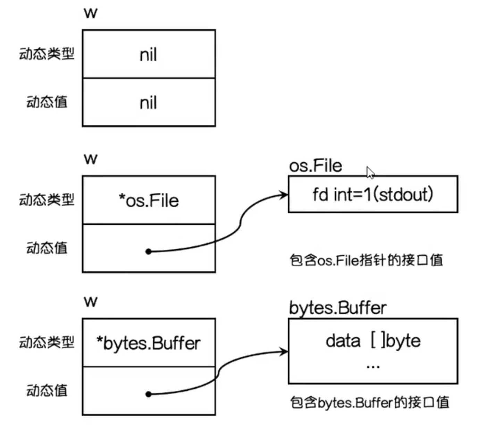
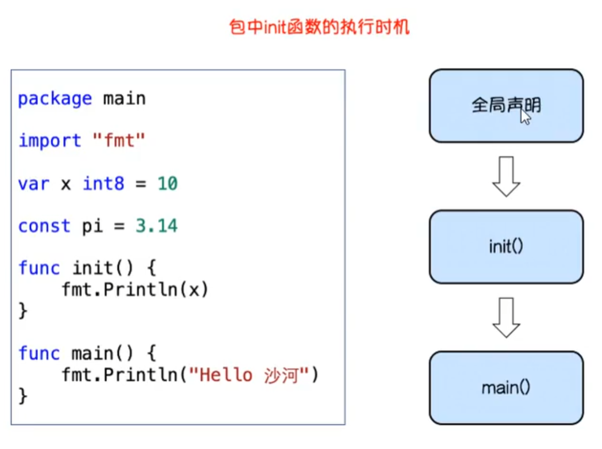
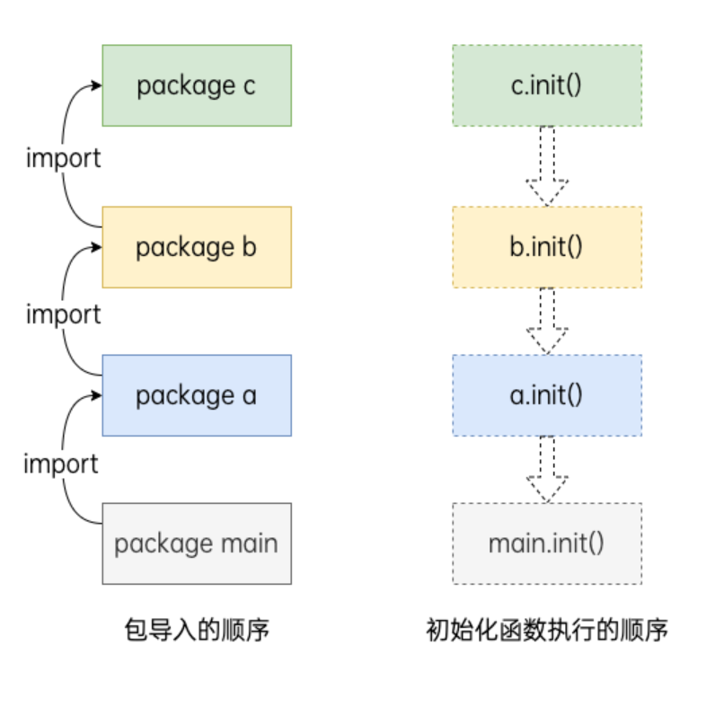
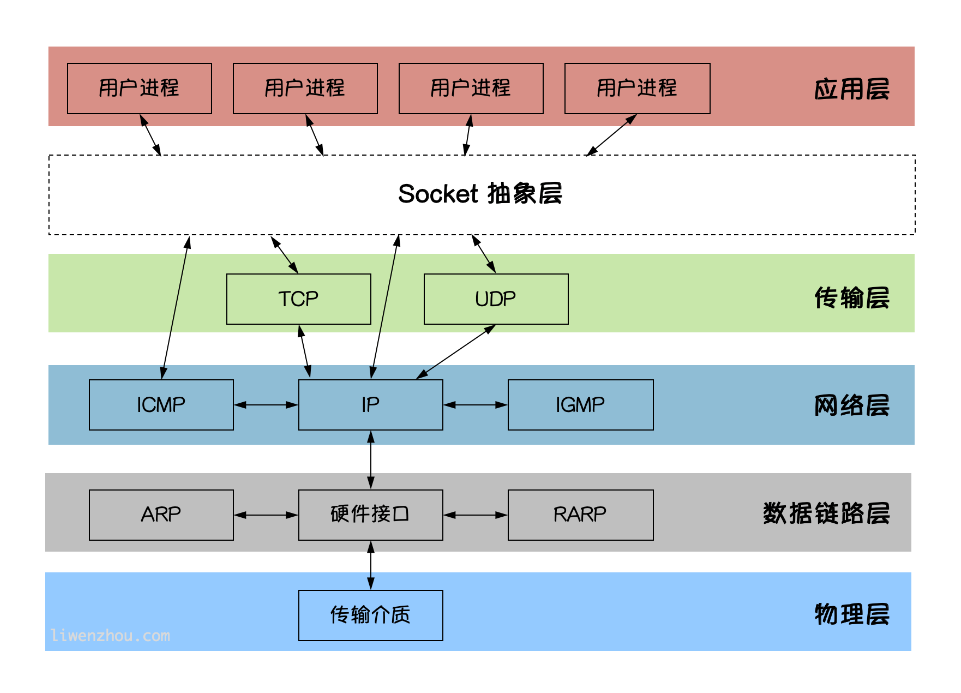
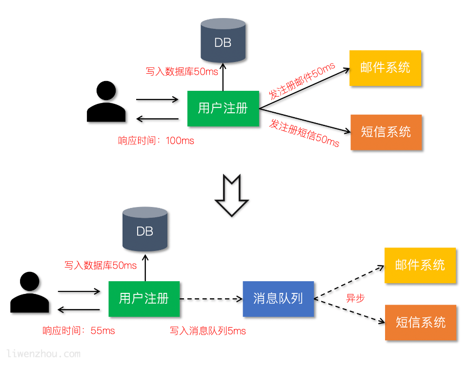
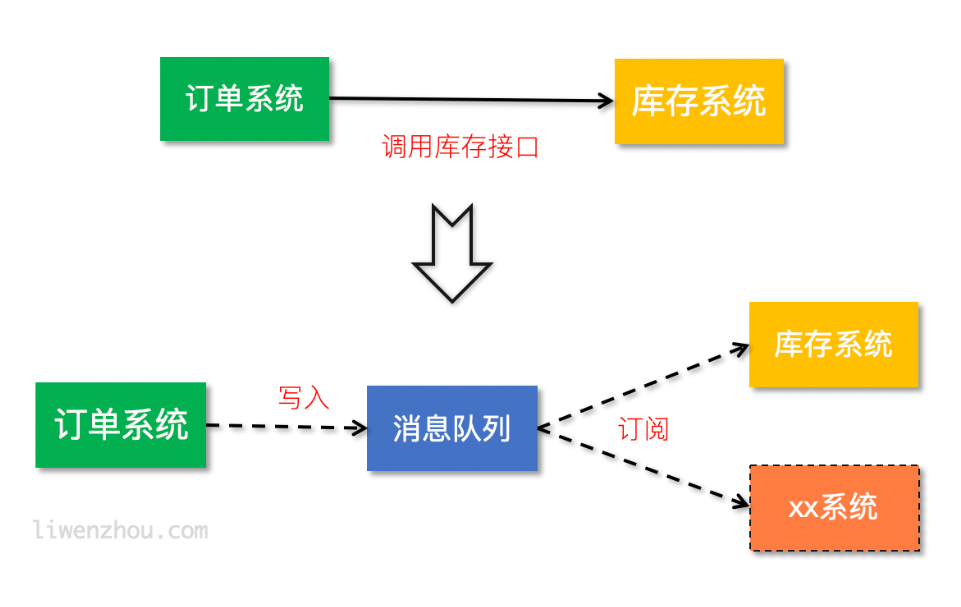
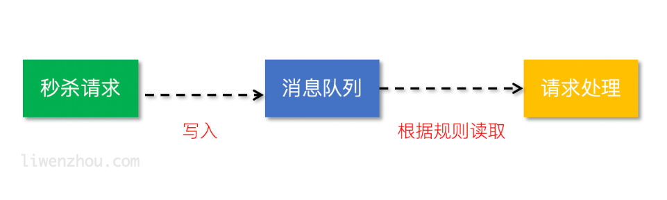
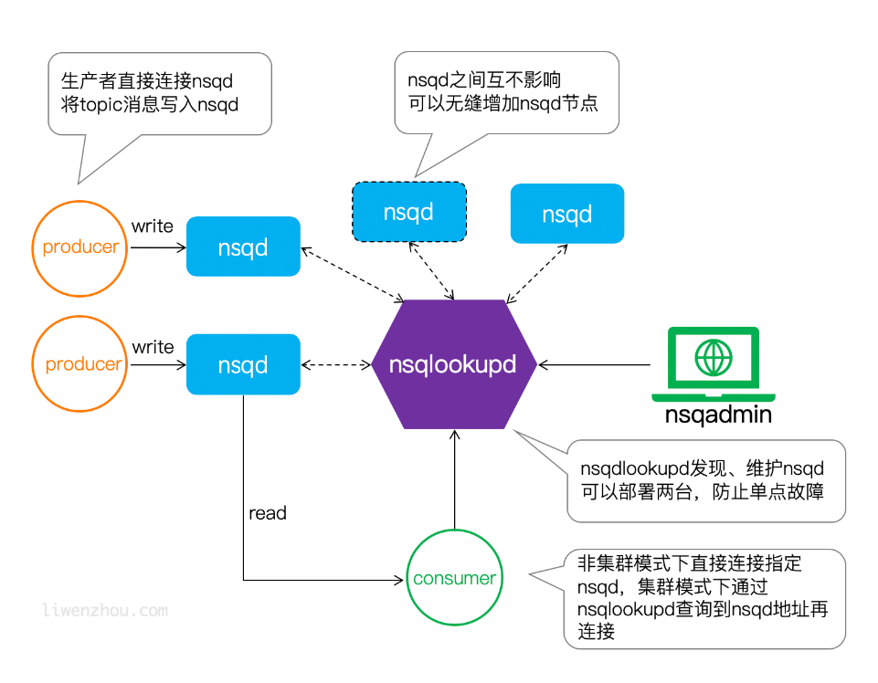

# Go

## 标识符

标识符:变量名 函数名 类型名 方法名

Go语言中如果标识符首字母是大写的,就表示对外部包可见(暴露的,公有的)

### 变量

> 变量声明后必须使用

**单变量声明**

`var 变量名 变量类型 = 赋值`

**简短变量声明**(只能在函数中使用)

`变量名 := 赋值`

**批量声明**

```go
var(
    变量名 变量类型
    变量名 变量类型
    变量名 变量类型
    ...
)
```

**匿名变量**

`_`不占用命名空间，不会分配内存，所以匿名变量之间不存在重复声明,用于忽略某个值

### 常量

**const**
`const 变量名 = 赋值`
```go
const (
    变量名 = 赋值
    变量名 = 赋值
    变量名 
    ...
)
```
> 如果省略了值则表示和上面一行的值相同

**iota**
> iota是go语言的常量计数器，只能在常量的表达式中使用。
> iota在const关键字出现时将被重置为0。
> const中每新增一行常量声明将使iota计数一次
> 使用_跳过某些值


### 基本数据类型

- 整形
> 二 八 十六进制
> 默认是int类型，位数取决于电脑位数
- 特殊整形
- 浮点型
> 默认为float64
- 复数
> complex(64/128)  分别实部和虚部都是(32/64)
- 布尔值
> 默认值为false
> 不允许将整数强制转换为布尔值
> 布尔类型无法参与数值运算,也无法转换为其他类型
- 字符串
> 字符串用双引号
> 字符用单引号
```go
"单行字符串"
`多行字符串
...
...
`    
```
> 字符串常用操作

| 方法                                                      | 介绍           |
| --------------------------------------------------------- | -------------- |
| len(str)                                                  | 求长度         |
| +或fmt.Sprintf("%s%s",str1,str2)                          | 拼接字符串     |
| strings.contains(str1,str2)                               | 判断是否包含   |
| strings.HasPrefix(str1,str2),strings.HasSuffix(str1,str2) | 前缀/后缀判断  |
| strings.Index(str1,str2),strings.LastIndex(str1,str2)     | 子串出现的位置 |
| strings.Join(a[]string, sep string)                       | join操作       |

- byte和rune类型
  
> uint8类型，或者叫 byte 型，代表一个ASCII码字符。
> rune类型，代表一个 UTF-8字符,实际是一个int32。
> 字符串底层是一个byte数组，所以可以和[]byte类型相互转换。
> 字符串是不能修改的 字符串是由byte字节组成，所以字符串的长度是byte字节的长度。 
> rune类型用来表示utf8字符，一个rune字符由一个或多个byte组成。
> 要修改字符串，需要先将其转换成[]rune或[]byte，完成后再转换为string
> Go语言中只有强制类型转换，没有隐式类型转换。`T(表达式)`

## 复合数据类型

### Array(数组)
> 多维数组只有第一层可以使用...来让编译器推导数组长度
> 数组是值类型，赋值和传参会复制整个数组。
> [n]*T表示指针数组，*[n]T表示数组指针


**数组定义**
`var 数组变量名 [元素数量]T`
> 数组的长度必须是常量，并且长度是数组类型的一部分

**数组的初始化**
> 初始化列表
> 编译器根据初始值的个数自行推断数组的长度`数组变量名 = [...]{X,X,...}`
> 指定索引值`数组变量名 = [元素数量]{X:x,X:x,...}`
> 如果不初始化:默认元素都是零值(布尔值:false，整型和浮点型都是0，字符串:"")

**数组的遍历**
> 下标是从0开始，最后一个元素下标是：len-1
- 根据索引遍历
- for range遍历`index, value`

### 切片
> 一个拥有相同类型元素的可变长度的序列

**切片的本质**
> 基于数组类型做的一层封装
> 引用类型，内部结构包含地址、长度和容量

**切片的定义**
`var name []T`

**切片的长度和容量**
通过使用内置的len()函数求长度
使用内置的cap()函数求切片的容量

**切片表达式**
- 简单切片表达式
`s := a[low:high]`
> 左包含，右不包含,省略了low则默认为0；省略了high则默认为切片操作数的长度
> 0 <= low <= high <= len(a)

- 完整切片表达式
`a[low : high : max]`
> 容量设置为max-low,其余与简单切片表达式相同
> 0 <= low <= high <= max <= cap(a)

**使用make()函数构造切片**
`make([]T, size, cap)`

**判断切片是否为空**
要检查切片是否为空，请始终使用len(s) == 0来判断，而不应该使用s == nil来判断。

**切片不能直接比较**
> 不能使用==操作符来判断两个切片是否含有全部相等元素
> 唯一合法的比较操作是和nil比较
> 一个nil值的切片并没有底层数组，一个nil值的切片的长度和容量都是0。
> 但是我们不能说一个长度和容量都是0的切片一定是nil

```go
var s1 []int         //len(s1)=0;cap(s1)=0;s1==nil
s2 := []int{}        //len(s2)=0;cap(s2)=0;s2!=nil
s3 := make([]int, 0) //len(s3)=0;cap(s3)=0;s3!=nil
```

**切片的赋值拷贝**
拷贝前后两个变量共享底层数组

**切片遍历**
- 索引遍历
- for range遍历`index, value`


**append()方法为切片添加元素**
```go
var citySlice []string
// 追加一个元素
citySlice = append(citySlice, "北京")
// 追加多个元素
citySlice = append(citySlice, "上海", "广州", "深圳")
// 追加切片
a := []string{"成都", "重庆"}
citySlice = append(citySlice, a...)
fmt.Println(citySlice) //[北京 上海 广州 深圳 成都 重庆]
```
> 每个切片会指向一个底层数组，这个数组的容量够用就添加新增元素。
> 当底层数组不能容纳新增的元素时，切片就会自动按照一定的策略进行“扩容”，此时该切片指向的底层数组就会更换。
> “扩容”操作往往发生在append()函数调用时，所以我们通常都需要用*原变量接收append函数的返回值*。

**使用copy()函数复制切片**
> copy()函数可以迅速地将一个切片的数据复制到另外一个切片空间中
`copy(destSlice, srcSlice []T)`

**从切片中删除元素**
要从切片a中删除索引为index的元素，操作方法是`a = append(a[:index], a[index+1:]...)`

### 指针
**指针地址和指针类型**
- 取变量指针的语法
`ptr := &v    // v的类型为T`
> v:代表被取地址的变量，类型为T
> ptr:用于接收地址的变量，ptr的类型就为*T，称做T的指针类型。*代表指针。

**指针取值**
`变量名 := *ptr`
`*ptr := 值`

*__总结__： 取地址操作符&和取值操作符*是一对互补操作符，&取出地址，*根据地址取出地址指向的值*

**new和make**

new是一个内置的函数，它的函数签名如下：
`func new(Type) *Type`

make函数的函数签名如下：
`func make(t Type, size ...IntegerType) Type`
> 二者都是用来做内存分配的。
> make只用于slice、map以及channel的初始化，返回的还是这三个引用类型本身；
> 而new用于类型的内存分配，并且内存对应的值为类型零值，返回的是指向类型的指针。

### map
> Go语言中提供的映射关系容器为map，其内部使用散列表（hash）实现
> map是一种无序的基于key-value的数据结构，Go语言中的map是**引用类型**，必须初始化才能使用

**map定义**

Go语言中 map的定义语法如下：

`map[KeyType]ValueType`
> map类型的变量默认初始值为nil，需要使用make()函数来分配内存。语法为：

`make(map[KeyType]ValueType, [cap])`
> 其中cap表示map的容量，该参数虽然不是必须的，但是我们应该在初始化map的时候就为其指定一个合适的容量

eg:
```go
scoreMap := make(map[string]int, 8)
scoreMap["张三"] = 90
scoreMap["小明"] = 100
fmt.Println(scoreMap)
fmt.Println(scoreMap["小明"])
fmt.Printf("type of a:%T\n", scoreMap)

userInfo := map[string]string{
    "username": "沙河小王子",
    "password": "123456",
}
fmt.Println(userInfo)
```

**判断某个键是否存在**
判断map中键是否存在的特殊写法，格式如下:
`value, ok := map[key]`

**map的遍历**
- for range遍历map
`for k, v := range scoreMap`
`for k := range scoreMap`
`for _,v := range scoreMap`
*__注意__： 遍历map时的元素顺序与添加键值对的顺序无关。*

**使用delete()函数删除键值对**
delete()函数的格式如下：
`delete(map, key)`

## 简单语法

### 控制语句

- if else(分支结构)
- if条件判断特殊写法
- for(循环结构)
- for range(键值循环)
- switch case
> fallthrough语法可以执行满足条件的case的下一个case，是为了兼容C语言中的case设计的
- goto(跳转到指定标签)
- break <table>(跳出标记循环)
- break(跳出循环)
- continue(继续下次循环)

### 运算符

**算术运算符*-
**关系运算符**
**逻辑运算符**
**位运算符**
**赋值运算符**

### 函数

**函数定义**
```go
func 函数名(参数)(返回值){
    函数体
}
```

**函数的调用**
通过函数名()的方式调用函数

**参数**
- 类型简写
  > 函数的参数中如果相邻变量的类型相同，则可以省略类型(前面的)
- 可变参数
  > 可变参数通过在参数名后加...来标识
  > 可变参数通常要作为函数的最后一个参数
- 没有默认参数

**返回值**
- 多返回值
  > 函数如果有多个返回值时必须用()将所有返回值包裹起来
- 返回值命名
  > 函数定义时可以给返回值命名，并在函数体中直接使用这些变量，最后通过return关键字返回
- 返回值补充
  > 当我们的一个函数返回值类型为slice时，nil可以看做是一个有效的slice，没必要显示返回一个长度为0的切片

**变量作用域**
- 全局变量
  > 在函数外部的变量，它在程序整个运行周期内都有效
- 局部变量
  > 局部变量和全局变量重名，优先访问局部变量
  > 函数内定义的变量无法在该函数外使用
  > 语句块定义的变量: if条件判断、for循环、switch语句

**函数类型与变量**
- 定义函数类型
  > `type calculation func(int, int) int`
- 函数类型变量
  > 声明函数类型的变量并且为该变量赋值

**高阶函数**
- 函数作为参数
  > `func calc(x, y int, op func(int, int) int) int`
- 函数作为返回值
  > `func do(s string) (func(int, int) int)`

**匿名函数**
> 因为没有函数名，所以没办法像普通函数那样调用，所以匿名函数需要保存到某个变量或者作为立即执行函数
> 多用于实现回调函数和闭包
```go
func main() {
	// 将匿名函数保存到变量
	add := func(x, y int) {
		fmt.Println(x + y)
	}
	add(10, 20) // 通过变量调用匿名函数

	//自执行函数：匿名函数定义完加()直接执行
	func(x, y int) {
		fmt.Println(x + y)
	}(10, 20)
}
```

**闭包**
`闭包=函数+引用环境`
> 闭包指的是一个函数和与其相关的引用环境组合而成的实体
```go
func calc(base int) (func(int) int, func(int) int) {
	add := func(i int) int {
		base += i
		return base
	}

	sub := func(i int) int {
		base -= i
		return base
	}
	return add, sub
}

func main() {
	f1, f2 := calc(10)
	fmt.Println(f1(1), f2(2)) //11 9
	fmt.Println(f1(3), f2(4)) //12 8
	fmt.Println(f1(5), f2(6)) //13 7
}
```

**defer语句**
> 将其后面跟随的语句进行延迟处理(逆序执行)
> defer语句能非常方便的处理资源释放问题
- defer执行时机
> 在Go语言的函数中return语句在底层并不是原子操作，它分为给返回值赋值和RET指令两步。
> 而defer语句执行的时机就在返回值赋值操作后，RET指令执行前。

```go
func f1() int {
	x := 5
	defer func() {
		x++
	}()
	return x
}
func f2() (x int) {
	defer func() {
		x++
	}()
	return 5
}
func f3() (y int) {
	x := 5
	defer func() {
		x++
	}()
	return x
}
func f4() (x int) {
	defer func(x int) {
		x++
	}(x)
	return 5
}
func main() {
	fmt.Println(f1())
	fmt.Println(f2())
	fmt.Println(f3())
	fmt.Println(f4())
}

func calc(index string, a, b int) int {
	ret := a + b
	fmt.Println(index, a, b, ret)
	return ret
}
func main() {
	x := 1
	y := 2
	defer calc("AA", x, calc("A", x, y))
	x = 10
	defer calc("BB", x, calc("B", x, y))
	y = 20
}
```

### 类型别名和自定义类型

**自定义类型**
> 使用type关键字来定义自定义类型
```go
//将MyInt定义为int类型
type MyInt int
```
> 通过type关键字的定义，MyInt就是一种新的类型，它具有int的特性

**类型别名**
```go
type TypeAlias = Type
type byte = uint8
type rune = int32
```

**区别**
```go
//类型定义
type NewInt int

//类型别名
type MyInt = int

func main() {
	var a NewInt
	var b MyInt
	
	fmt.Printf("type of a:%T\n", a) //type of a:main.NewInt    表示main包下定义的NewInt类型
	fmt.Printf("type of b:%T\n", b) //type of b:int    MyInt类型只会在代码中存在，编译完成时并不会有MyInt类型
}
```

### 结构体
> 通过struct来实现面向对象

**结构体的定义**
> 使用type和struct关键字来定义
```go
type 类型名 struct {
    字段名 字段类型
    字段名 字段类型
    …
}
```

**结构体实例化**
- 基本实例化
- 匿名结构体
  > 在定义一些临时数据结构等场景下还可以使用匿名结构体
  ```go
    var user struct{Name string; Age int}
    user.Name = "小王子"
    user.Age = 18
    fmt.Printf("%#v\n", user)
  ``` 
- 创建指针类型结构体
  > 使用new关键字对结构体进行实例化，得到的是结构体的地址
  `var p2 = new(your_struct)`
  


**结构体初始化**
> 没有初始化的结构体，其成员变量都是对应其类型的零值
```go
type person struct {
	name string
	city string
	age  int8
}
```
- 使用键值对初始化
```go
p5 := person{
    name: "小王子",
    city: "北京",
    age:  18,
}
p6 := &person{
	name: "小王子",
	city: "北京",
	age:  18,
}
```
- 使用值的列表初始化
```go
p8 := &person{
	"沙河娜扎",
	"北京",
	28,
}
```
> 使用值的列表初始化需要注意：
  - 必须初始化结构体的所有字段。
  - 初始值的填充顺序必须与字段在结构体中的声明顺序一致。
  - 该方式不能和键值初始化方式混用。

**结构体内存布局**
[结构体内存布局](https://www.liwenzhou.com/posts/Go/struct-memory-layout/)
- 结构体大小
  > 结构体是占用一块连续的内存
- 内存对齐
  > Go 在编译的时候会按照一定的规则自动进行内存对齐
  > 为了减少 CPU 访问内存的次数
  > 因为 CPU 访问内存时，并不是逐个字节访问，而是以字（word）为单位访问
- 对齐保证
  > 以通过内置unsafe包的Alignof函数来获取一个变量的对齐系数
- 空结构体


**结构体内存布局的特殊场景**
- 空结构体字段对齐

**构造函数**
> 结构体比较复杂的话，值拷贝性能开销会比较大(数据个数大于2)，返回的是结构体指针类型
```go
func structname(参数)*structname{
    return &structname{
        参数:赋值
        参数:赋值
        参数:赋值
        ...
    }
}
```

**方法和接收者**
> 方法（Method）是一种作用于特定类型变量的函数
> 这种特定类型变量叫做接收者（Receiver）
> 接收者的概念就类似于其他语言中的this或者 self

- 方法的定义格式如下：
  * 接收者变量：接收者中的参数变量名在命名时，官方建议使用接收者**类型名称首字母的小写**，而不是self、this之类的命名
  * 接收者类型：接收者类型和参数类似，可以是指针类型和非指针类型。
  * 方法名、参数列表、返回参数：具体格式与函数定义相同
```go
func (接收者变量 接收者类型) 方法名(参数列表) (返回参数) {
    函数体
}
```
- 指针类型的接收者
  > 修改都是有效的
- 值类型的接收者
  > 修改操作只是针对副本，无法修改接收者变量本身


**任意类型添加方法**

使用type关键字可以定义新的自定义类型，然后为我们的自定义类型添加方法
***注意事项***： 非本地类型不能定义方法，也就是说我们不能给别的包的类型定义方法

**结构体的匿名字段**

结构体允许其成员字段在声明时没有字段名而只有类型，这种没有名字的字段就称为匿名字段。
***注意***: 这里匿名字段的说法并不代表没有字段名，而是默认会采用类型名作为字段名，结构体要求字段名称必须唯一，因此一个结构体中同种类型的匿名字段只能有一个。


**嵌套结构体**
一个结构体中可以嵌套包含另一个结构体或结构体指针
- 嵌套匿名字段
  > 当访问结构体成员时会先在结构体中查找该字段，找不到再去嵌套的匿名字段中查找
- 嵌套结构体的字段名冲突
  > 嵌套结构体内部可能存在相同的字段名
  > 为了避免歧义需要通过指定具体的内嵌结构体字段名


**结构体的“继承”**
实体
```go
//Animal 动物
type Animal struct {
	name string
}

func (a Animal) move() {
	fmt.Printf("%s会动！\n", a.name)
}

//Dog 狗
type Dog struct {
	Feet    int8
	Animal //通过嵌套匿名结构体实现继承
}

func (d Dog) wang() {
	fmt.Printf("%s会汪汪汪~\n", d.name)
}

func main() {
	d1 := Dog{
		Feet: 4,
		Animal: Animal{ //注意嵌套的是结构体指针
			name: "乐乐",
		},
	}
	d1.wang() //乐乐会汪汪汪~
	d1.move() //乐乐会动！
}
```
指针
```go
//Animal 动物
type Animal struct {
	name string
}

func (a *Animal) move() {
	fmt.Printf("%s会动！\n", a.name)
}

//Dog 狗
type Dog struct {
	Feet    int8
	*Animal //通过嵌套匿名结构体实现继承
}

func (d *Dog) wang() {
	fmt.Printf("%s会汪汪汪~\n", d.name)
}

func main() {
	d1 := &Dog{
		Feet: 4,
		Animal: &Animal{ //注意嵌套的是结构体指针
			name: "乐乐",
		},
	}
	d1.wang() //乐乐会汪汪汪~
	d1.move() //乐乐会动！
}
```

**结构体字段的可见性**
结构体中字段大写开头表示可公开访问，小写表示私有（仅在定义当前结构体的包中可访问）


**结构体与JSON序列化**
JSON(JavaScript Object Notation) 是一种轻量级的数据交换格式

**结构体标签（Tag）**
Tag是结构体的元信息，可以在运行的时候通过反射的机制读取出来。 Tag在结构体字段的后方定义，由一对反引号包裹起来
`key1:"value1" key2:"value2"`
结构体tag由一个或多个键值对组成。键与值使用冒号分隔，值用双引号括起来。同一个结构体字段可以设置多个键值对tag，不同的键值对之间使用空格分隔。
***注意事项***： 为结构体编写Tag时，必须严格遵守键值对的规则。结构体标签的解析代码的容错能力很差，一旦格式写错，编译和运行时都不会提示任何错误，通过反射也无法正确取值。例如不要在key和value之间添加空格。


### 接口

**接口类型**

- 接口的定义
  > 每个接口类型由任意个方法签名组成，接口的定义格式如下：
```go
type 接口类型名 interface{
    方法名1( 参数列表1 ) 返回值列表1
    方法名2( 参数列表2 ) 返回值列表2
    …
}
```
> 接口类型名：Go语言的接口在命名时，一般会在单词后面添加er，如有写操作的接口叫Writer，有关闭操作的接口叫closer等。接口名最好要能突出该接口的类型含义。
> 方法名：当方法名首字母是大写且这个接口类型名首字母也是大写时，这个方法可以被接口所在的包（package）之外的代码访问。
> 参数列表、返回值列表：参数列表和返回值列表中的参数变量名可以省略。
  
- 实现接口的条件
  > 接口就是规定了一个需要实现的方法列表，在 Go 语言中一个类型只要实现了接口中规定的所有方法，那么我们就称它实现了这个接口

- 接口类型变量
  > 动态类型，初始化为nil
  

**值接收者和指针接收者**
由于Go语言中有对指针求值的语法糖，对于值接收者实现的接口，无论使用值类型还是指针类型都没有问题。但是我们并不总是能对一个值求址，所以对于指针接收者实现的接口要额外注意。

**类型与接口的关系**
- 一个类型实现多个接口
- 多种类型实现同一接口

**接口组合**
> 接口与接口之间可以通过互相嵌套形成新的接口类型

**空接口**
- 空接口的定义
  `interface{}`
> 空接口是指没有定义任何方法的接口类型。因此任何类型都可以视为实现了空接口。也正是因为空接口类型的这个特性，空接口类型的变量可以存储任意类型的值。

- 空接口的应用
  + 空接口作为函数的参数
	> 使用空接口实现可以接收任意类型的函数参数
  + 空接口作为map的值
	> 使用空接口实现可以保存任意值的字典。


**类型断言**
类型断言，其语法格式如下
`x.(T)`
> x：表示接口类型的变量
> T：表示断言x可能是的类型

### 包与依赖管理
> 在工程化的Go语言开发项目中，Go语言的源码复用是建立在包（package）基础之上的。

**包（package）**
- 包介绍
  > Go语言中支持模块化的开发理念，在Go语言中使用包（package）来支持代码模块化和代码复用
  > 一个包是由一个或多个Go源码文件（.go结尾的文件）组成，是一种高级的代码复用方案
  > Go语言中不允许引入包却不在代码中使用这个包的内容，如果引入了未使用的包则会触发编译错误。

- 定义包
  > 一个包可以简单理解为一个存放.go文件的文件夹。该文件夹下面的所有.go文件都要在非注释的第一行添加如下声明，声明该文件归属的包

  `package packagename`
  > package：声明包的关键字
  > ***packagename***：包名，可以不与文件夹的名称一致，不能包含 - 符号，最好与其实现的功能相对应
  > 注意一个文件夹下面直接包含的文件只能归属一个包，同一个包的文件不能在多个文件夹下。
  > 包名为main的包是应用程序的入口包，这种包编译后会得到一个可执行文件，而编译不包含main包的源代码则不会得到可执行文件。

- 标识符可见性
  > 在同一个包内部声明的标识符都位于同一个命名空间下，在不同的包内部声明的标识符就属于不同的命名空间。想要在包的外部使用包内部的标识符就需要添加包名前缀，例如fmt.Println("Hello world!")，就是指调用fmt包中的Println函数。
  > 如果想让一个包中的标识符（如变量、常量、类型、函数等）能被外部的包使用，那么标识符必须是对外可见的（public）。在Go语言中是通过标识符的首字母大/小写来控制标识符的对外可见（public）/不可见（private）的。在一个包内部只有首字母大写的标识符才是对外可见的。

- 包的引入
  > 要在当前包中使用另外一个包的内容就需要使用import关键字引入这个包，并且import语句通常放在文件的开头，package声明语句的下方。

  `import importname "path/to/package"`
  > importname：引入的包名，通常都省略。默认值为引入包的包名。
  > path/to/package：引入包的路径名称，必须使用双引号包裹起来
  > 包名是从$GOPATH/src/后开始计算的，使用/进行路径分隔
  > Go语言中禁止循环导入包。

- 匿名引入
  > 如果引入一个包的时候为其设置了一个特殊_作为包名，那么这个包的引入方式就称为匿名引入。
  > 一个包被匿名引入的目的主要是为了加载这个包，从而使得这个包中的资源得以初始化。 
  > 被匿名引入的包中的init函数将被执行并且仅执行一遍。
  > 匿名引入的包与其他方式导入的包一样都会被编译到可执行文件中


- init初始化函数
  > 在每一个Go源文件中，都可以定义任意个如下格式的特殊函数
```go
func init(){
  // ...
}
```
> 这种特殊的函数不接收任何参数也没有任何返回值，我们也不能在代码中主动调用它。
> 当程序启动的时候，init函数会按照它们声明的顺序自动执行。




**go module**

- go module介绍
  > Go module 是 Go1.11 版本发布的依赖管理方案，从 Go1.14 版本开始推荐在生产环境使用，于Go1.16版本默认开启。

- go module相关命令

| 命令            | 介绍                                     |
| --------------- | ---------------------------------------- |
| go mod init     | 初始化项目依赖，生成go.mod文件           |
| go mod download | 据go.mod文件下载依赖                     |
| go mod tidy     | 比对项目文件中引入的依赖与go.mod进行比对 |
| go mod graph    | 输出依赖关系图                           |
| go mod edit     | 编辑go.mod文件                           |
| go mod vendor   | 将项目的所有依赖导出至vendor目录         |
| go mod verify   | 检验一个依赖包是否被篡改过               |
| go mod why      | 解释为什么需要某个依赖                   |


Go语言在 go module 的过渡阶段提供了 GO111MODULE 这个环境变量来作为是否启用 go module 功能的开关，考虑到 Go1.16 之后 go module 已经默认开启，所以本书不再介绍该配置，对于刚接触Go语言的读者而言完全没有必要了解这个历史包袱。

- GOPROXY

这个环境变量主要是用于设置 Go 模块代理（Go module proxy），其作用是用于使 Go 在后续拉取模块版本时能够脱离传统的 VCS 方式，直接通过镜像站点来快速拉取。

GOPROXY 的默认值是：https://proxy.golang.org,direct，由于某些原因国内无法正常访问该地址，所以我们通常需要配置一个可访问的地址。目前社区使用比较多的有两个https://goproxy.cn和https://goproxy.io，当然如果你的公司有提供GOPROXY地址那么就直接使用。设置GOPAROXY的命令如下：

`go env -w GOPROXY=https://goproxy.cn,direct`

GOPROXY 允许设置多个代理地址，多个地址之间需使用英文逗号 “,” 分隔。最后的 “direct” 是一个特殊指示符，用于指示 Go 回源到源地址去抓取（比如 GitHub 等）。当配置有多个代理地址时，如果第一个代理地址返回 404 或 410 错误时，Go 会自动尝试下一个代理地址，当遇见 “direct” 时触发回源，也就是回到源地址去抓取。

- GOPRIVATE

设置了GOPROXY 之后，go 命令就会从配置的代理地址拉取和校验依赖包。当我们在项目中引入了非公开的包（公司内部git仓库或 github 私有仓库等），此时便无法正常从代理拉取到这些非公开的依赖包，这个时候就需要配置 GOPRIVATE 环境变量。GOPRIVATE用来告诉 go 命令哪些仓库属于私有仓库，不必通过代理服务器拉取和校验。

GOPRIVATE 的值也可以设置多个，多个地址之间使用英文逗号 “,” 分隔。我们通常会把自己公司内部的代码仓库设置到 GOPRIVATE 中，例如：

`$ go env -w GOPRIVATE="git.mycompany.com"`

这样在拉取以git.mycompany.com为路径前缀的依赖包时就能正常拉取了。

此外，如果公司内部自建了 GOPROXY 服务，那么我们可以通过设置 GONOPROXY=none，允许通内部代理拉取私有仓库的包。

### 反射
> Go程序在运行期间使用reflect包访问程序的反射信息
种类（Kind）就是指底层的类型，但在反射中，当需要区分指针、结构体等大品种的类型时，就会用到种类（Kind）
**变量的内在机制**
Go语言中的变量是分为两部分的:
- 类型信息：预先定义好的元信息。
- 值信息：程序运行过程中可动态变化的。

**反射介绍**
反射是指在程序运行期间对程序本身进行访问和修改的能力
程序在编译时，变量被转换为内存地址，变量名不会被编译器写入到可执行部分
在运行程序时，程序无法获取自身的信息
支持反射的语言可以在程序编译期间将变量的反射信息，如字段名称、类型信息、结构体信息等整合到可执行文件中，并给程序提供接口访问反射信息，这样就可以在程序运行期间获取类型的反射信息，并且有能力修改它们
反射就是在运行时动态的获取一个变量的类型信息和值信息


### 并发
> Go语言在语言层面天生支持并发

**基本概念**
- 串行、并发与并行
  + 串行：我们都是先读小学，小学毕业后再读初中，读完初中再读高中。
  + 并发：同一时间段内执行多个任务（你在用微信和两个女朋友聊天）。
  + 并行：同一时刻执行多个任务（你和你朋友都在用微信和女朋友聊天）。
- 进程、线程和协程
  + 进程（process）：程序在操作系统中的一次执行过程，系统进行资源分配和调度的一个独立单位。
  + 线程（thread）：操作系统基于进程开启的轻量级进程，是操作系统调度执行的最小单位。
  + 协程（coroutine）：非操作系统提供而是由用户自行创建和控制的用户态‘线程’，比线程更轻量级。
- 并发模型
业界将如何实现并发编程总结归纳为各式各样的并发模型，常见的并发模型有以下几种：
  + 线程&锁模型
  + Actor模型
  + CSP模型
  + Fork&Join模型
> Go语言中的并发程序主要是通过基于CSP（communicating sequential processes）的goroutine和channel来实现，当然也支持使用传统的多线程共享内存的并发方式。

**goroutine**
Goroutine 是 Go 语言支持并发的核心，在一个Go程序中同时创建成百上千个goroutine是非常普遍的，一个goroutine会以一个很小的栈开始其生命周期，一般只需要2KB。区别于操作系统线程由系统内核进行调度， goroutine 是由Go运行时（runtime）负责调度。例如Go运行时会智能地将 m个goroutine 合理地分配给n个操作系统线程，实现类似m:n的调度机制，不再需要Go开发者自行在代码层面维护一个线程池。

Goroutine 是 Go 程序中最基本的并发执行单元。每一个 Go 程序都至少包含一个 goroutine——main goroutine，当 Go 程序启动时它会自动创建。

在Go语言编程中你不需要去自己写进程、线程、协程，你的技能包里只有一个技能——goroutine，当你需要让某个任务并发执行的时候，你只需要把这个任务包装成一个函数，开启一个 goroutine 去执行这个函数就可以了，就是这么简单粗暴。

- go关键字

Go语言中使用 goroutine 非常简单，只需要在函数或方法调用前加上go关键字就可以创建一个 goroutine ，从而让该函数或方法在新创建的 goroutine 中执行。

`go fun()  // 创建一个新的 goroutine 运行函数f`
匿名函数也支持使用go关键字创建 goroutine 去执行。
```go
go func(){
  // ...
}()
```
一个 goroutine 必定对应一个函数/方法，可以创建多个 goroutine 去执行相同的函数/方法。
在 main goroutine 中使用sync.WaitGroup来等待 goroutine 完成后再退出
```go
var wg sync.WaitGroup

wg.Add(n)

defer wg.Done()
```


- 动态栈
  
操作系统的线程一般都有固定的栈内存（通常为2MB）,而 Go 语言中的 goroutine 非常轻量级，一个 goroutine 的初始栈空间很小（一般为2KB），所以在 Go 语言中一次创建数万个 goroutine 也是可能的。并且 goroutine 的栈不是固定的，可以根据需要动态地增大或缩小， Go 的 runtime 会自动为 goroutine 分配合适的栈空间。

- goroutine调度

操作系统内核在调度时会挂起当前正在执行的线程并将寄存器中的内容保存到内存中，然后选出接下来要执行的线程并从内存中恢复该线程的寄存器信息，然后恢复执行该线程的现场并开始执行线程。从一个线程切换到另一个线程需要完整的上下文切换。因为可能需要多次内存访问，索引这个切换上下文的操作开销较大，会增加运行的cpu周期。

区别于操作系统内核调度操作系统线程，goroutine 的调度是Go语言运行时（runtime）层面的实现，是完全由 Go 语言本身实现的一套调度系统——go scheduler。它的作用是按照一定的规则将所有的 goroutine 调度到操作系统线程上执行。

在经历数个版本的迭代之后，目前 Go 语言的调度器采用的是 GPM 调度模型。


- 其中：

  + G：表示 goroutine，每执行一次go f()就创建一个 G，包含要执行的函数和上下文信息。

  + 全局队列（Global Queue）：存放等待运行的 G。

  + P：表示 goroutine 执行所需的资源，最多有 GOMAXPROCS 个。

  + P 的本地队列：同全局队列类似，存放的也是等待运行的G，存的数量有限，不超过256个。新建 G 时，G 优先加入到 P 的本地队列，如果本地队列满了会批量移动部分 G 到全局队列。

  + M：线程想运行任务就得获取 P，从 P 的本地队列获取 G，当 P 的本地队列为空时，M 也会尝试从全局队列或其他 P 的本地队列获取 G。M 运行 G，G 执行之后，M 会从 P 获取下一个 G，不断重复下去。

  + Goroutine 调度器和操作系统调度器是通过 M 结合起来的，每个 M 都代表了1个内核线程，操作系统调度器负责把内核线程分配到 CPU 的核上执行。

单从线程调度讲，Go语言相比起其他语言的优势在于OS线程是由OS内核来调度的， goroutine 则是由Go运行时（runtime）自己的调度器调度的，完全是在用户态下完成的， 不涉及内核态与用户态之间的频繁切换，包括内存的分配与释放，都是在用户态维护着一块大的内存池， 不直接调用系统的malloc函数（除非内存池需要改变），成本比调度OS线程低很多。 另一方面充分利用了多核的硬件资源，近似的把若干goroutine均分在物理线程上， 再加上本身 goroutine 的超轻量级，以上种种特性保证了 goroutine 调度方面的性能。

**GOMAXPROCS**

Go运行时的调度器使用GOMAXPROCS参数来确定需要使用多少个 OS 线程来同时执行 Go 代码。默认值是机器上的 CPU 核心数。例如在一个 8 核心的机器上，GOMAXPROCS 默认为 8。Go语言中可以通过runtime.GOMAXPROCS函数设置当前程序并发时占用的 CPU逻辑核心数。（Go1.5版本之前，默认使用的是单核心执行。Go1.5 版本之后，默认使用全部的CPU 逻辑核心数。）

**channel**
单纯地将函数并发执行是没有意义的。函数与函数间需要交换数据才能体现并发执行函数的意义。

虽然可以使用共享内存进行数据交换，但是共享内存在不同的 goroutine 中容易发生竞态问题。为了保证数据交换的正确性，很多并发模型中必须使用互斥量对内存进行加锁，这种做法势必造成性能问题。

Go语言采用的并发模型是CSP（Communicating Sequential Processes），提倡通过通信共享内存而不是通过共享内存而实现通信。

如果说 goroutine 是Go程序并发的执行体，channel就是它们之间的连接。channel是可以让一个 goroutine 发送特定值到另一个 goroutine 的通信机制。

Go 语言中的通道（channel）是一种特殊的类型。通道像一个传送带或者队列，总是遵循先入先出（First In First Out）的规则，保证收发数据的顺序。每一个通道都是一个具体类型的导管，也就是声明channel的时候需要为其指定元素类型。

**channel类型(声明)**
> channel是 Go 语言中一种特有的类型。声明通道类型变量的格式如下：

`var 变量名称 chan 元素类型`
> 其中：
>  + chan：是关键字
>  + 元素类型：是指通道中传递元素的类型

举几个例子：
```go
var ch1 chan int   // 声明一个传递整型的通道
var ch2 chan bool  // 声明一个传递布尔型的通道
var ch3 chan []int // 声明一个传递int切片的通道
```
**channel零值**
> 未初始化的通道类型变量其默认零值是nil。
```go
var ch chan int
fmt.Println(ch) // <nil>
```

**初始化channel**
> 声明的通道类型变量需要使用内置的make函数初始化之后才能使用。具体格式如下：

`make(chan 元素类型, [缓冲大小])`
> 其中：
> + channel的缓冲大小是可选的。

举几个例子：
```go
ch4 := make(chan int)
ch5 := make(chan bool, 1)  // 声明一个缓冲区大小为1的通道
```

**channel操作**
通道共有发送（send）、接收(receive)和关闭（close）三种操作。而发送和接收操作都使用<-符号。
现在我们先使用以下语句定义一个通道：
`ch := make(chan int)`
  + 发送
将一个值发送到通道中。
`ch <- 10 // 把10发送到ch中`
  + 接收
从一个通道中接收值。
`x := <- ch // 从ch中接收值并赋值给变量x`
`<-ch       // 从ch中接收值，忽略结果`
  + 关闭
我们通过调用内置的close函数来关闭通道。
`close(ch)`


**注意**：一个通道值是可以被垃圾回收掉的。通道通常由发送方执行关闭操作，并且只有在接收方明确等待通道关闭的信号时才需要执行关闭操作。它和关闭文件不一样，通常在结束操作之后关闭文件是必须要做的，但关闭通道不是必须的

> 关闭后的通道有以下特点：
- 对一个关闭的通道再发送值就会导致 panic。
- 对一个关闭的通道进行接收会一直获取值直到通道为空。
- 对一个关闭的并且没有值的通道执行接收操作会得到对应类型的零值。
- 关闭一个已经关闭的通道会导致 panic。


**无缓冲的通道**
无缓冲的通道又称为阻塞的通道。
> 无缓冲的通道只有在有接收方能够接收值的时候才能发送成功，否则会一直处于等待发送的阶段。同理，如果对一个无缓冲通道执行接收操作时，没有任何向通道中发送值的操作那么也会导致接收操作阻塞。
> 无缓冲通道进行通信将导致发送和接收的 goroutine 同步化。因此，无缓冲通道也被称为同步通道

```go
func recv(c chan int) {
	ret := <-c
	fmt.Println("接收成功", ret)
}

func main() {
	ch := make(chan int)
	go recv(ch) // 创建一个 goroutine 从通道接收值
	ch <- 10
	fmt.Println("发送成功")
}
```

**有缓冲的通道**
在使用 make 函数初始化通道时，可以为其指定通道的容量
> 只要通道的容量大于零，那么该通道就属于有缓冲的通道，通道的容量表示通道中最大能存放的元素数量。当通道内已有元素数达到最大容量后，再向通道执行发送操作就会阻塞，除非有从通道执行接收操作。
> 可以使用内置的len函数获取通道内元素的数量，使用cap函数获取通道的容量

```go
func main() {
	ch := make(chan int, 1) // 创建一个容量为1的有缓冲区通道
	ch <- 10
	fmt.Println("发送成功")
}
```

**多返回值模式**
当向通道中发送完数据时，我们可以通过close函数来关闭通道。当一个通道被关闭后，再往该通道发送值会引发panic，从该通道取值的操作会先取完通道中的值。通道内的值被接收完后再对通道执行接收操作得到的值会一直都是对应元素类型的零值。

> 对一个通道执行接收操作时支持使用如下多返回值模式。

`value, ok := <- ch`


**for range接收值**
通常我们会选择使用for range循环从通道中接收值，当通道被关闭后，会在通道内的所有值被接收完毕后会自动退出循环

```go
func f3(ch chan int) {
	for v := range ch {
		fmt.Println(v)
	}
}
```

**注意**：目前Go语言中并没有提供一个不对通道进行读取操作就能判断通道是否被关闭的方法。不能简单的通过len(ch)操作来判断通道是否被关闭。


**单向通道**

Go语言中提供了单向通道来处理这种需要限制通道只能进行某种操作的情况。
```go
<- chan int // 只接收通道，只能接收不能发送
chan <- int // 只发送通道，只能发送不能接收
```
其中，箭头<-和关键字chan的相对位置表明了当前通道允许的操作，这种限制将在编译阶段进行检测。另外对一个只接收通道执行close也是不允许的，因为默认通道的关闭操作应该由发送方来完成


**总结**


**worker pool (goroutine池)**
`worker pool`模式。可以指定启动的`goroutine数量-worker pool模式`。
通常会使用`worker pool`模式，控制`goroutine`的数量，防止`goroutine`泄漏和暴涨。
一个简易的`work pool`示例代码如下:


**select多路复用**
> Go 语言内置了select关键字，使用它可以同时响应多个通道的操作。
> Select 的使用方式类似于之前学到的 switch 语句，它也有一系列 case 分支和一个默认的分支。
> 每个 case 分支会对应一个通道的通信（接收或发送）过程。select 会一直等待，直到其中的某个 case 的通信操作完成时，就会执行该 case 分支对应的语句。

```go
select {
case <-ch1:
	//...
case data := <-ch2:
	//...
case ch3 <- 10:
	//...
default:
	//默认操作
}
```
- 特点
  + 可处理一个或多个 channel 的发送/接收操作。
  + 如果多个 case 同时满足，select 会随机选择一个执行。
  + 对于没有 case 的 select 会一直阻塞，可用于阻塞 main 函数，防止退出。

### 锁
**并发安全和锁**
> 代码中可能会存在多个 goroutine 同时操作一个资源（临界区）的情况，这种情况下就会发生竞态问题（数据竞态）。

- 互斥锁
> 互斥锁是一种常用的控制共享资源访问的方法，它能够保证同一时间只有一个 goroutine 可以访问共享资源。
> Go 语言中使用sync包中提供的Mutex类型来实现互斥锁。

sync.Mutex提供了两个方法供我们使用。
| 方法名                   | 功能       |
| ------------------------ | ---------- |
| func (m *Mutex) Lock()   | 获取互斥锁 |
| func (m *Mutex) Unlock() | 释放互斥锁 |

```go
var lock sync.Mutex

lock.Lock()

lock.Unlock()
```

- 读写互斥锁
> 互斥锁是完全互斥的，但是实际上有很多场景是读多写少的，当我们并发的去读取一个资源而不涉及资源修改的时候是没有必要加互斥锁的，这种场景下使用读写锁是更好的一种选择。
> 读写锁在 Go 语言中使用sync包中的RWMutex类型。

sync.RWMutex提供了以下5个方法。

| 方法名                              | 功能                           |
| ----------------------------------- | ------------------------------ |
| func (rw *RWMutex) Lock()           | 获取写锁                       |
| func (rw *RWMutex) Unlock()         | 释放写锁                       |
| func (rw *RWMutex) RLock()          | 获取读锁                       |
| func (rw *RWMutex) RUnlock()        | 释放读锁                       |
| func (rw *RWMutex) RLocker() Locker | 返回一个实现Locker接口的读写锁 |

> 读写锁分为两种：读锁和写锁。
  - 当一个 goroutine 获取到读锁之后，其他的 goroutine 如果是获取读锁会继续获得锁，如果是获取写锁就会等待；
  - 而当一个 goroutine 获取写锁之后，其他的 goroutine 无论是获取读锁还是写锁都会等待。


**sync.WaitGroup**
在代码中生硬的使用time.Sleep肯定是不合适的，Go语言中可以使用sync.WaitGroup来实现并发任务的同步。 sync.WaitGroup有以下几个方法：

| 方法名                               | 功能                |
| ------------------------------------ | ------------------- |
| func (wg * WaitGroup) Add(delta int) | 计数器+delta        |
| (wg *WaitGroup) Done()               | 计数器-1            |
| (wg *WaitGroup) Wait()               | 阻塞直到计数器变为0 |

sync.WaitGroup内部维护着一个计数器，计数器的值可以增加和减少。例如当我们启动了 N 个并发任务时，就将计数器值增加N。每个任务完成时通过调用 Done 方法将计数器减1。通过调用 Wait 来等待并发任务执行完，当计数器值为 0 时，表示所有并发任务已经完成。


**sync.Once**
在某些场景下我们需要确保某些操作即使在高并发的场景下也只会被执行一次，例如只加载一次配置文件等。

Go语言中的sync包中提供了一个针对只执行一次场景的解决方案——sync.Once，sync.Once只有一个Do方法，其签名如下：
`func (o *Once) Do(f func())`
sync.Once
在某些场景下我们需要确保某些操作即使在高并发的场景下也只会被执行一次，例如只加载一次配置文件等。

Go语言中的sync包中提供了一个针对只执行一次场景的解决方案——sync.Once，sync.Once只有一个Do方法，其签名如下：

func (o *Once) Do(f func())
**注意：**如果要执行的函数f需要传递参数就需要搭配闭包来使用。如果要执行的函数f需要传递参数就需要搭配闭包来使用。

并发安全的单例模式
```go
package singleton

import (
    "sync"
)

type singleton struct {}

var instance *singleton
var once sync.Once

func GetInstance() *singleton {
    once.Do(func() {
        instance = &singleton{}
    })
    return instance
}
```

**sync.Map**
> Go 语言中内置的 map 不是并发安全的
> Go语言的sync包中提供了一个开箱即用的并发安全版 map——sync.Map。开箱即用表示其不用像内置的 map 一样使用 make 函数初始化就能直接使用。

| 方法名                                                                              | 功能                            |
| ----------------------------------------------------------------------------------- | ------------------------------- |
| func (m *Map) Store(key, value interface{})                                         | 存储key-value数据               |
| func (m *Map) Load(key interface{}) (value interface{}, ok bool)                    | 查询key对应的value              |
| func (m *Map) LoadOrStore(key, value interface{}) (actual interface{}, loaded bool) | 查询或存储key对应的value        |
| func (m *Map) LoadAndDelete(key interface{}) (value interface{}, loaded bool)       | 查询并删除key                   |
| func (m *Map) Delete(key interface{})                                               | 删除key                         |
| func (m *Map) Range(f func(key, value interface{}) bool)                            | 对map中的每个key-value依次调用f |


### 原子操作
> 针对整数数据类型（int32、uint32、int64、uint64）我们还可以使用原子操作来保证并发安全，通常直接使用原子操作比使用锁操作效率更高。Go语言中原子操作由内置的标准库sync/atomic提供。

**atomic包**

| 方法                                                                                     | 解释           |
| ---------------------------------------------------------------------------------------- | -------------- |
| func LoadInt32(addr *int32) (val int32)                                                  | 读取操作       |
| func LoadInt64(addr *int64) (val int64)                                                  |                |
| func LoadUint32(addr *uint32) (val uint32)                                               |                |
| func LoadUint64(addr *uint64) (val uint64)                                               |                |
| func LoadUintptr(addr *uintptr) (val uintptr)                                            |                |
| func LoadPointer(addr *unsafe.Pointer) (val unsafe.Pointer)                              |                |
| func StoreInt32(addr *int32, val int32)                                                  | 写入操作       |
| func StoreInt64(addr *int64, val int64)                                                  |                |
| func StoreUint32(addr *uint32, val uint32)                                               |                |
| func StoreUint64(addr *uint64, val uint64)                                               |                |
| func StoreUintptr(addr *uintptr, val uintptr)                                            |                |
| func StorePointer(addr *unsafe.Pointer, val unsafe.Pointer)                              |                |
| func AddInt32(addr *int32, delta int32) (new int32)                                      | 修改操作       |
| func AddInt64(addr *int64, delta int64) (new int64)                                      |                |
| func AddUint32(addr *uint32, delta uint32) (new uint32)                                  |                |
| func AddUint64(addr *uint64, delta uint64) (new uint64)                                  |                |
| func AddUintptr(addr *uintptr, delta uintptr) (new uintptr)                              |                |
| func SwapInt32(addr *int32, new int32) (old int32)                                       | 交换操作       |
| func SwapInt64(addr *int64, new int64) (old int64)                                       |                |
| func SwapUint32(addr *uint32, new uint32) (old uint32)                                   |                |
| func SwapUint64(addr *uint64, new uint64) (old uint64)                                   |                |
| func SwapUintptr(addr *uintptr, new uintptr) (old uintptr)                               |                |
| func SwapPointer(addr *unsafe.Pointer, new unsafe.Pointer) (old unsafe.Pointer)          |                |
| func CompareAndSwapInt32(addr *int32, old, new int32) (swapped bool)                     | 比较并交换操作 |
| func CompareAndSwapInt64(addr *int64, old, new int64) (swapped bool)                     |                |
| func CompareAndSwapUint32(addr *uint32, old, new uint32) (swapped bool)                  |                |
| func CompareAndSwapUint64(addr *uint64, old, new uint64) (swapped bool)                  |                |
| func CompareAndSwapUintptr(addr *uintptr, old, new uintptr) (swapped bool)               |                |
| func CompareAndSwapPointer(addr *unsafe.Pointer, old, new unsafe.Pointer) (swapped bool) |                |


## 网络编程

### 互联网协议介绍

**互联网分层模型**
[互联网分层模型](https://www.liwenzhou.com/posts/Go/socket/)


### socket编程
> Socket是BSD UNIX的进程通信机制，通常也称作”套接字”，用于描述IP地址和端口，是一个通信链的句柄。
> Socket可以理解为TCP/IP网络的API，它定义了许多函数或例程，程序员可以用它们来开发TCP/IP网络上的应用程序。电脑上运行的应用程序通常通过”套接字”向网络发出请求或者应答网络请求。


**socket图解**
> Socket是应用层与TCP/IP协议族通信的中间软件抽象层。
> 在设计模式中，Socket其实就是一个门面模式，它把复杂的TCP/IP协议族隐藏在Socket后面，对用户来说只需要调用Socket规定的相关函数，让Socket去组织符合指定的协议数据然后进行通信。



**Go语言实现TCP通信**

- TCP协议
> TCP/IP(Transmission Control Protocol/Internet Protocol) 即传输控制协议/网间协议，是一种面向连接（连接导向）的、可靠的、基于字节流的传输层（Transport layer）通信协议，因为是面向连接的协议，数据像水流一样传输，会存在黏包问题。

- TCP服务端
一个TCP服务端可以同时连接很多个客户端，例如世界各地的用户使用自己电脑上的浏览器访问淘宝网。
因为Go语言中创建多个goroutine实现并发非常方便和高效，所以我们可以每建立一次链接就创建一个goroutine去处理。

- **补充**：nc 127.0.0.1 8080

> TCP服务端程序的处理流程：
> - 监听端口
> - 接收客户端请求建立链接
> - 创建goroutine处理链接

- TCP客户端

> 一个TCP客户端进行TCP通信的流程如下：
> - 建立与服务端的链接
> - 进行数据收发
> - 关闭链接


**TCP黏包**
- 为什么会出现粘包

主要原因就是tcp数据传递模式是流模式，在保持长连接的时候可以进行多次的收和发。

粘包可发生在发送端也可发生在接收端：

由Nagle算法造成的发送端的粘包：Nagle算法是一种改善网络传输效率的算法。简单来说就是当我们提交一段数据给TCP发送时，TCP并不立刻发送此段数据，而是等待一小段时间看看在等待期间是否还有要发送的数据，若有则会一次把这两段数据发送出去。
接收端接收不及时造成的接收端粘包：TCP会把接收到的数据存在自己的缓冲区中，然后通知应用层取数据。当应用层由于某些原因不能及时的把TCP的数据取出来，就会造成TCP缓冲区中存放了几段数据。

- 解决办法

出现"粘包"的关键在于接收方不确定将要传输的数据包的大小，因此我们可以对数据包进行封包和拆包的操作。

封包：封包就是给一段数据加上包头，这样一来数据包就分为包头和包体两部分内容了(过滤非法包时封包会加入"包尾"内容)。包头部分的长度是固定的，并且它存储了包体的长度，根据包头长度固定以及包头中含有包体长度的变量就能正确的拆分出一个完整的数据包。


**Go语言实现UDP通信**

- UDP协议
> UDP协议（User Datagram Protocol）中文名称是用户数据报协议，是OSI（Open System Interconnection，开放式系统互联）参考模型中一种无连接的传输层协议，不需要建立连接就能直接进行数据发送和接收，属于不可靠的、没有时序的通信，但是UDP协议的实时性比较好，通常用于视频直播相关领域。


- UDP服务端
- UDP客户端


## 测试

### 基本测试

**go test工具**

Go语言中的测试依赖go test命令。编写测试代码和编写普通的Go代码过程是类似的，并不需要学习新的语法、规则或工具。

go test命令是一个按照一定约定和组织的测试代码的驱动程序。在包目录内，所有以_test.go为后缀名的源代码文件都是go test测试的一部分，不会被go build编译到最终的可执行文件中。

在*_test.go文件中有三种类型的函数，单元测试函数、基准测试函数和示例函数。

| 类型     | 格式                  | 作用                           |
| -------- | --------------------- | ------------------------------ |
| 测试函数 | 函数名前缀为Test      | 测试程序的一些逻辑行为是否正确 |
| 基准函数 | 函数名前缀为Benchmark | 测试函数的性能                 |
| 示例函数 | 函数名前缀为Example   | 为文档提供示例文档             |


`go test`命令会遍历所有的*_test.go文件中符合上述命名规则的函数，然后生成一个临时的main包用于调用相应的测试函数，然后构建并运行、报告测试结果，最后清理测试中生成的临时文件。

**单元测试函数**

- 格式

> 每个测试函数必须导入testing包，测试函数的基本格式（签名）如下：

```go
func TestName(t *testing.T){
    // ...
}
```
其中参数t用于报告测试失败和附加的日志信息。

testing.T的拥有的方法如下：
```go
func (c *T) Cleanup(func())
func (c *T) Error(args ...interface{})
func (c *T) Errorf(format string, args ...interface{})
func (c *T) Fail()
func (c *T) FailNow()
func (c *T) Failed() bool
func (c *T) Fatal(args ...interface{})
func (c *T) Fatalf(format string, args ...interface{})
func (c *T) Helper()
func (c *T) Log(args ...interface{})
func (c *T) Logf(format string, args ...interface{})
func (c *T) Name() string
func (c *T) Skip(args ...interface{})
func (c *T) SkipNow()
func (c *T) Skipf(format string, args ...interface{})
func (c *T) Skipped() bool
func (c *T) TempDir() string
```

**go test -v**

为了能更好的在输出结果中看到每个测试用例的执行情况，我们可以为go test命令添加-v参数，让它输出完整的测试结果。

**go test -run**

在执行go test命令的时候可以添加-run参数，它对应一个正则表达式，只有函数名匹配上的测试函数才会被go test命令执行。
例如：通过给go test添加-run=Sep参数来告诉它本次测试只运行TestSplitWithComplexSep这个测试用例


**跳过某些测试用例**
为了节省时间支持在单元测试时跳过某些耗时的测试用例。
```go
func TestTimeConsuming(t *testing.T) {
    if testing.Short() {
        t.Skip("short模式下会跳过该测试用例")
    }
    ...
}
```
当执行go test -short时就不会执行上面的TestTimeConsuming测试用例。

**回归测试**

我们修改了代码之后仅仅执行那些失败的测试用例或新引入的测试用例是错误且危险的，正确的做法应该是完整运行所有的测试用例，保证不会因为修改代码而引入新的问题。
有了单元测试就能够在代码改动后快速进行回归测试，极大地提高开发效率并保证代码的质量

**跳过某些测试用例**
为了节省时间支持在单元测试时跳过某些耗时的测试用例。
```go
func TestTimeConsuming(t *testing.T) {
    if testing.Short() {
        t.Skip("short模式下会跳过该测试用例")
    }
    ...
}
```
当执行go test -short时就不会执行上面的TestTimeConsuming测试用例。

**子测试(测试组)**
通常单元测试中需要多组测试数据保证测试的效果。Go1.7+中新增了子测试，支持在测试函数中使用t.Run执行一组测试用例，这样就不需要为不同的测试数据定义多个测试函数了
```go
func TestXXX(t *testing.T){
  t.Run("case1", func(t *testing.T){...})
  t.Run("case2", func(t *testing.T){...})
  t.Run("case3", func(t *testing.T){...})
}
```

**表格驱动测试**
- 介绍

表格驱动测试不是工具、包或其他任何东西，它只是编写更清晰测试的一种方式和视角。
编写好的测试并非易事，但在许多情况下，表格驱动测试可以涵盖很多方面：表格里的每一个条目都是一个完整的测试用例，包含输入和预期结果，有时还包含测试名称等附加信息，以使测试输出易于阅读。

使用表格驱动测试能够很方便的维护多个测试用例，避免在编写单元测试时频繁的复制粘贴。

表格驱动测试的步骤通常是定义一个测试用例表格，然后遍历表格，并使用t.Run对每个条目执行必要的测试。

示例:
```go
package split_string

import (
	"reflect"
	"testing"
)

func TestSplit01(t *testing.T) {
	type testCase struct {
		str  string
		sep  string
		want []string
	}
	testGroup := []testCase{
		{"babcbef", "b", []string{"", "a", "c", "ef"}},
		{"a:b:c", ":", []string{"a", "b", "c"}},
		{"abcef", "bc", []string{"a", "ef"}},
		{"沙河有沙又有河", "有", []string{"沙河", "沙又", "河"}},
	}
	for _, tc := range testGroup {
		got := Split(tc.str, tc.sep)
		if !reflect.DeepEqual(got, tc.want) {
			t.Fatalf("want:%#v got:%#v\n", tc.want, got)
		}
	}
}

func TestSplit02(t *testing.T) {
	type testCase struct {
		str  string
		sep  string
		want []string
	}
	testGroup := map[string]testCase{
		"case_1": {"babcbef", "b", []string{"", "a", "c", "ef"}},
		"case_2": {"a:b:c", ":", []string{"a", "b", "c"}},
		"case_3": {"abcef", "bc", []string{"a", "ef"}},
		"case_4": {"沙河有沙又有河", "有", []string{"沙河", "沙又", "河"}},
	}
	for name, tc := range testGroup {
		t.Run(name, func(t *testing.T) {
			got := Split(tc.str, tc.sep)
			if !reflect.DeepEqual(got, tc.want) {
				t.Fatalf("want:%#v got:%#v\n", tc.want, got)
			}
		})

	}
}
```

- 并行测试

表格驱动测试中通常会定义比较多的测试用例，而Go语言又天生支持并发，所以很容易发挥自身并发优势将表格驱动测试并行化。 想要在单元测试过程中使用并行测试，可以像下面的代码示例中那样通过添加t.Parallel()来实现。
```go
	// 遍历测试用例
	for _, tt := range tests {
		tt := tt  // 注意这里重新声明tt变量（避免多个goroutine中使用了相同的变量）
		t.Run(tt.name, func(t *testing.T) { // 使用t.Run()执行子测试
			t.Parallel()  // 将每个测试用例标记为能够彼此并行运行
			got := Split(tt.input, tt.sep)
			if !reflect.DeepEqual(got, tt.want) {
				t.Errorf("expected:%#v, got:%#v", tt.want, got)
			}
		})
	}
```


- 使用工具生成测试代码

社区里有很多自动生成表格驱动测试函数的工具，比如gotests等，很多编辑器如Goland也支持快速生成测试文件。这里简单演示一下gotests的使用。

*安装*
`go get -u github.com/cweill/gotests/...`

*执行*
`gotests -all -w split.go`

上面的命令表示，为split.go文件的所有函数生成测试代码至split_test.go文件（目录下如果事先存在这个文件就不再生成）。

**测试覆盖率**

测试覆盖率是指代码被测试套件覆盖的百分比。通常我们使用的都是语句的覆盖率，也就是在测试中至少被运行一次的代码占总代码的比例。在公司内部一般会要求测试覆盖率达到80%左右。

Go提供内置功能来检查你的代码覆盖率，即使用`go test -cover`来查看测试覆盖率。

Go还提供了一个额外的`-coverprofile`参数，用来将覆盖率相关的记录信息输出到一个文件

然后我们执行`go tool cover -html=c.out`，使用cover工具来处理生成的记录信息，该命令会打开本地的浏览器窗口生成一个HTML报告。

### 性能测试

**基准测试(性能测试)**

- 基准测试函数格式

基准测试就是在一定的工作负载之下检测程序性能的一种方法。基准测试的基本格式如下:

```go
func BenchmarkName(b *testing.B){
    for i:=0;i<b.N;i++ {
        //..
    }
    //...
}
```

基准测试以 `Benchmark` 为前缀，需要一个 `*testing.B` 类型的参数 b，基准测试必须要执行 `b.N` 次，这样的测试才有对照性， b.N 的值是系统根据实际情况去调整的，从而保证测试的稳定性。 

testing.B 拥有的方法如下:
```go
func (c *B) Error(args ...interface{})
func (c *B) Errorf(fotmat string, args ...interface{})
func (c *B) Fail()
func (c *B) FailNow()
func (c *B) Failed() bool
func (c *B) Fatal(args ...interface{})
func (c *B) Fatalf(format string, args ...interface{})
func (c *B) Log(args ...interface{})
func (c *B) Logf(format string, args ...interface{})
func (c *B) Name() string
func (b *B) ReportAllocs()
func (b *B) ResetTimer()
func (b *B) Run(name string, f func(b *B)) bool 
func (b *B) RunParallel(body func(*PB))
func (b *B) SetBytes(n int64)
func (b *B) SetParallelism(p int)
func (c *B) Skip(args ...interface{})
func (c *B) SkipNow()
func (c *B) Skipf(format string, args ...interface{})
func (c *B) Skipped() bool 
func (b *B) StartTimer()
func (b *B) StopTimer()
```

基准测试并不会默认执行，需要增加-bench 参数，所以我们通过执行
`go test -bench=.`命令执行基准测试
`go test -bench=<func_name>`命令执行基准测试

基中 BenchmarkSplit-8 表示对Split函数进行基准测试，数字8表示GOMAXPROCS的值，这个对于并发基准测试很重要。
10000000和203ns/op表示每次调用Split函数耗时203ns这个结果是 10000000 次调用的平均值
还可以为基准测试添加`-benchmem`参数,来获得内存分配的统计数据。

- 性能比较函数

性能比较函数通常是一个带有参数的函数，被多个不同的Benchmark函数传入不同的值来调用。


- 注意
  - 默认情况下，每个基准测试至少运行1秒
  - 可以使用-benchtime标志增加最小基准时间，以产生更准确的结果。
  - 可以使用-cpu=N,指定核数
  - b.SetParallelism(1)   //设置使用的CPU数

- 重置时间
  
b.ResetTimer 之前的处理不会放到执行时间里，也不会输出到报告中，所以可以在之前做一些不计划作为测试报告的操作。例如:
```go
func Benchmarksplit(b*testing.B){
    time.sleep(5*time.Second)//假设需要做一些耗时的无关操作
    //重置计时器
    b.ResetTimer()
    for i := 0;i< b.N; i++{
        Split("沙河有沙又有河沙")
    }
}
```

- 并行测试
  
`func(b *B)RunParallel(body func(*PB))`会以并行的方式执行给定的基准测试。

RunPara1lel会创建出多个goroutine，并将b.N分配给这些 goroutine执行，其中 goroutine 数量的默认值为GOMAXPROCS。用户如果想要增加非CPU受限(non-CPU-bound)基准测试的并行性，那么可以在 RunPara1le1之前调用 SetParallelism, RunParallel 通常会与 -cpu 标志一同使用。

可以通过在测试命令后添加-cpu参数如 go test-bench=.-cpu=1 来指定使用的CPU数量


**Setup与TearDown**
测试程序有时需要在测试之前进行额外的设置(setup)或在测试之后进行拆卸(teardown)

- TestMain
  
通过在*_test.g0 文件中定义 TestMain 函数来可以在测试之前进行额外的设置(setup)或在测试之后进行拆卸(teardown)操作。
如果测试文件包含函数: func Testmain(m*testing.M)那么生成的测试会先调用 TestMain(m)，然后再运行具体测试。
TestMain 运行在主 goroutine中,可以在调用 m.Run 前后做任何设置(setup)和拆卸(teardown)。退出测试的时候应该使用 m.Run 的返回值作为参数调用os.Exit。

一个使用 TestMain来设置Setup和TearDown的例如下:
```go
func TestMain(m *testing.M){
    fmt.Println("write setup code here...")// 测试之前的做一些设置
    //如果 TestMain 使用了 flags，这里应该加上flag.Parse()
    retCode := m.Run()// 执行测试
    fmt.Println("write teardown code here...")// 测试之后做一些拆卸工作
    os.Exit(retCode) //退出测试
}
```
需要注意的是:在调用 TestMain 时，flag.Parse 并没有被调用。
所以如果 TestMain 依赖于command-line标志(包括 testing 包的标记),则应该显示的调用 flag.Parse 。

- 子测试的Setup与Teardown

有时候我们可能需要为每个测试集设置Setup与Teardown，也有可能需要为每个子测试设置Setup与Teardown。


**示例函数**

- 示例函数的格式

被 go test 特殊对待的第三种函数就是示例函数，它们的函数名以 Example 为前缀。它们既没有参数也没有返回值
标准格式如下:
```go
func ExampleName(){
    //...
}
```

### 性能优化测试
> 在计算机性能调试领域里，profiling 是指对应用程序的画像，画像就是应用程序使用 CPU 和内存的情况。

**采集性能数据**

Go语言内置了获取程序的运行数据的工具，包括以下两个标准库：

- runtime/pprof：采集工具型应用运行数据进行分析
- net/http/pprof：采集服务型应用运行时数据进行分析

pprof开启后，每隔一段时间（10ms）就会收集下当前的堆栈信息，获取各个函数占用的CPU以及内存资源；最后通过对这些采样数据进行分析，形成一个性能分析报告。

*注意*，我们只应该在性能测试的时候才在代码中引入pprof。

**工具型应用**

如果你的应用程序是运行一段时间就结束退出类型。那么最好的办法是在应用退出的时候把 profiling 的报告保存到文件中，进行分析。对于这种情况，可以使用runtime/pprof库。 

- 首先在代码中导入runtime/pprof工具：

`import "runtime/pprof"`

- CPU性能分析

  + 开启CPU性能分析：

`pprof.StartCPUProfile(w io.Writer)`

  + 停止CPU性能分析：

`pprof.StopCPUProfile()`

应用执行结束后，就会生成一个文件，保存了我们的 CPU profiling 数据。
得到采样数据之后，使用go tool pprof工具进行CPU性能分析。


- 内存性能优化

  + 记录程序的堆栈信息

`pprof.WriteHeapProfile(w io.Writer)`

得到采样数据之后，使用go tool pprof工具进行内存性能分析。

go tool pprof默认是使用-inuse_space进行统计，还可以使用-inuse-objects查看分配对象的数量。


**服务型应用**
如果你的应用程序是一直运行的，比如 web 应用，那么可以使用net/http/pprof库，它能够在提供 HTTP 服务进行分析。

如果使用了默认的http.DefaultServeMux（通常是代码直接使用 http.ListenAndServe(“0.0.0.0:8000”, nil)），只需要在你的

- web server端代码中按如下方式导入net/http/pprof

  `import _ "net/http/pprof"`

  + 如果你使用自定义的 Mux，则需要手动注册一些路由规则：
    ```go
    r.HandleFunc("/debug/pprof/", pprof.Index)
    r.HandleFunc("/debug/pprof/cmdline", pprof.Cmdline)
    r.HandleFunc("/debug/pprof/profile", pprof.Profile)
    r.HandleFunc("/debug/pprof/symbol", pprof.Symbol)
    r.HandleFunc("/debug/pprof/trace", pprof.Trace)
    ```
  + 如果你使用的是gin框架，那么推荐使用github.com/gin-contrib/pprof，在代码中通过以下命令注册pprof相关路由。
    `pprof.Register(router)`
    
- 不管哪种方式，你的 HTTP 服务都会多出/debug/pprof endpoint
  > 这个路径下还有几个子页面：
  + /debug/pprof/profile：访问这个链接会自动进行 CPU profiling，持续 30s，并生成一个文件供下载
  + /debug/pprof/heap： Memory Profiling 的路径，访问这个链接会得到一个内存 Profiling 结果的文件
  + /debug/pprof/block：block Profiling 的路径
  + /debug/pprof/goroutines：运行的 goroutines 列表，以及调用关系


**go tool pprof命令**
不管是工具型应用还是服务型应用，我们使用相应的pprof库获取数据之后，下一步的都要对这些数据进行分析，我们可以使用go tool pprof命令行工具。

go tool pprof最简单的使用方式为:
`go tool pprof [binary] [source]`
- 其中：
  + binary 是应用的二进制文件，用来解析各种符号；
  + source 表示 profile 数据的来源，可以是本地的文件，也可以是 http 地址。

*注意事项*： 获取的 Profiling 数据是动态的，要想获得有效的数据，请保证应用处于较大的负载（比如正在生成中运行的服务，或者通过其他工具模拟访问压力）。否则如果应用处于空闲状态，得到的结果可能没有任何意义。

**命令行交互界面**
我们使用go工具链里的pprof来分析一下。

`go tool pprof <file_name>.pprof`
> - flat：当前函数占用CPU的耗时
> - flat：:当前函数占用CPU的耗时百分比
> - sun%：函数占用CPU的耗时累计百分比
> - cum：当前函数加上调用当前函数的函数占用CPU的总耗时
> - cum%：当前函数加上调用当前函数的函数占用CPU的总耗时百分比
> - 最后一列：函数名称


还可以使用`list 函数名`命令查看具体的函数分析


**图形化**
> 或者可以直接输入web，通过svg图的方式查看程序中详细的CPU占用情况。

Windows: 下载graphviz 将graphviz安装目录下的bin文件夹添加到Path环境变量中。 
在终端输入dot -version查看是否安装成功。

关于图形的说明： 每个框代表一个函数，理论上框的越大表示占用的CPU资源越多。 方框之间的线条代表函数之间的调用关系。 线条上的数字表示函数调用的次数。 方框中的第一行数字表示当前函数占用CPU的百分比，第二行数字表示当前函数累计占用CPU的百分比。

除了分析CPU性能数据，pprof也支持分析内存性能数据。比如，使用下面的命令分析http服务的heap性能数据，查看当前程序的内存占用以及热点内存对象使用的情况。

```go
# 查看内存占用数据
go tool pprof -inuse_space http://127.0.0.1:8080/debug/pprof/heap
go tool pprof -inuse_objects http://127.0.0.1:8080/debug/pprof/heap
# 查看临时内存分配数据
go tool pprof -alloc_space http://127.0.0.1:8080/debug/pprof/heap
go tool pprof -alloc_objects http://127.0.0.1:8080/debug/pprof/heap
```

## Go操作MySQL

### 连接
Go语言中的database/sql包提供了保证SQL或类SQL数据库的泛用接口，并不提供具体的数据库驱动。使用database/sql包时必须注入（至少）一个数据库驱动。

**下载依赖**
cmd：`go get -u github.com/go-sql-driver/mysql`

**使用MySQL驱动**
`func Open(driverName, dataSourceName string) (*DB, error)`
Open打开一个dirverName指定的数据库，dataSourceName指定数据源，一般至少包括数据库文件名和其它连接必要的信息。
Open打开一个dirverName指定的数据库，dataSourceName指定数据源，一般至少包括数据库文件名和其它连接必要的信息。

**初始化连接**
Open函数可能只是验证其参数格式是否正确，实际上并不创建与数据库的连接。如果要检查数据源的名称是否真实有效，应该调用Ping方法。

返回的DB对象可以安全地被多个goroutine并发使用，并且维护其自己的空闲连接池。因此，Open函数应该仅被调用一次，很少需要关闭这个DB对象。

接下来，我们定义一个全局变量db，用来保存数据库连接对象。将上面的示例代码拆分出一个独立的initDB函数，只需要在程序启动时调用一次该函数完成全局变量db的初始化，其他函数中就可以直接使用全局变量db了
```go
// 定义一个全局对象db
var db *sql.DB

// 定义一个初始化数据库的函数
func initDB() (err error) {
	// DSN:Data Source Name
	dsn := "user:password@tcp(127.0.0.1:3306)/sql_test?charset=utf8mb4&parseTime=True"
	// 不会校验账号密码是否正确
	// 注意！！！这里不要使用:=，我们是给全局变量赋值，然后在main函数中使用全局变量db
	db, err = sql.Open("mysql", dsn)
	if err != nil {
		return err
	}
	// 尝试与数据库建立连接（校验dsn是否正确）
	err = db.Ping()
	if err != nil {
		return err
	}
	return nil
}

func main() {
	err := initDB() // 调用输出化数据库的函数
	if err != nil {
		fmt.Printf("init db failed,err:%v\n", err)
		return
	}
}
```
其中sql.DB是表示连接的数据库对象（结构体实例），它保存了连接数据库相关的所有信息。它内部维护着一个具有零到多个底层连接的连接池，它可以安全地被多个goroutine同时使用。

**SetMaxOpenConns**
`func (db *DB) SetMaxOpenConns(n int)`
SetMaxOpenConns设置与数据库建立连接的最大数目。 如果n大于0且小于最大闲置连接数，会将最大闲置连接数减小到匹配最大开启连接数的限制。 如果n<=0，不会限制最大开启连接数，默认为0（无限制）。

**SetMaxIdleConns**
`func (db *DB) SetMaxIdleConns(n int)`
SetMaxIdleConns设置连接池中的最大闲置连接数。 如果n大于最大开启连接数，则新的最大闲置连接数会减小到匹配最大开启连接数的限制。 如果n<=0，不会保留闲置连接。

### CRUD

**建库建表**

我们先在MySQL中创建一个名为sql_test的数据库

`CREATE DATABASE sql_test;`
进入该数据库:

`use sql_test;`
执行以下命令创建一张用于测试的数据表：
```sql
CREATE TABLE `user` (
    `id` BIGINT(20) NOT NULL AUTO_INCREMENT,
    `name` VARCHAR(20) DEFAULT '',
    `age` INT(11) DEFAULT '0',
    PRIMARY KEY(`id`)
)ENGINE=InnoDB AUTO_INCREMENT=1 DEFAULT CHARSET=utf8mb4;
```

**查询**
为了方便查询，我们事先定义好一个结构体来存储user表的数据。
```go
type user struct {
	id   int
	age  int
	name string
}
```

- 单行查询
  
单行查询db.QueryRow()执行一次查询，并期望返回最多一行结果（即Row）。
QueryRow总是返回非nil的值，直到返回值的Scan方法被调用时，才会返回被延迟的错误。（如：未找到结果）

`func (db *DB) QueryRow(query string, args ...interface{}) *Row`
eg:`db.QueryRow(sqlStr, id).Scan(&u.id, &u.name, &u.age)`

- 多行查询
  
多行查询db.Query()执行一次查询，返回多行结果（即Rows），一般用于执行select命令。参数args表示query中的占位参数。

`func (db *DB) Query(query string, args ...interface{}) (*Rows, error)`

- 插入,更新,删除数据
  
插入、更新和删除操作都使用Exec方法。
`func (db *DB) Exec(query string, args ...interface{}) (Result, error)`
Exec执行一次命令（包括查询、删除、更新、插入等），返回的Result是对已执行的SQL命令的总结。参数args表示query中的占位参数。


### MySQL预处理

**什么是预处理？**
- 普通SQL语句执行过程：
  + 客户端对SQL语句进行占位符替换得到完整的SQL语句。
  + 客户端发送完整SQL语句到MySQL服务端
  + MySQL服务端执行完整的SQL语句并将结果返回给客户端。
- 预处理执行过程：
  + 把SQL语句分成两部分，命令部分与数据部分。
  + 先把命令部分发送给MySQL服务端，MySQL服务端进行SQL预处理。
  + 然后把数据部分发送给MySQL服务端，MySQL服务端对SQL语句进行占位符替换。
  + MySQL服务端执行完整的SQL语句并将结果返回给客户端。

**为什么要预处理？**
优化MySQL服务器重复执行SQL的方法，可以提升服务器性能，提前让服务器编译，一次编译多次执行，节省后续编译的成本。
避免SQL注入问题。

**Go实现MySQL预处理**

database/sql中使用下面的Prepare方法来实现预处理操作
`func (db *DB) Prepare(query string) (*Stmt, error)`
Prepare方法会先将sql语句发送给MySQL服务端，返回一个准备好的状态用于之后的查询和命令。返回值可以同时执行多个查询和命令。

**SQL注入问题**

我们任何时候都不应该自己拼接SQL语句！

**补充：**
不同的数据库中，SQL语句使用的占位符语法不尽相同。

| 数据库     | 占位符语法 |
| ---------- | ---------- |
| MySQL      | ?          |
| PostgreSQL | $1, $2等   |
| SQLite     | ? 和$1     |
| Oracle     | :name      |

### 实现MySQL事务

**什么是事务？**
事务：一个最小的不可再分的工作单元；通常一个事务对应一个完整的业务(例如银行账户转账业务，该业务就是一个最小的工作单元)，同时这个完整的业务需要执行多次的DML(insert、update、delete)语句共同联合完成。A转账给B，这里面就需要执行两次update操作。

在MySQL中只有使用了Innodb数据库引擎的数据库或表才支持事务。事务处理可以用来维护数据库的完整性，保证成批的SQL语句要么全部执行，要么全部不执行。

**事务的ACID**
通常事务必须满足4个条件（ACID）：原子性（Atomicity，或称不可分割性）、一致性（Consistency）、隔离性（Isolation，又称独立性）、持久性（Durability）。

**事务相关方法**
Go语言中使用以下三个方法实现MySQL中的事务操作。 
- 开始事务

`func (db *DB) Begin() (*Tx, error)`
- 提交事务

`func (tx *Tx) Commit() error`
- 回滚事务

`func (tx *Tx) Rollback() error`


## Go语言操作Redis

### Redis介绍


### go-redis库


## NSQ

### NSQ介绍

NSQ是Go语言编写的一个开源的实时分布式内存消息队列，其性能十分优异。 NSQ的优势有以下优势：

NSQ提倡分布式和分散的拓扑，没有单点故障，支持容错和高可用性，并提供可靠的消息交付保证
NSQ支持横向扩展，没有任何集中式代理。
NSQ易于配置和部署，并且内置了管理界面。


### NSQ的应用场景

**异步处理**
利用消息队列把业务流程中的非关键流程异步化，从而显著降低业务请求的响应时间。


**应用解耦**
通过使用消息队列将不同的业务逻辑解耦，降低系统间的耦合，提高系统的健壮性。
后续有其他业务要使用订单数据可直接订阅消息队列，提高系统的灵活性。


**流量削峰**
类似秒杀（大秒）等场景下，某一时间可能会产生大量的请求，使用消息队列能够为后端处理请求提供一定的缓冲区，保证后端服务的稳定性。


**安装**
官方下载页面根据自己的平台下载并解压即可。
[官方下载安装](https://nsq.io/deployment/installing.html)


### NSQ组件

### NSQ架构

**NSQ工作模式**


**Topic和Channel**
每个nsqd实例旨在一次处理多个数据流。这些数据流称为“topics”，一个topic具有1个或多个“channels”。每个channel都会收到topic所有消息的副本，实际上下游的服务是通过对应的channel来消费topic消息。

topic和channel不是预先配置的。topic在首次使用时创建，方法是将其发布到指定topic，或者订阅指定topic上的channel。channel是通过订阅指定的channel在第一次使用时创建的。

topic和channel都相互独立地缓冲数据，防止缓慢的消费者导致其他chennel的积压（同样适用于topic级别）。

channel可以并且通常会连接多个客户端。假设所有连接的客户端都处于准备接收消息的状态，则每条消息将被传递到随机客户端


总而言之，消息是从topic -> channel（每个channel接收该topic的所有消息的副本）多播的，但是从channel -> consumers均匀分布（每个消费者接收该channel的一部分消息）。

**NSQ接收和发送消息流程**


**NSQ特性**

消息默认不持久化，可以配置成持久化模式。nsq采用的方式时内存+硬盘的模式，当内存到达一定程度时就会将数据持久化到硬盘。

如果将--mem-queue-size设置为0，所有的消息将会存储到磁盘。

服务器重启时也会将当时在内存中的消息持久化。
每条消息至少传递一次。
消息不保证有序。


### Go操作NSQ

官方提供了Go语言版的客户端：go-nsq，更多客户端支持请查看CLIENT LIBRARIES。

**安装**
`go get -u github.com/nsqio/go-nsq`


## 依赖管理


### go module
> go module是Go1.11版本之后官方推出的版本管理工具，并且从Go1.13版本开始，go module将是Go语言默认的依赖管理工具


**GO111MODULE**
要启用go module支持首先要设置环境变量GO111MODULE，通过它可以开启或关闭模块支持，它有三个可选值：off、on、auto，默认值是auto。

GO111MODULE=off禁用模块支持，编译时会从GOPATH和vendor文件夹中查找包。
GO111MODULE=on启用模块支持，编译时会忽略GOPATH和vendor文件夹，只根据 go.mod下载依赖。
GO111MODULE=auto，当项目在$GOPATH/src外且项目根目录有go.mod文件时，开启模块支持。
简单来说，设置GO111MODULE=on之后就可以使用go module了，以后就没有必要在GOPATH中创建项目了，并且还能够很好的管理项目依赖的第三方包信息。

使用 go module 管理依赖后会在项目根目录下生成两个文件go.mod和go.sum。


**GOPROXY**
Go1.11之后设置GOPROXY命令为：

`export GOPROXY=https://goproxy.cn`
Go1.13之后GOPROXY默认值为https://proxy.golang.org，在国内是无法访问的，所以十分建议大家设置GOPROXY，这里我推荐使用goproxy.cn。

`go env -w GOPROXY=https://goproxy.cn,direct`


**go mod命令**
常用的go mod命令如下：

| go mod download | 下载依赖的module到本地cache（默认为$GOPATH/pkg/mod目录） |
| --------------- | -------------------------------------------------------- |
| go mod edit     | 编辑go.mod文件                                           |
| go mod graph    | 打印模块依赖图                                           |
| go mod init     | 初始化当前文件夹, 创建go.mod文件                         |
| go mod tidy     | 增加缺少的module，删除无用的module                       |
| go mod vendor   | 将依赖复制到vendor下                                     |
| go mod verify   | 校验依赖                                                 |
| go mod why      | 解释为什么需要依赖                                       |


**go.mod**
go.mod文件记录了项目所有的依赖信息，其结构大致如下：
```go
module github.com/Q1mi/studygo/blogger

go 1.12

require (
	github.com/DeanThompson/ginpprof v0.0.0-20190408063150-3be636683586
	github.com/gin-gonic/gin v1.4.0
	github.com/go-sql-driver/mysql v1.4.1
	github.com/jmoiron/sqlx v1.2.0
	github.com/satori/go.uuid v1.2.0
	google.golang.org/appengine v1.6.1 // indirect
)
```
其中，

module用来定义包名
require用来定义依赖包及版本
indirect表示间接引用


- 依赖的版本

go mod支持语义化版本号，比如go get foo@v1.2.3，也可以跟git的分支或tag，比如go get foo@master，当然也可以跟git提交哈希，比如go get foo@e3702bed2。关于依赖的版本支持以下几种格式：

gopkg.in/tomb.v1 v1.0.0-20141024135613-dd632973f1e7
gopkg.in/vmihailenco/msgpack.v2 v2.9.1
gopkg.in/yaml.v2 <=v2.2.1
github.com/tatsushid/go-fastping v0.0.0-20160109021039-d7bb493dee3e
latest

- replace

在国内访问golang.org/x的各个包都需要翻墙，你可以在go.mod中使用replace替换成github上对应的库。

replace (
	golang.org/x/crypto v0.0.0-20180820150726-614d502a4dac => github.com/golang/crypto v0.0.0-20180820150726-614d502a4dac
	golang.org/x/net v0.0.0-20180821023952-922f4815f713 => github.com/golang/net v0.0.0-20180826012351-8a410e7b638d
	golang.org/x/text v0.3.0 => github.com/golang/text v0.3.0
)

**go get**
在项目中执行go get命令可以下载依赖包，并且还可以指定下载的版本。

运行go get -u将会升级到最新的次要版本或者修订版本(x.y.z, z是修订版本号， y是次要版本号)
运行go get -u=patch将会升级到最新的修订版本
运行go get package@version将会升级到指定的版本号version
如果下载所有依赖可以使用go mod download 命令。

**整理依赖**
我们在代码中删除依赖代码后，相关的依赖库并不会在go.mod文件中自动移除。这种情况下我们可以使用go mod tidy命令更新go.mod中的依赖关系。


**go mod edit**
- 格式化
  
因为我们可以手动修改go.mod文件，所以有些时候需要格式化该文件。Go提供了一下命令：

`go mod edit -fmt`
- 添加依赖项

`go mod edit -require=golang.org/x/text`
- 移除依赖项

如果只是想修改go.mod文件中的内容，那么可以运行go mod edit -droprequire=package path，比如要在go.mod中移除golang.org/x/text包，可以使用如下命令：

`go mod edit -droprequire=golang.org/x/text`
关于go mod edit的更多用法可以通过go help mod edit查看。


