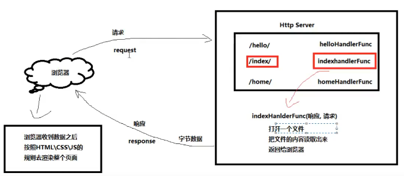
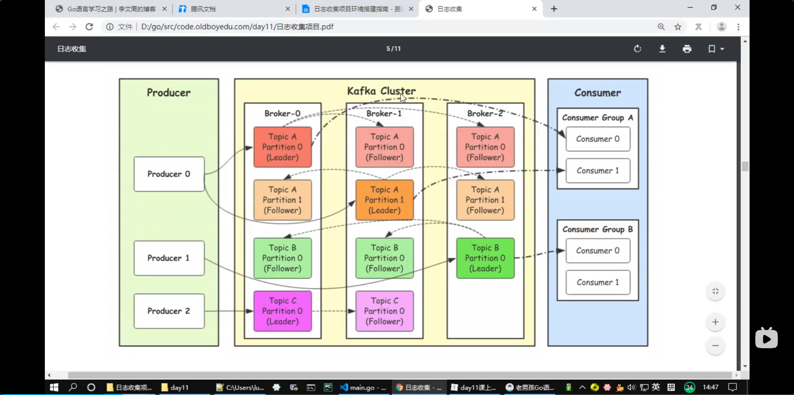
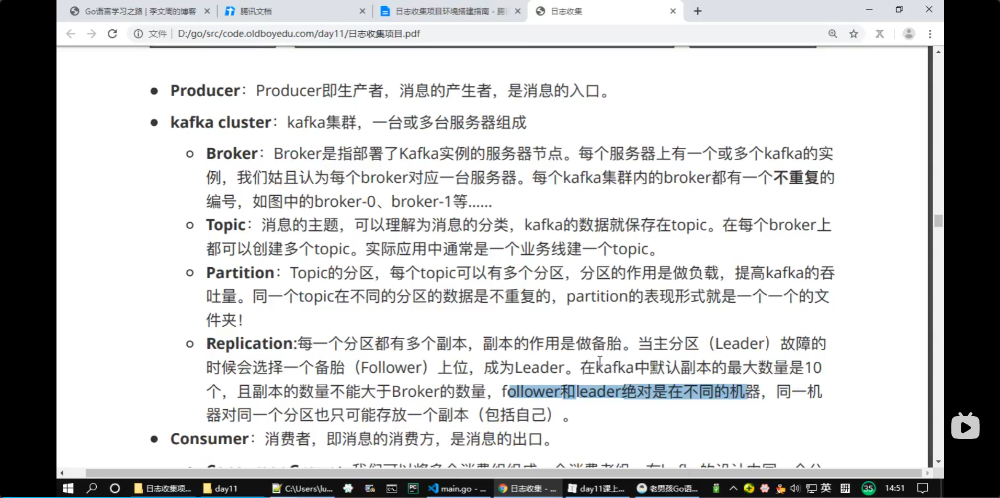
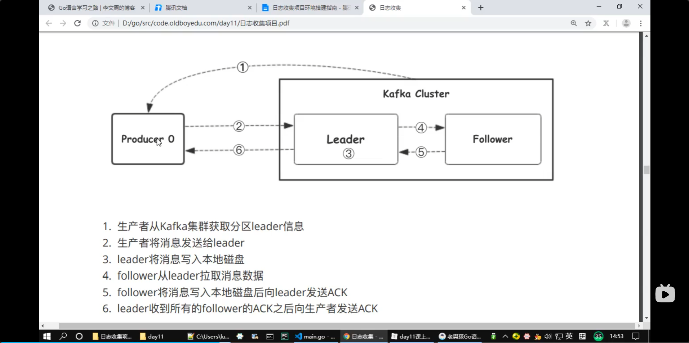
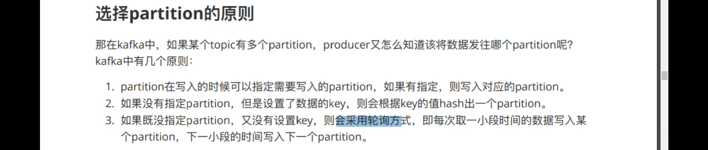
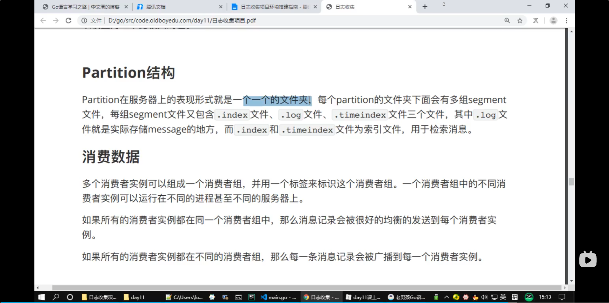
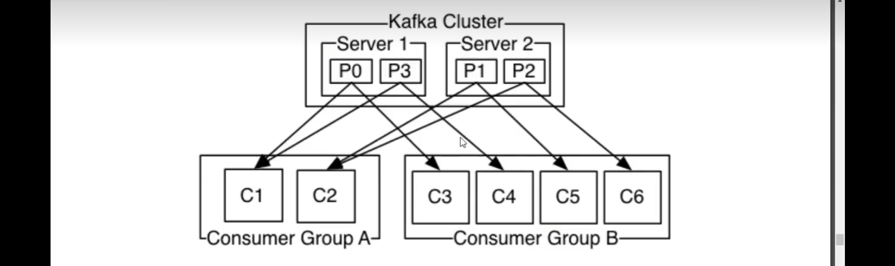

# 库

## time
> time 包提供了一些关于时间显示和测量用的函数。time 包中日历的计算采用的是公历，不考虑润秒。

### 时间类别

**时间类型**
> 通过time.Now函数获取当前的时间对象，然后从时间对象中可以获取到年、月、日、时、分、秒等信息。
```go
// timeDemo 时间对象的年月日时分秒
func timeDemo() {
	now := time.Now() // 获取当前时间
	fmt.Printf("current time:%v\n", now)

	year := now.Year()     // 年
	month := now.Month()   // 月
	day := now.Day()       // 日
	hour := now.Hour()     // 小时
	minute := now.Minute() // 分钟
	second := now.Second() // 秒
	fmt.Println(year, month, day, hour, minute, second)
}
```

**Location和time zone**
>  location 来映射具体的时区。时区（Time Zone）是根据世界各国家与地区不同的经度而划分的时间定义，全球共分为24个时区。中国差不多跨5个时区，但为了使用方便只用东八时区的标准时即北京时间为准
**Unix Time**
> Unix Time是自1970年1月1日 00:00:00 UTC 至当前时间经过的总秒数

```go
// timestampDemo 时间戳
func timestampDemo() {
	now := time.Now()        // 获取当前时间
	timestamp := now.Unix()  // 秒级时间戳
	milli := now.UnixMilli() // 毫秒时间戳 Go1.17+
	micro := now.UnixMicro() // 微秒时间戳 Go1.17+
	nano := now.UnixNano()   // 纳秒时间戳
	fmt.Println(timestamp, milli, micro, nano)
}
```


### 时间操作

**Add**
`func (t Time) Add(d Duration) Time`
```go
func main() {
	now := time.Now()
	later := now.Add(time.Hour) // 当前时间加1小时后的时间
	fmt.Println(later)
}
```

**Sub**
> 两个时间之间的差值

`func (t Time) Sub(u Time) Duration`
> 返回一个时间段t-u。如果结果超出了Duration可以表示的最大值/最小值，将返回最大值/最小值。要获取时间点t-d（d为Duration），可以使用t.Add(-d)。

**Equal**
`func (t Time) Equal(u Time) bool`
> 判断两个时间是否相同，会考虑时区的影响，因此不同时区标准的时间也可以正确比较。本方法和用t==u不同，这种方法还会比较地点和时区信息。

**Before**
`func (t Time) Before(u Time) bool`
> 如果t代表的时间点在u之前，返回真；否则返回假。

**After**
`func (t Time) After(u Time) bool`
> 如果t代表的时间点在u之后，返回真；否则返回假。


**定时器**
使用time.Tick(时间间隔)来设置定时器，定时器的本质上是一个通道（channel）。
```go
func tickDemo() {
	ticker := time.Tick(time.Second) //定义一个1秒间隔的定时器
	for i := range ticker {
		fmt.Println(i)//每秒都会执行的任务
	}
}
```

**时间格式化**
> time.Format函数能够将一个时间对象格式化输出为指定布局的文本表示形式，需要注意的是 Go 语言中时间格式化的布局不是常见的Y-m-d H:M:S，而是使用 2006-01-02 15:04:05.000 （记忆口诀为2006 1 2 3 4 5）。
2006：年（Y）
01：月（m）
02：日（d）
15：时（H）
04：分（M）
05：秒（S）
> 如果想格式化为12小时格式，需在格式化布局中添加PM。
小数部分想保留指定位数就写0，如果想省略末尾可能的0就写 9。


**解析字符串格式的时间**
> 对于从文本的时间表示中解析出时间对象，time包中提供了time.Parse和time.ParseInLocation两个函数。
> 其中time.Parse在解析时不需要额外指定时区信息。


## log

**使用Logger**
> 提供了一些格式化输出的方法
> 调用函数Print系列（Print|Printf|Println）、Fatal系列（Fatal|Fatalf|Fatalln）、和Panic系列（Panic|Panicf|Panicln）来使用，比自行创建一个logger对象更容易使用
> logger会打印每条日志信息的日期、时间，默认输出到系统的标准错误。Fatal系列函数会在写入日志信息后调用os.Exit(1)。Panic系列函数会在写入日志信息后panic。

**配置logger**
- 标准logger的配置
  > log标准库中的Flags函数会返回标准logger的输出配置，而SetFlags函数用来设置标准logger的输出配置
```go
func Flags() int
func SetFlags(flag int)
```
- flag选项
  > log标准库提供了如下的flag选项，它们是一系列定义好的常量。
```go
const (
    // 控制输出日志信息的细节，不能控制输出的顺序和格式。
    // 输出的日志在每一项后会有一个冒号分隔：例如2009/01/23 01:23:23.123123 /a/b/c/d.go:23: message
    Ldate         = 1 << iota     // 日期：2009/01/23
    Ltime                         // 时间：01:23:23
    Lmicroseconds                 // 微秒级别的时间：01:23:23.123123（用于增强Ltime位）
    Llongfile                     // 文件全路径名+行号： /a/b/c/d.go:23
    Lshortfile                    // 文件名+行号：d.go:23（会覆盖掉Llongfile）
    LUTC                          // 使用UTC时间
    LstdFlags     = Ldate | Ltime // 标准logger的初始值
)
```

- 配置日志前缀
> log标准库中还提供了关于日志信息前缀的两个方法：
```go
func Prefix() string
func SetPrefix(prefix string)
```
> 其中Prefix函数用来查看标准logger的输出前缀，SetPrefix函数用来设置输出前缀。


- 配置日志输出位置
`func SetOutput(w io.Writer)`
> SetOutput函数用来设置标准logger的输出目的地，默认是标准错误输出。


**创建logger**
> log标准库中还提供了一个创建新logger对象的构造函数–New，支持我们创建自己的logger示例。New函数的签名如下：

`func New(out io.Writer, prefix string, flag int) *Logger`
>　New创建一个Logger对象。其中，参数out设置日志信息写入的目的地。参数prefix会添加到生成的每一条日志前面。参数flag定义日志的属性（时间、文件等等）。


## reflect
[reflect](https://www.liwenzhou.com/posts/Go/reflect/)

### reflect包
> 在Go语言的反射机制中，任何接口值都由是一个具体类型和具体类型的值两部分组成的
> 任意接口值在反射中都可以理解为由reflect.Type和reflect.Value两部分组成，并且reflect包提供了reflect.TypeOf和reflect.ValueOf两个函数来获取任意对象的Value和Type。

**TypeOf**
使用reflect.TypeOf()函数可以获得任意值的类型对象（reflect.Type），程序通过类型对象可以访问任意值的类型信息

- type name和type kind
  > 在反射中关于类型还划分为两种：类型（Type）和种类（Kind）
  > 种类（Kind）就是指底层的类型，但在反射中，当需要区分指针、结构体等大品种的类型时，就会用到种类（Kind）


**ValueOf**
> reflect.ValueOf()返回的是reflect.Value类型，其中包含了原始值的值信息。reflect.Value与原始值之间可以互相转换

reflect.Value类型提供的获取原始值的方法如下：
| 方法                     | 说明                                                                            |
| ------------------------ | ------------------------------------------------------------------------------- |
| Interface() interface {} | 将值以 interface{} 类型返回，可以通过类型断言转换为指定类型                     |
| Int() int64              | 将值以 int 类型返回，所有有符号整型均可以此方式返回                             |
| Uint() uint64            | 将值以 uint 类型返回，所有无符号整型均可以此方式返回                            |
| Float() float64          | 将值以双精度（float64）类型返回，所有浮点数（float32、float64）均可以此方式返回 |
| Bool() bool              | 将值以 bool 类型返回                                                            |
| Bytes() []bytes          | 将值以字节数组 []bytes 类型返回                                                 |
| String() string          | 将值以字符串类型返回                                                            |

- 通过反射获取值
- 通过反射设置变量的值
  > 想要在函数中通过反射修改变量的值，需要注意函数参数传递的是值拷贝，必须传递变量地址才能修改变量值。而反射中使用专有的Elem()方法来获取指针对应的值

```go
func reflectSetValue1(x interface{}) {
	v := reflect.ValueOf(x)
	if v.Kind() == reflect.Int64 {
		v.SetInt(200) //修改的是副本，reflect包会引发panic
	}
}
func reflectSetValue2(x interface{}) {
	v := reflect.ValueOf(x)
	// 反射中使用 Elem()方法获取指针对应的值
	if v.Elem().Kind() == reflect.Int64 {
		v.Elem().SetInt(200)
	}
}
```

**isNil()**
`func (v Value) IsNil() bool`
IsNil()报告v持有的值是否为nil。v持有的值的分类必须是通道、函数、接口、映射、指针、切片之一；否则IsNil函数会导致panic。

**isValid()**
`func (v Value) IsValid() bool`
IsValid()返回v是否持有一个值。如果v是Value零值会返回假，此时v除了IsValid、String、Kind之外的方法都会导致panic。

> ***总结***：IsNil()常被用于判断指针是否为空；IsValid()常被用于判定返回值是否有效

### 结构体反射
**与结构体相关的方法**
任意值通过reflect.TypeOf()获得反射对象信息后，如果它的类型是结构体，可以通过反射值对象（reflect.Type）的NumField()和Field()方法获得结构体成员的详细信息。

reflect.Type中与获取结构体成员相关的的方法如下表所示。

| 方法                                                        | 说明                                                                    |
| ----------------------------------------------------------- | ----------------------------------------------------------------------- |
| Field(i int) StructField                                    | 根据索引，返回索引对应的结构体字段的信息。                              |
| NumField() int                                              | 返回结构体成员字段数量。                                                |
| FieldByName(name string) (StructField, bool)                | 根据给定字符串返回字符串对应的结构体字段的信息。                        |
| FieldByIndex(index []int) StructField                       | 多层成员访问时，根据 []int 提供的每个结构体的字段索引，返回字段的信息。 |
| FieldByNameFunc(match func(string) bool) (StructField,bool) | 根据传入的匹配函数匹配需要的字段。                                      |
| NumMethod() int                                             | 返回该类型的方法集中方法的数目                                          |
| Method(int) Method                                          | 返回该类型方法集中的第i个方法                                           |
| MethodByName(string)(Method, bool)                          | 根据方法名返回该类型方法集中的方法                                      |

**StructField类型**
> StructField类型用来描述结构体中的一个字段的信息。

```go
type StructField struct {
    // Name是字段的名字。PkgPath是非导出字段的包路径，对导出字段该字段为""。
    // 参见http://golang.org/ref/spec#Uniqueness_of_identifiers
    Name    string
    PkgPath string
    Type      Type      // 字段的类型
    Tag       StructTag // 字段的标签
    Offset    uintptr   // 字段在结构体中的字节偏移量
    Index     []int     // 用于Type.FieldByIndex时的索引切片
    Anonymous bool      // 是否匿名字段
}
```

## strconv
> strconv包实现了基本数据类型与其字符串表示的转换，主要有以下常用函数： Atoi()、Itoa()、parse系列、format系列、append系列。


**string与int类型转换**
- Atoi()
Atoi()函数用于将字符串类型的整数转换为int类型，函数签名如下
`func Atoi(s string) (i int, err error)`
- Itoa()
Itoa()函数用于将int类型数据转换为对应的字符串表示，具体的函数签名如下。
`func Itoa(i int) string`
- a的典故
【扩展阅读】这是C语言遗留下的典故。C语言中没有string类型而是用字符数组(array)表示字符串，所以Itoa对很多C系的程序员很好理解。


**Parse系列函数**
> Parse类函数用于转换字符串为给定类型的值：ParseBool()、ParseFloat()、ParseInt()、ParseUint()。

- ParseBool()
`func ParseBool(str string) (value bool, err error)`
返回字符串表示的bool值。它接受1、0、t、f、T、F、true、false、True、False、TRUE、FALSE；否则返回错误。

- ParseInt()
`func ParseInt(s string, base int, bitSize int) (i int64, err error)`
返回字符串表示的整数值，接受正负号。

> base指定进制（2到36），如果base为0，则会从字符串前置判断，“0x"是16进制，“0"是8进制，否则是10进制；
> bitSize指定结果必须能无溢出赋值的整数类型，0、8、16、32、64 分别代表 int、int8、int16、int32、int64；
> 返回的err是*NumErr类型的，如果语法有误，err.Error = ErrSyntax；如果结果超出类型范围err.Error = ErrRange。

- ParseUnit()
`func ParseUint(s string, base int, bitSize int) (n uint64, err error)`
ParseUint类似ParseInt但不接受正负号，用于无符号整型。
- ParseFloat()
`func ParseFloat(s string, bitSize int) (f float64, err error)`
解析一个表示浮点数的字符串并返回其值。
> 如果s合乎语法规则，函数会返回最为接近s表示值的一个浮点数（使用IEEE754规范舍入）。
> bitSize指定了期望的接收类型，32是float32（返回值可以不改变精确值的赋值给float32），64是float64；
> 返回值err是*NumErr类型的，语法有误的，err.Error=ErrSyntax；结果超出表示范围的，返回值f为±Inf，err.Error= ErrRange。

**Format系列函数**
Format系列函数实现了将给定类型数据格式化为string类型数据的功能。

- FormatBool()
`func FormatBool(b bool) string`
> 根据b的值返回"true"或"false”。

- FormatInt()
`func FormatInt(i int64, base int) string`
> 返回i的base进制的字符串表示。base 必须在2到36之间，结果中会使用小写字母’a’到’z’表示大于10的数字。

- FormatUint()
`func FormatUint(i uint64, base int) string`
> 是FormatInt的无符号整数版本。

- FormatFloat()
`func FormatFloat(f float64, fmt byte, prec, bitSize int) string`
> 函数将浮点数表示为字符串并返回。
> bitSize表示f的来源类型（32：float32、64：float64），会据此进行舍入。
> fmt表示格式：‘f’（-ddd.dddd）、‘b’（-ddddp±ddd，指数为二进制）、’e’（-d.dddde±dd，十进制指数）、‘E’（-d.ddddE±dd，十进制指数）、‘g’（指数很大时用’e’格式，否则’f’格式）、‘G’（指数很大时用’E’格式，否则’f’格式）。
> prec控制精度（排除指数部分）：对’f’、’e’、‘E’，它表示小数点后的数字个数；对’g’、‘G’，它控制总的数字个数。如果prec 为-1，则代表使用最少数量的、但又必需的数字来表示f。


**其他**
- isPrint()
`func IsPrint(r rune) bool`
返回一个字符是否是可打印的，和unicode.IsPrint一样，r必须是：字母（广义）、数字、标点、符号、ASCII空格。

- CanBackquote()
`func CanBackquote(s string) bool`
返回字符串s是否可以不被修改的表示为一个单行的、没有空格和tab之外控制字符的反引号字符串。

- 其他
除上文列出的函数外，strconv包中还有Append系列、Quote系列等函数。具体用法可查看官方文档。

## net/http

### net/http介绍
Go语言内置的net/http包提供了HTTP客户端和服务端的实现。

**HTTP协议**
> 超文本传输协议(HTTP，HyperText Transfer Protocol)是互联网上应用最为广泛的一种网络传输协议，所有的WWW文件都必须遵守这个标准。设计HTTP最初的目的是为了提供一种发布和接收HTML页面的方法。


### HTTP客户端

**基本的HTTP/HTTPS请求**


## flag
> Go语言内置的flag包实现了命令行参数的解析，flag包使得开发命令行工具更为简单。

### os.Args

简单的想要获取命令行参数，可以使用os.Args来获取命令行参数
os.Args是一个存储命令行参数的字符串切片，它的第一个元素是执行文件的名称

### flag包基本使用

**导入flag包**
`import flag`

**flag参数类型**
flag包支持的命令行参数类型有bool、int、int64、uint、uint64、float float64、string、duration

| flag参数     | 有效值                                                                                                   |
| ------------ | -------------------------------------------------------------------------------------------------------- |
| 字符串flag   | 合法字符串                                                                                               |
| 整数flag     | 1234、0664、0x1234等类型，也可以是负数。                                                                 |
| 浮点数flag   | 合法浮点数                                                                                               |
| bool类型flag | 1, 0, t, f, T, F, true, false, TRUE, FALSE, True, False。                                                |
| 时间段flag   | 任何合法的时间段字符串。如"300ms"、"-1.5h"、“2h45m”。合法的单位有"ns"、“us” /“µs”、“ms”、“s”、“m”、“h”。 |


**定义命令行flag参数**

- flag.Type()

基本格式如下：

`flag.Type(flag名, 默认值, 帮助信息)*Type`

- flag.TypeVar()

基本格式如下： 

`flag.TypeVar(Type指针, flag名, 默认值, 帮助信息)`


**查看帮助信息**
`xxx.exe -help`
`xxx.exe --help`

**flag.Parse()**
通过调用flag.Parse()来对命令行参数进行解析

> 支持的命令行参数格式有以下几种：
> + -flag xxx （使用空格，一个-符号）
> + --flag xxx （使用空格，两个-符号）
> + -flag=xxx （使用等号，一个-符号）
> + --flag=xxx （使用等号，两个-符号）
> 其中，布尔类型的参数必须使用等号的方式指定。

Flag解析在第一个非flag参数（单个"-"不是flag参数）之前停止，或者在终止符"–"之后停止。


**flag其他函数**

```go
flag.Args()  ////返回命令行参数后的其他参数，以[]string类型
flag.NArg()  //返回命令行参数后的其他参数个数
flag.NFlag() //返回使用的命令行参数个数
```

## sqlx

**sqlx介绍**
在项目中我们通常可能会使用database/sql连接MySQL数据库。sqlx可以认为是Go语言内置database/sql的超集，它在优秀的内置database/sql基础上提供了一组扩展。这些扩展中除了大家常用来查询的Get(dest interface{}, ...) error和Select(dest interface{}, ...) error外还有很多其他强大的功能。

**安装sqlx**
下载 sqlx依赖。

`go get github.com/jmoiron/sqlx`

### 基本使用
**连接数据库**
```go
import (
	"fmt"
	_ "github.com/go-sql-driver/mysql"  // 不要忘了导入数据库驱动
	"github.com/jmoiron/sqlx"
)

var db *sqlx.DB

func initDB() (err error) {
	dsn := "user:password@tcp(127.0.0.1:3306)/sql_test?charset=utf8mb4&parseTime=True"
	// 也可以使用MustConnect连接不成功就panic
	db, err = sqlx.Connect("mysql", dsn)
	if err != nil {
		fmt.Printf("connect DB failed, err:%v\n", err)
		return
	}
	db.SetMaxOpenConns(20)
	db.SetMaxIdleConns(10)
	return
}
```
**查询**
查询单行数据示例代码如下：
```go
// 查询单条数据示例
func queryRowDemo() {
	sqlStr := "select id, name, age from user where id=?"
	var u user
	err := db.Get(&u, sqlStr, 1)
	if err != nil {
		fmt.Printf("get failed, err:%v\n", err)
		return
	}
	fmt.Printf("id:%d name:%s age:%d\n", u.ID, u.Name, u.Age)
}
```
查询多行数据示例代码如下：
```go
// 查询多条数据示例
func queryMultiRowDemo() {
	sqlStr := "select id, name, age from user where id > ?"
	var users []user
	err := db.Select(&users, sqlStr, 0)
	if err != nil {
		fmt.Printf("query failed, err:%v\n", err)
		return
	}
	fmt.Printf("users:%#v\n", users)
}
```
**插入、更新和删除**
sqlx中的exec方法与原生sql中的exec使用基本一致：
```go
// 插入数据
func insertRowDemo() {
	sqlStr := "insert into user(name, age) values (?,?)"
	ret, err := db.Exec(sqlStr, "沙河小王子", 19)
	if err != nil {
		fmt.Printf("insert failed, err:%v\n", err)
		return
	}
	theID, err := ret.LastInsertId() // 新插入数据的id
	if err != nil {
		fmt.Printf("get lastinsert ID failed, err:%v\n", err)
		return
	}
	fmt.Printf("insert success, the id is %d.\n", theID)
}

// 更新数据
func updateRowDemo() {
	sqlStr := "update user set age=? where id = ?"
	ret, err := db.Exec(sqlStr, 39, 6)
	if err != nil {
		fmt.Printf("update failed, err:%v\n", err)
		return
	}
	n, err := ret.RowsAffected() // 操作影响的行数
	if err != nil {
		fmt.Printf("get RowsAffected failed, err:%v\n", err)
		return
	}
	fmt.Printf("update success, affected rows:%d\n", n)
}

// 删除数据
func deleteRowDemo() {
	sqlStr := "delete from user where id = ?"
	ret, err := db.Exec(sqlStr, 6)
	if err != nil {
		fmt.Printf("delete failed, err:%v\n", err)
		return
	}
	n, err := ret.RowsAffected() // 操作影响的行数
	if err != nil {
		fmt.Printf("get RowsAffected failed, err:%v\n", err)
		return
	}
	fmt.Printf("delete success, affected rows:%d\n", n)
}
```

**NamedExec**
DB.NamedExec方法用来绑定SQL语句与结构体或map中的同名字段。
```go
func insertUserDemo()(err error){
	sqlStr := "INSERT INTO user (name,age) VALUES (:name,:age)"
	_, err = db.NamedExec(sqlStr,
		map[string]interface{}{
			"name": "七米",
			"age": 28,
		})
	return
}
```

**NamedQuery**

与DB.NamedExec同理，这里是支持查询。

```go
func namedQuery(){
	sqlStr := "SELECT * FROM user WHERE name=:name"
	// 使用map做命名查询
	rows, err := db.NamedQuery(sqlStr, map[string]interface{}{"name": "七米"})
	if err != nil {
		fmt.Printf("db.NamedQuery failed, err:%v\n", err)
		return
	}
	defer rows.Close()
	for rows.Next(){
		var u user
		err := rows.StructScan(&u)
		if err != nil {
			fmt.Printf("scan failed, err:%v\n", err)
			continue
		}
		fmt.Printf("user:%#v\n", u)
	}

	u := user{
		Name: "七米",
	}
	// 使用结构体命名查询，根据结构体字段的 db tag进行映射
	rows, err = db.NamedQuery(sqlStr, u)
	if err != nil {
		fmt.Printf("db.NamedQuery failed, err:%v\n", err)
		return
	}
	defer rows.Close()
	for rows.Next(){
		var u user
		err := rows.StructScan(&u)
		if err != nil {
			fmt.Printf("scan failed, err:%v\n", err)
			continue
		}
		fmt.Printf("user:%#v\n", u)
	}
}
```


**事务操作**
对于事务操作，我们可以使用sqlx中提供的db.Beginx()和tx.Exec()方法。示例代码如下：
```go
func transactionDemo2()(err error) {
	tx, err := db.Beginx() // 开启事务
	if err != nil {
		fmt.Printf("begin trans failed, err:%v\n", err)
		return err
	}
	defer func() {
		if p := recover(); p != nil {
			tx.Rollback()
			panic(p) // re-throw panic after Rollback
		} else if err != nil {
			fmt.Println("rollback")
			tx.Rollback() // err is non-nil; don't change it
		} else {
			err = tx.Commit() // err is nil; if Commit returns error update err
			fmt.Println("commit")
		}
	}()

	sqlStr1 := "Update user set age=20 where id=?"

	rs, err := tx.Exec(sqlStr1, 1)
	if err!= nil{
		return err
	}
	n, err := rs.RowsAffected()
	if err != nil {
		return err
	}
	if n != 1 {
		return errors.New("exec sqlStr1 failed")
	}
	sqlStr2 := "Update user set age=50 where i=?"
	rs, err = tx.Exec(sqlStr2, 5)
	if err!=nil{
		return err
	}
	n, err = rs.RowsAffected()
	if err != nil {
		return err
	}
	if n != 1 {
		return errors.New("exec sqlStr1 failed")
	}
	return err
}
```

### sqlx.In


## Redis

### Redis介绍

> Redis是一个开源的内存数据库，Redis提供了多种不同类型的数据结构，很多业务场景下的问题都可以很自然地映射到这些数据结构上。除此之外，通过复制、持久化和客户端分片等特性，我们可以很方便地将Redis扩展成一个能够包含数百GB数据、每秒处理上百万次请求的系统。

**Redis支持的数据结构**
Redis支持诸如字符串（string）、哈希（hashe）、列表（list）、集合（set）、带范围查询的排序集合（sorted set）、bitmap、hyperloglog、带半径查询的地理空间索引（geospatial index）和流（stream）等数据结构。


**Redis应用场景**
缓存系统，减轻主数据库（MySQL）的压力。
计数场景，比如微博、抖音中的关注数和粉丝数。
热门排行榜，需要排序的场景特别适合使用ZSET。
利用 LIST 可以实现队列的功能。
利用 HyperLogLog 统计UV、PV等数据。
使用 geospatial index 进行地理位置相关查询。

**准备Redis环境**
读者可以选择在本机安装 redis 或使用云数据库，这里直接使用Docker启动一个 redis 环境，方便学习使用。

使用下面的命令启动一个名为 redis507 的 5.0.7 版本的 redis server环境。

`docker run --name redis507 -p 6379:6379 -d redis:5.0.7`
> *注意*： 此处的版本、容器名和端口号可以根据自己需要设置。

启动一个 `redis-cli` 连接上面的 `redis server`。

`docker run -it --network host --rm redis:5.0.7 redis-cli`

### go-redis库
**安装**
Go 社区中目前有很多成熟的 redis client 库，比如https://github.com/gomodule/redigo 和https://github.com/redis/go-redis，读者可以自行选择适合自己的库。本文使用 go-redis 这个库来操作 Redis 数据库。

使用以下命令下安装 go-redis 库。

安装v8版本：

`go get github.com/redis/go-redis/v8`
安装v9版本：

`go get github.com/redis/go-redis/v9`


## Context

### Context初识

Go1.7加入了一个新的标准库context，它定义了Context类型，专门用来简化 对于处理单个请求的多个 goroutine 之间与请求域的数据、取消信号、截止时间等相关操作，这些操作可能涉及多个 API 调用。

对服务器传入的请求应该创建上下文，而对服务器的传出调用应该接受上下文。它们之间的函数调用链必须传递上下文，或者可以使用WithCancel、WithDeadline、WithTimeout或WithValue创建的派生上下文。当一个上下文被取消时，它派生的所有上下文也被取消。

### Context接口
context.Context是一个接口，该接口定义了四个需要实现的方法。
具体签名如下：
```go
type Context interface {
    Deadline() (deadline time.Time, ok bool)
    Done() <-chan struct{}
    Err() error
    Value(key interface{}) interface{}
}
```
> 其中：
> - Deadline方法需要返回当前Context被取消的时间，也就是完成工作的截止时间（deadline）；
> - Done方法需要返回一个Channel，这个Channel会在当前工作完成或者上下文被取消之后关闭，多次调用Done方法会返回同一个Channel；
> - Err方法会返回当前Context结束的原因，它只会在Done返回的Channel被关闭时才会返回非空的值；
>   + 如果当前Context被取消就会返回Canceled错误；
>   + 如果当前Context超时就会返回DeadlineExceeded错误；
> - Value方法会从Context中返回键对应的值，对于同一个上下文来说，多次调用Value 并传入相同的Key会返回相同的结果，该方法仅用于传递跨API和进程间跟请求域的数据；

**Background()和TODO()**

Go内置两个函数：Background()和TODO()，这两个函数分别返回一个实现了Context接口的background和todo。我们代码中最开始都是以这两个内置的上下文对象作为最顶层的partent context，衍生出更多的子上下文对象。

Background()主要用于main函数、初始化以及测试代码中，作为Context这个树结构的最顶层的Context，也就是根Context。

TODO()，它目前还不知道具体的使用场景，如果我们不知道该使用什么Context的时候，可以使用这个。

background和todo本质上都是emptyCtx结构体类型，是一个不可取消，没有设置截止时间，没有携带任何值的Context。

### With系列函数

**WithCancel**

WithCancel的函数签名如下：

`func WithCancel(parent Context) (ctx Context, cancel CancelFunc)`
WithCancel返回带有新Done通道的父节点的副本。当调用返回的cancel函数或当关闭父上下文的Done通道时，将关闭返回上下文的Done通道，无论先发生什么情况。

**WithDeadline**

WithDeadline的函数签名如下：

`func WithDeadline(parent Context, deadline time.Time) (Context, CancelFunc)`
返回父上下文的副本，并将deadline调整为不迟于d。如果父上下文的deadline已经早于d，则WithDeadline(parent, d)在语义上等同于父上下文。当截止日过期时，当调用返回的cancel函数时，或者当父上下文的Done通道关闭时，返回上下文的Done通道将被关闭，以最先发生的情况为准。
取消此上下文将释放与其关联的资源，因此代码应该在此上下文中运行的操作完成后立即调用cancel。

**WithTimeout**

WithTimeout的函数签名如下：

`func WithTimeout(parent Context, timeout time.Duration) (Context, CancelFunc)`
WithTimeout返回WithDeadline(parent, time.Now().Add(timeout))。

取消此上下文将释放与其相关的资源，因此代码应该在此上下文中运行的操作完成后立即调用cancel，通常用于数据库或者网络连接的超时控制。

**WithTimeout**

WithTimeout的函数签名如下：

`func WithTimeout(parent Context, timeout time.Duration) (Context, CancelFunc)`
WithTimeout返回WithDeadline(parent, time.Now().Add(timeout))。

取消此上下文将释放与其相关的资源，因此代码应该在此上下文中运行的操作完成后立即调用cancel，通常用于数据库或者网络连接的超时控制。

**WithValue**

WithValue函数能够将请求作用域的数据与 Context 对象建立关系。声明如下：

`func WithValue(parent Context, key, val interface{}) Context`

WithValue返回父节点的副本，其中与key关联的值为val。

仅对API和进程间传递请求域的数据使用上下文值，而不是使用它来传递可选参数给函数。

所提供的键必须是可比较的，并且不应该是string类型或任何其他内置类型，以避免使用上下文在包之间发生冲突。WithValue的用户应该为键定义自己的类型。为了避免在分配给interface{}时进行分配，上下文键通常具有具体类型struct{}。或者，导出的上下文关键变量的静态类型应该是指针或接口。


**使用Context的注意事项**
推荐以参数的方式显示传递Context
以Context作为参数的函数方法，应该把Context作为第一个参数。
给一个函数方法传递Context的时候，不要传递nil，如果不知道传递什么，就使用context.TODO()
Context的Value相关方法应该传递请求域的必要数据，不应该用于传递可选参数
Context是线程安全的，可以放心的在多个goroutine中传递
  


## kafka

### kafka架构






### 工作流程



### partition选择



### partition结构和消费数据





## Gin
Gin是一个用Go语言编写的web框架。它是一个类似于martini但拥有更好性能的API框架, 由于使用了httprouter，速度提高了近40倍。 如果你是性能和高效的追求者, 你会爱上Gin

### Gin框架介绍
Go世界里最流行的Web框架，Github上有32K+star。 基于httprouter开发的Web框架。 中文文档齐全，简单易用的轻量级框架。

### Gin框架安装与使用


**安装**
下载并安装Gin:

`go get -u github.com/gin-gonic/gin`


