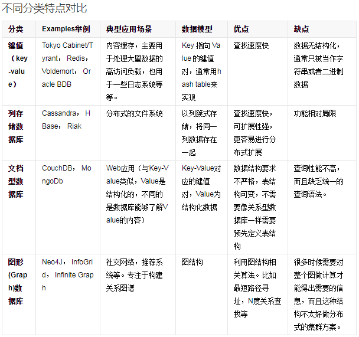
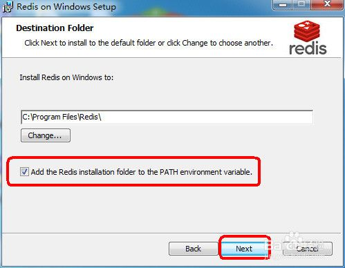
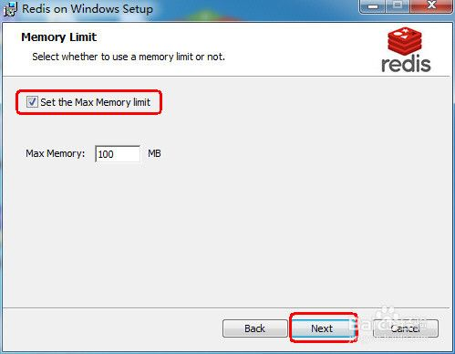
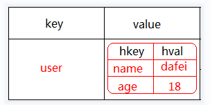
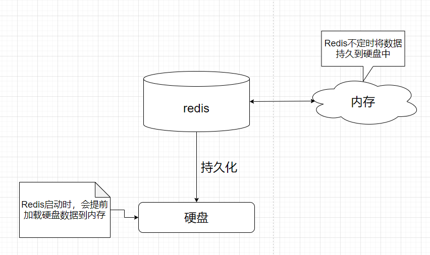
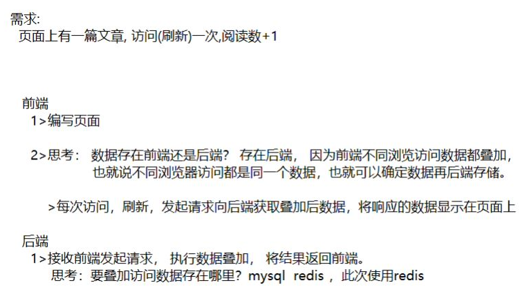

# 教学目标

1>了解NoSQL概念

2>了解Redis概念，定位，优点，缺点

3>掌握Redis常用五大类型

4>掌握Redis Key 与Value值设计

5>掌握Redis全局命令

6>掌握Redis 安全与事务操作

7>了解Redis持久化策略

8>了解Redis内存淘汰机制与过期Key清理

9>掌握Java集成Redis操作

10>完成综合案例设计与实现


# 认识 Redis

## 数据库分类

目前数据库分：关系型数据库与非关系型数据库

常用的关系型数据库： Oracle，**MySQL**，SqlServer，DB2

常用的非关系数据库：**Redis**，MongoDB，ElasticSearch， Hbase，Neo4j

那啥是非关系数据库呢？此处涉及到新名词：NoSQL

**NoSQL**最常见的解释是“non-relational”， “Not Only SQL”也被很多人接受。NoSQL仅仅是一个概念，泛指非关系型的数据库，区别于关系数据库，它们不保证关系数据的ACID特性。详情见：百度百科：https://baike.baidu.com/item/NoSQL/8828247?fr=aladdin

经典案例

*


## NoSQL分类

*


## 什么是Redis

### Redis简介

是以key-value形式存储,和传统的关系型数据库不一样.不一定遵循传统数据库的一些基本要求.(非关系型的,分布式的,开源的,水平可拓展的)

优点:
	**对数据高并发读写**(直接是内存中进行读写的)
	对海量数据的高效率存储和访问
	对数据的可拓展性和高可用性.
    **单线程操作**,每个操作都是原子操作,没有并发相关问题(redis 6)

缺点:
	redis(ACID处理非常简单) 
	无法做太复杂的关系数据库模型

*

### 谁在用Redis

比较著名的公司有：
github、blizzard、stackoverflow、flickr

国内
新浪微博（全球最大的redis集群）【2017】
	2200+亿 commands/day 5000亿Read/day 500亿Write/day
	18TB+ Memory
	500+ Servers in 6 IDC 2000+instances
淘宝
腾讯微博


### 怎么学redis

redis在线入门 ： http://try.redis.io/
redis 中文资料站： http://www.redis.cn/
https://www.runoob.com/redis/redis-tutorial.html


### Redis的安装

题外话：

Redis是使用C写的程序，目前主流在Linux操作系统，官方不提供Window版，最新的Redis版：Redis7.x

官网下载：https://redis.io/download/


Redis 的Window版是微软公司自行移植的，目前最新版：Redis-x64-3.2.100

window版：https://github.com/microsoftarchive/redis/releases/tag/win-3.2.100


新版控的同学：

1>购买阿里云Redis

https://www.aliyun.com/minisite/goods?taskPkg=amb618all&pkgSid=442814&recordId=4183761&userCode=sd4xtwwm

2>购买阿里云ECS

购买服务器，自己搭建最新版的Redis

3>安装虚拟机：Linux，再安装最新版Redis

这个，项目三讲Linux操作系统时再教。


#### **服务端**

版本：Redis-x64-3.2.100.msi

傻瓜式安装,下一步,下一步就可以了

**注意：添加到环境变量中**

*

**注意：默认端口**

*

**注意：最大内存**

*


**测试是否成功**

*

*


#### **客户端**--redisclient

打开CMD命令框，输入命令：**java -jar  redisclient.jar**


#### **客户端**--RedisDesktopClient


#### **客户端**--rdm


# 数据类型

## 概况

Redis支持的存储数据类型有很多：

常用：**string**（字符串），**hash**（哈希），**list**（列表），**set**（集合）及**zset**(sorted set：有序集合)

不常用：HyperLogLog，Bitmap(位图)，Bloom Filter(布隆过滤器)，Geospatial(地理位置) ，Module(模块)， Streams(流信息)

此处重点讲解常用的类型。


**命令格式**

类型命令    key       参数数据

   set           name    dafei


**操作建议**

Redis操作有点类似Java的Map集合，都是key-value形式存储数据，在学习过程中，可以进行类比。

另外Redis中的key大部分为String类型，value值根据缓存数据结构可以选用：string，hash，list，set，zset等类型。


**注意：下面讲的各种类型，表述的是缓存数据的value类型。**


## String类型

String类型包含多种类型的特殊类型，并且是二进制安全的，其值可以是数值，可以是字符串，也可以是二进制数据。

类似Java中：**Map<String,  String/Number>  map**

在Redis内容数据存储结构：

*

### **常用的命令**

| 命令格式                | 功能                                               | 案例                |
| ----------------------- | -------------------------------------------------- | ------------------- |
| set key value           | 将key-value缓存redis中                             | set name dafei      |
| get key                 | 从redis中获取key对应value值                        | get name            |
| incr key                | 将key对应value值 + 1                               | incr age            |
| decr key                | 将key对应value值-1                                 | decr age            |
| setex key seconds value | 将key-value缓存到redis中，seconds 秒后失效         | setex  sex  10  man |
| ttl key                 | 查看key存活时间                                    | ttl sex             |
| del  key                | 从redis中删除key                                   | del name            |
| setnx key value         | 如果key已经存，不做任何操作，如果key不存，直接添加 | setnx  name xiaofei |


### **非常用命令**

| 命令格式                    | 功能                                                      | 案例                   |
| --------------------------- | --------------------------------------------------------- | ---------------------- |
| incrby key increment        | 给key对应值加increment                                    | incrby age 10          |
| mset k1 v1 k2 v2....        | 批量添加k1v1 k2v2 key value对                             | mset name dafei age 18 |
| mget k1  k2....             | 批量获取k1, k2的值                                        | mget name  age         |
| append key  value           | 在key对应的value值中拼+value                              | append name yes        |
| setrange key  offset  value | 修改key对应的value值,替换为指定value,冲offset索引位置开始 | setrange name 2   xx   |


### 应用场景

1>计数器

如：视频播放数系统就是使用redis作为视频播放数计数的基础组件。

**incr  viewnum 1**


2>共享session

出于负载均衡的考虑，分布式服务会将用户信息的访问均衡到不同服务器上，用户刷新一次访问可能会需要重新登录，为避免这个问题可以用redis将用户session集中管理，  在这种模式下只要保证redis的高可用和扩展性的，每次获取用户更新或查询登录信息都直接从redis中集中获取。


**user_login_info:uid---->{"id":1, "name":"dafei", "age":18}**


## Hash类型

Hash类型是String类型的field和value的映射表，或者说是一个String集合。它特别适合存储对象，相比较而言，将一个对象存储在Hash类型里要比存储在String类型里占用更少的内存空间。

类似Java中：**Map<String, Map<String, ?>> map**

*

### **常用的命令**

| 命令格式                       | 功能                                                | 案例                 |
| ------------------------------ | --------------------------------------------------- | -------------------- |
| hset key field  value          | 将field  value对缓存到redis中hash中，键值为key      | hset user name dafei |
| hget key field                 | 从key对应hash列表中获取field字段                    | hget user  name      |
| hexists key  field             | 判断key对应的hash列表是否存在 field字段             | hexists user age     |
| hdel key  field                | 删除key对应hash列表中field字段                      | hdel user age        |
| hincrby  key  field  increment | 给key对应hash列表中field字段 + increment            | hincrby user  age 10 |
| hlen key                       | 查看key对应的hash列表field的数量                    | hlen user            |
| hkeys  key                     | 获取key对应的hash列表所有的field值                  | hkeys  user          |
| hvals  key                     | 获取key对应的hash列表所有的field对应的value值       | kvals  user          |
| hgetall key                    | 获取key对应的hash列表中所有的field及其对应的value值 | hgetall user         |


### 应用场景

Hash结构相对于字符串序列化缓存信息更加直观，并且在更新操作上更加便捷。

**共享session设计**

```java
public class User{
	private String userame;
	private String password;
	private  int age;
}
```

登录用户：

```java
User user = new User("dafei", "666", 18);
```


登录缓存：

key：**user_token**                value：**new User("dafei", "666", 18)**

\----------------------------------------------------------------------------------------------

方案1： 将user对象转换json格式字符串存redis  【侧重于查， 改非常麻烦】

key                            value

\---------------------------------------------------------------------------------------------

**user_token**   ：   **"{name:dafei, age:18, password:666}"**


方案2： 将user对象转换hash对象存redis【侧重于改，查询相对麻烦】

key                            value

\---------------------------------------------------------------------------------------------

**user_token**   ：  **{**

​                                    **name：ddafei**

​                                    **age ：    18**

​                                    **password： 666**

​                                 **}**


## List类型

Redis中的List类似Java中的Queue,也可以当做List来用.

List类型是一个链表结构的集合，其主要功能有push、pop、获取元素等，更详细的说,List类型是一个双端链表的结构，我们可以通过相关操作进行集合的头部或者尾部添加删除元素，List的设计非常简单精巧，即可以作为栈,又可以作为队列，满足绝大多数需求.

类似Java中：**Map<String, List>  map**

*


### **常用的命令**

| 命令格式              | 功能                                                 | 案例              |
| --------------------- | ---------------------------------------------------- | ----------------- |
| rpush  key  value     | 从右边往key集合中添加value值                         | rpush hobby java  |
| lrange key start stop | 从左边开始列表key集合，从start位置开始，stop位置结束 | lrange hobby 0 -1 |
| lpush key value       | 从左边往key集合中添加value值                         | lpush hobby c++   |
| lpop key              | 弹出key集合中最左边的数据                            | lpop hobby        |
| rpop key              | 弹出key集合中最右边的数据                            | rpop hobby        |
| llen key              | 获取列表长度                                         | llen hooby        |


### **非常用命令**

| 命令格式                        | 功能                                    | 案例                          |
| ------------------------------- | --------------------------------------- | ----------------------------- |
| linsert key before pivot value  | 操作key集合，在pivot值之前插入value     | linsert hobby before java  c# |
| linsert key  after  pivot value | 操作key集合，在pivot值之后插入value     | linsert hobby after  java  c# |
| lset key  index  value          | 操作key集合，更新索引index位置值为value | lset hobby 1  go              |
| lrem key count  value           | 操作key集合，删除 count个 value值       | lrem hobby 3   go             |
| ltrim   key  start stop         | 操作key集合，从start到stop截取自列表    | ltrim  hobby 2   4            |
| lindex  key  index              | 操作key集合，获取索引为index位置的数据  | lindex  hobby 1               |


### 应用场景

1>用户收藏文章列表：

key：user_favor_article_list

value: [aid1, aid2, aid3......]


## Set类型

Set集合是String类型的无序集合,set是通过HashTable实现的，对集合我们可以取**交集、并集、差集。**

类似Java中：**Map<String, Set>  map**

*


### **常用的命令**

| 命令格式                 | 功能                           | 案例               |
| ------------------------ | ------------------------------ | ------------------ |
| sadd key  members [....] | 往key 集合中添加member元素     | sadd myset a  b  c |
| smembers key             | 遍历key集合中所有的元素        | smembers myset     |
| srem  key members [....] | 删除key集合中members元素       | srem myset a       |
| spop key count           | 从key集合中随机弹出count个元素 | spop myset 1       |


### **非常用命令**

| 命令格式                        | 功能                                                 | 案例                         |
| ------------------------------- | ---------------------------------------------------- | ---------------------------- |
| **sdiff key1   key2**           | **返回key1中特有的元素(差集)**                       | **sdiff key1 key2**          |
| sidiffstore  dest  key1 key2    | 返回key1中特有的元素，并将返回值缓存到dest集合中     | sidiffstore  dest  key1 key2 |
| **sinter key1 key2**            | **返回key1跟key2集合的交集**                         | **sinter key1 key2**         |
| sinterstore  dest key1 key2     | 返回key1跟key2集合的交集，并将返回值缓存到dest集合中 | sinterstore  dest key1 key2  |
| **sunion key1  key2**           | **返回key1跟key2集合的并集**                         | **sunion key1  key2**        |
| sunionstore dest key1  key2     | 返回key1跟key2集合的并集，并将返回值缓存到dest集合中 | sunionstore dest key1  key2  |
| smove source destination member | 将source集合中member元素移动到destination集合中      | smove key1  key2 aa          |
| sismember key member            | 判断member元素是否在key集合中                        | sismember key1   aa          |
| srandmember  key  count         | 随机获取set集合中count 个元素                        | srandmember key1 1           |

### 应用场景

1，去重；

2，抽奖;

​           1：准备一个抽奖池:sadd luckydraw 1 2 3 4 5 6 7 8 9 10 11 12 13

​           2：抽3个三等奖:spop luckydraw 3

​           3：抽2个二等奖:spop luckydraw 2

​		   4：抽1个:一等奖:spop luckydraw 1


## Sorted set 类型

Sorted set 也称Zset类型，是一种具有排序效果的set集合。它跟set集合一样也是 string 类型元素的集合，且不允许重复的成员。并且要求每个元素都会关联一个double 类型的分数。后续可以通过分数来为集合中的成员进行从小到大的排序。

Sorted set集合是通过哈希表实现的，所以添加，删除，查找的复杂度都是 O(1)。 集合中最大的成员数为 232 - 1 (4294967295, 每个集合可存储40多亿个成员)。

数据缓存结构：

*


### **常用的命令**

| 命令格式                                | 功能                                       | 案例                               |
| --------------------------------------- | ------------------------------------------ | ---------------------------------- |
| zadd key score member                   | 往key集合中添加member元素，分数为score     | zadd players 100  a                |
| zincrby  key increment  member          | 将key集合中的member元素 分数 + increment   | zadd players 100  a                |
| zrange  key  start  stop [withscores]   | 将key集合中的元素按分数升序排列 [显式分数] | zrange players 0 -1  withscores    |
| zrevrange key  start  stop [withscores] | 将key集合中的元素按分数降序排列 [显式分数] | zrevrange players 0 -1  withscores |
| zrank  key  member                      | 返回member元素在key结合中的正序排名        | zrank players  a                   |
| zrevrank key  member                    | 返回member元素在key结合中的倒序排名        | zrevrank players  a                |
| zcard  key                              | 返回key集合元素个数                        | zcard  players                     |


### **非常用命令**

| 命令格式                                     | 功能                                          | 案例                                           |
| -------------------------------------------- | --------------------------------------------- | ---------------------------------------------- |
| zrangebyscore  key  min  max  [withscores]   | 按[min, max) 分数范围返回key集合中元素(正序)  | zrangebyscore players  200 300  withscores     |
| zrevrangebyscore key  min  max  [withscores] | 按[min, max) 分数范围返回key集合中元素(倒序)  | zrevrangebyscore players  200 300  withscores  |
| zrem key member                              | 删除key集合中member元素与分数                 | zrem players  a                                |
| zremrangebyscore  key min max  withscores    | 按[min, max) 分数范围删除key集合中元素        | zremrangebyscore  players  200 300  withscores |
| zremrangebyrank  key start  stop             | 删除key集合正序排名落在[start, stop) 范围元素 | zremrangebyrank  players  10  20               |
| zcount key min max                           | 按照分数范围[min, max]统计key集合中元素个数   | zcount  players  100 300                       |


### 应用场景

排行榜：有序集合经典使用场景。例如视频网站需要对用户上传的视频做排行榜，榜单维护可能是多方面：按照时间、按照播放量、按照获得的赞数等。


## 类型总结

一个问题，Redis在项目中如何使用？

思考点：

1>项目是否需要使用到缓存？使用

2>使用缓存是否选用Redis？选用

3>使用Redis那该怎么设计Key-Value值？

这里重点讨论Redis的KV对的设计。


### Value设计

先说value值的设计其实就是value类型选用： String， Hash， List， Set， Sort Set

一般考虑：

- 是否需要排序？要使用Sort Set
- 缓存的数据是多个值还是单个值，
- 多个值：允许重复选List  不允许重复选择Set
- 单个值：简单值选择String， 对象值选择Hash


一种取巧的方式：

- 是否需要排序？要使用Sort Set
- 剩下使用String


操作方式：

所有value之后都转换成json格式字符串，然后缓存到Redis，原因：Java操作方便，减少泛型操作麻烦

比如：

```java
List<String>list = ...
Set<String> set = ....
Map<String, Object> map = ....


List<Object>  list = redis对象.getList
Set<Object> set =redis对象.getSet   
Map<Object, Object> map  =  redis对象.getMap
```

不管存放啥数据类型，从reds中获取出来都是Object类型，后续对象强制转换麻烦，干脆直接使用字符串。


### Key设计

Redis 的key 设计讲究4个性：

#### **唯一性**

Redis 类似Map集合，key必须保证唯一，缓存同一个key时，后者会覆盖前者，所有必须要求唯一，那如何保证唯一呢？

最常用的方式：**使用缓存数据的主键作为key**。

比如：缓存员工信息

key                             value

\----------------------------------------------------------------

1           					 员工1

2            					员工2

其中的1， 2 是员工的id


#### **可读性**

可读性是保证Redis的key能做到见名知意，上面的员工id1， 员工id2 虽说能保证key唯一，但可读性非常差，维护key时，无法从， 1， 2中快速判断该key对应value值。所以一一般在保证key唯一的前提下，给key加上前缀：

key                                       value

\----------------------------------------------------------------

employee_info:id1            员工1

employee_info:id2            员工2


employee_info:id1     employee_info:id2  这样子设计key，可读性就好多了。


可读性前缀的设计规范千奇百怪，我个人比较推崇的：

- 普通单值

  key                                       value

  \----------------------------------------------------------------

  employe_info:id1              员工对象信息
  
  

- 类似关系型数据库设计

  **表名:主键名:主键值:列名**

  key                                       value

  \----------------------------------------------------------------

  employee : id : 1:info        员工对象信息

  

- 通用玩法

  **业务模块名:业务逻辑含义:其他:value类型**

  key                                                        value

  \-----------------------------------------------------------------------

  employee :base.info:id1:hash         员工对象信息

  **业务模块名**：表示该key属于哪个功能模块

  **业务逻辑含义段**：这里可以使用  **.**  分开， 具体业务逻辑表示

  ​	比如：缓存员工权限

  ​    employee:auth.permission:id1:set     员工权限集合

  **其他**：一般设置唯一标识，比如主键

  **value类型**：key对应value类型值，提高可读性。

  

#### **灵活性**--项目二重点讲

这个难介绍，一般key保证唯一时，可以使用主键，有的使用，一个主键不能表达出全部意思，可以使用联合主键。

比如：

id为1的朋友圈下id为A的评论。

key                                                        value

\-----------------------------------------------------------------------

post:1:reply:A                                    评论内容

post:1:reply:B                                    评论内容


#### **时效性**

Redis key一定要设置过期时间。要跟自己的业务场景，需要对key设置合理的过期时间。可以在写入key时，就要追加过期时间；也可以在按照需要动态设置。

这里要注意：

- 不设置过期时间，这种key为永久key，会一直占用内存不释放，时间久了，数量一多，就容易达到服务器的内存上限，导致宕机，开发时一般配合Key过期策略使用哦。
- key的时效性设置，必须根据业务场景进行评估，设置合理有效期；


# Redis全局命令

全局命令针对的是所有的key，大部分用来做运维，做管理的

常用的全局key

| 命令格式            | 功能                                       | 案例                 |
| ------------------- | ------------------------------------------ | -------------------- |
| keys  pattern       | 按照pattern 匹配规则，列表redis中所有的key | keys xxx:*           |
| exists  key         | 判断key是否存在                            | exists name          |
| expire key  seconds | 给key设置过期时间，超时：seconds           | expire name 10       |
| persist key         | 取消key过期时间                            | persist  name        |
| select  index       | 切换数据库，默认是第0个，共有【0,15】个    | select 0             |
| move key   db       | 从当前数据库将key移动到指定db库            | move name 1          |
| randomkey           | 随机返回一个key                            | randomkey            |
| rename key newkey   | 将key改名为newkey                          | rename name  newname |
| echo message        | 打印message信息                            | echo  message        |
| dbsize              | 查看key个数                                | dbsize               |
| info                | 查看redis数据库信息                        | info                 |
| config get  *       | 查看所有redis配置信息                      | config get *         |
| flushdb             | 清空当前数据库                             | flushdb              |
| flushall            | 清空所有数据库                             | flushall             |


# Redis安全性

因为Redis速度非常快，所以在一台比较好的服务器下,一个外部用户在一秒内可以进行15w次的密码尝试，这意味你需要设定非常强大的密码来方式暴力破解。此时就需要对Redis进行密码设置啦。

**Linux系统**

编辑 redis.conf文件，找到下面进行保存修改
**requirepass 自定义密码**

重启Redis服务，访问时，使用带密码的命令：

**redis-cli -a 自定义密码**

否则会提示： (error)NOAUTH Authentication required.


Window系统

跟Linux系统一样，区别是，window系统的文件是

**redis.window-service.config**


# Redis事务[拓展]

一个事务从开始到执行会经历以下三个阶段：

- 开始事务。
- 命令入队。
- 执行事务。

借用：菜鸟教程中例子

它先以 **MULTI** 开始一个事务， 然后将多个命令入队到事务中， 最后由 **EXEC** 命令触发事务， 一并执行事务中的所有命令：

```bash
redis 127.0.0.1:6379> MULTI
OK

redis 127.0.0.1:6379> SET book-name "Mastering C++ in 21 days"
QUEUED

redis 127.0.0.1:6379> GET book-name
QUEUED

redis 127.0.0.1:6379> SADD tag "C++" "Programming" "Mastering Series"
QUEUED

redis 127.0.0.1:6379> SMEMBERS tag
QUEUED

redis 127.0.0.1:6379> EXEC
1) OK
2) "Mastering C++ in 21 days"
3) (integer) 3
4) 1) "Mastering Series"
   2) "C++"
   3) "Programming"
```

单个 Redis 命令的执行是原子性的，但 Redis 没有在事务上增加任何维持原子性的机制，所以 Redis 事务的执行并不是原子性的。

Redis事务可以理解为一个**打包的批量执行脚本**，但批量指令并非原子化的操作，中间某条指令的失败不会导致前面已做指令的回滚，也不会造成后续的指令不做。

```bash
127.0.0.1:6379> multi
OK
127.0.0.1:6379(TX)> set name dafei
QUEUED
127.0.0.1:6379(TX)> set age 18
QUEUED
127.0.0.1:6379(TX)> incr age 
QUEUED
127.0.0.1:6379(TX)> incr name
QUEUED
127.0.0.1:6379(TX)> get age
QUEUED
127.0.0.1:6379(TX)> get name
QUEUED
127.0.0.1:6379(TX)> exec
1) OK
2) OK
3) (integer) 19
4) (error) ERR value is not an integer or out of range
5) "19"
6) "dafei"
127.0.0.1:6379> 
```


Redis 事务可以一次执行多个命令， 并且带有以下三个重要的保证：

- 批量操作在发送 EXEC 命令前被放入队列缓存。
- 收到 EXEC 命令后进入事务执行，事务中任意命令执行失败，其余的命令依然被执行。
- 在事务执行过程，其他客户端提交的命令请求不会插入到事务执行命令序列中。


# Redis持久化机制[拓展]

## 引言

先来一个小实验，大家可以一起实现一下

步骤1：在Redis中添加2个key-value对

```bash
127.0.0.1:6379> set aa aa
OK
127.0.0.1:6379> set bb bb
OK
127.0.0.1:6379> keys *
```

步骤2：重启Redis 服务器，在执行keys * 观察数据

步骤3：分析结果

会出现一下几种结果：

- 之前的key在，aa  bb 都在（最理想的结果）
- 之前的key在，aa也在，bb不见了
- 之前的key在，aa， bb 不在
- 之前的key， aa， bb 都不在了（最坏的结果）

思考：

为啥会这样？以我们对内存的操作理解，按道理重启之后数据应该全丢失了，为啥Redis 可能丢失，也可能不丢失，为何？

这里就涉及到Redis的持久化机制了。

*


Redis持久化机制目前以后3种，分别为：

1>**快照方式**（RDB, Redis DataBase）

2>**文件追加方式**（AOF, Append Only File）

3>**混合持久化方式**（Redis4版本之后）


## RDB方式

Snapshotting(快照)默认方式，将内存数据中以快照的方式写入到二进制文件中，默认为dump.rdb。触发RDB持久化过程分手动触发与自动触发。


### 触发机制

**手动触发**

使用save命令：会阻塞当前Redis服务器，知道RDB过程完成为主，如果内存数据较多，会造成长时间阻塞，影响其他命令的使用，不建议轻易使用

使用bgsave命令：Redis进程执行fork指令创建子进程，由子进程实现RDB持久化，有需要时建议使用bgsave命令。

**自动触发**

使用save相关配置，格式： save m n      表示m秒内数据集存在n次修改时会自动触发bgsave命令。

```java
save 900 1  #900秒内如果超过1个Key被修改则发起快照保存
save 300 10 #300秒内如果超过10个key被修改,则发起快照保存
save 60 10000
```

*

### 优点

- RDB快照文件是一个紧凑压缩的二进制文件，非常使用用于备份，全量复制等场景。开发中可以按照每6小时执行一次bgsave备份，用于容灾备份。

- Redis加载RDB恢复数据远远快于AOF方式

### 缺点

- RDB无法做到实时持久化/秒级持久化，每次bgsave时都需要fork子进程，频繁执行有时间成本。
- RDB快照文件不同版本格式不一样，容易引起兼容问题。


## AOF方式

AOF与RDB不一样，它是一独立日志的方式记录每次写命令，重启时再重新执行AOF文件中命令达到恢复数据的目的。解决了数据持久化的实时性的问题。

Redis默认是不开启的，需要使用时，需要配置： **appendonly yes**

AOF 有3种文件同步策略

| 策略                 | 解释                                                   |
| -------------------- | ------------------------------------------------------ |
| appendfsync always   | 收到命令就立即写到磁盘,效率最慢.但是能保证完全的持久化 |
| appendfsync everysec | 每秒写入磁盘一次,在性能和持久化方面做了很好的折中      |
| appendfsync no       | 完全以依赖os，一般同步周期是30秒                       |

*

### 优点

- AOF方式数据安全性更高，配置得当，最多损失1秒的数据量
- 在不小心执行flushall命令，也可以通过AOF方式恢复(删除最后一个命令即可)

- AOF 日志是一个增量日志文件，不会存在断电时出现损坏问题。即使出现问题，redis-check-aof 工具也能够轻松修复它。
- 当 AOF 变得太大时，Redis 能够在后台自动重写 AOF


### 缺点

- 相同数据量来说，AOF文件体积通常大于RDB文件
- 数据持久化性能上来说，AOF 比 RDB 慢


## RDB-AOF混合方式

混合持久化是结合了 RDB 和 AOF 的优点，在写入的时候，先把当前的数据以 RDB 的形式写入文件的开头，再将后续的操作命令以 AOF 的格式存入文件。即以 RDB 作为全量备份，AOF 作为增量备份，来提高备份效率。这样既能保证 Redis 重启时的速度，又能防止数据丢失的风险， 这就是 Redis 4.0 之后推出的 **RDB-AOF 混合持久化模式，其作为默认配置来使用**。


## 持久化机制选择

- 如果对数据安全性有非常高的要求，建议 RDB 和 AOF 同时启用。

- 如果对数据安全性要求不是很高，能够容忍数据的丢失，建议单独使用 RDB。

- 不推荐单独使用 AOF，因为对于进行数据库备份、更快重启以及 AOF 引擎中出现错误的情况来说，RDB 是更好的选择。

- 如果没特殊要求，Redis又是4.x版本以上，可以选择RDB-AOF混合方式。

  

如果不是混合模式，而是普通的RDB与AOF一起启动时，Redis加载数据执行流程

*


# Redis内存淘汰机制[拓展]

## 引言

Redis 启动会加载一个配置：

```bash
maxmemory <byte>   //内存上限
```

默认值为 0 (window版的限制为100M)，表示默认设置Redis内存上限。但是真实开发还是需要提前评估key的体量，提前设置好内容上限。

此时思考一个问题，开发中，在设置完内存上限之后，如果Redis key达到上限了，该怎么办？这就设置到Redis的内存淘汰机制了。


## 内存淘汰算法

Redis内存淘汰机制也可以称之为key内卷机制，当资源不足时，该如何选择？

常见的内存淘汰机制分为四大类：

- **LRU：**LRU是Least recently used，最近最少使用的意思，简单的理解就是从数据库中删除最近最少访问的数据，该算法认为，你长期不用的数据，那么被再次访问的概率也就很小了，淘汰的数据为最长时间没有被使用，仅与时间相关。


- **LFU：**LFU是Least Frequently Used，最不经常使用的意思，简单的理解就是淘汰一段时间内，使用次数最少的数据，这个与频次和时间相关。

  

- **TTL：**Redis中，有的数据是设置了过期时间的，而设置了过期时间的这部分数据，就是该算法要解决的对象。如果你快过期了，不好意思，我内存现在不够了，反正你也要退休了，提前送你一程，把你干掉吧。

- 随机淘汰：生死有命，富贵在天，是否被干掉，全凭天意了。


## Redis淘汰策略

Redis 通过配置

```bash
maxmemroy-policy  
```

来配置指定具体的淘汰机制，可供选择的值有：

　通过maxmemroy-policy可以配置具体的淘汰机制，看了网上很多文章说只有6种，其实有8种，可以看Redis5.0的配置文件，上面有说明：

- volatile-lru -> 找出已经设置过期时间的数据集，将最近最少使用（被访问到）的数据干掉。
- volatile-ttl -> 找出已经设置过期时间的数据集，将即将过期的数据干掉。
- volatile-random -> 找出已经设置过期时间的数据集，进行无差别攻击，随机干掉数据。
- volatile-lfu -> 找出已经设置过期时间的数据集，将一段时间内，使用次数最少的数据干掉。


- allkeys-lru ->与第1个差不多，数据集从设置过期时间数据变为全体数据。
- allkeys-lfu -> 与第4个差不多，数据集从设置过期时间数据变为全体数据。
- allkeys-random -> 与第3个差不多，数据集从设置过期时间数据变为全体数据。


- no-enviction -> 什么都不干，报错，告诉你内存不足，这样的好处是可以保证数据不丢失

**系统默认选择： noenviction** 


# 过期Key处理[拓展]

接下讨论一个问题：Redis的key过期了，该如何清理问题。

Redis给出3种实现方案：

**惰性删除**：当访问Key时，才去判断它是否过期，如果过期，直接干掉。这种方式对CPU很友好，但是一个key如果长期不用，一直存在内存里，会造成内存浪费。

**定时删除**：设置键的过期时间的同时，创建一个定时器，当到达过期时间点，立即执行对Key的删除操作，这种方式对CPU不友好，得额外让出CPU维护定时器。

**定期删除**：隔一段时间，对数据进行一次检查，删除里面的过期Key，至于要删除多少过期Key，检查多少数据，则由算法决定。

**Redis服务器实际使用的是惰性删除和定期删除两种策略：通过配合使用这两种删除策略，可以很好地在合理使用CPU和避免浪费内存之间取得平衡。**


# Redis编程

## 概况

Redis编程就是使用编程方式操作Redis，当前Redis支持的编程语言有：https://redis.io/docs/clients/


这里以Java为开发语言，选择Java点击进去


java实现操作Redis的客户端有很多，其中名气最高的：**Redisson**，**Jedis**，**lettuce** 3个客户端，其中Jedis，lettuce侧重于单例Redis 数据库的 CRUD（增删改查），Redisson 侧重于分布式开发。当前重点讲解Jedis与lettuce的使用，后续有机会再重点讲解Redisson使用。


## Jedis

项目使用的SpringBoot，所以重点讲解SpringBoot继承Jedis

**步骤1：建项目，导入依赖**

```xml
<parent>
    <groupId>org.springframework.boot</groupId>
    <artifactId>spring-boot-starter-parent</artifactId>
    <version>2.4.3</version>
    <relativePath/> <!-- lookup parent from repository -->
</parent>
<dependencies>
    <dependency>
        <groupId>org.springframework.boot</groupId>
        <artifactId>spring-boot-starter</artifactId>
    </dependency>
    
    <dependency>
        <groupId>org.springframework.boot</groupId>
        <artifactId>spring-boot-starter-test</artifactId>
        <scope>test</scope>
    </dependency>

    <dependency>
        <groupId>redis.clients</groupId>
        <artifactId>jedis</artifactId>
    </dependency>

    <dependency>
        <groupId>org.projectlombok</groupId>
        <artifactId>lombok</artifactId>
    </dependency>
</dependencies>
```

**步骤2：导入配置文件**

```yml

#redis配置--jedis版
jedis:
  pool:
    #redis服务器的IP
    host: localhost
    #redis服务器的Port
    port: 6379
    #数据库密码
    password:
    #连接超时时间
    timeout: 7200
    #最大活动对象数
    maxTotall: 100
    #最大能够保持idel状态的对象数
    maxIdle: 100
    #最小能够保持idel状态的对象数
    minIdle: 50
    #当池内没有返回对象时，最大等待时间
    maxWaitMillis: 10000
    #当调用borrow Object方法时，是否进行有效性检查
    testOnBorrow: true
    #当调用return Object方法时，是否进行有效性检查
    testOnReturn: true
    #“空闲链接”检测线程，检测的周期，毫秒数。如果为负值，表示不运行“检测线程”。默认为-1.
    timeBetweenEvictionRunsMillis: 30000
    #向调用者输出“链接”对象时，是否检测它的空闲超时；
    testWhileIdle: true
    # 对于“空闲链接”检测线程而言，每次检测的链接资源的个数。默认为3.
    numTestsPerEvictionRun: 50


```

**步骤3：加载配置文件**

```java
@Component
@ConfigurationProperties(prefix = "jedis.pool")
@Getter
@Setter
public class JedisProperties {
    private int  maxTotall;
    private int  maxIdle;
    private int  minIdle;
    private int  maxWaitMillis;
    private boolean  testOnBorrow;
    private boolean  testOnReturn;
    private int  timeBetweenEvictionRunsMillis;
    private boolean  testWhileIdle;
    private int  numTestsPerEvictionRun;

    private String host;
    private String password;
    private int port;
    private int timeout;
}
```

**步骤4：编写Jedis配置类**

```java
@Configuration
public class JedisConfig {
    /**
     * jedis连接池
     * @param jedisProperties
     * @return
     */
    @Bean
    public JedisPool jedisPool(JedisProperties jedisProperties) {

        JedisPoolConfig config = new JedisPoolConfig();
        config.setMaxTotal(jedisProperties.getMaxTotall());
        config.setMaxIdle(jedisProperties.getMaxIdle());
        config.setMinIdle(jedisProperties.getMinIdle());
        config.setMaxWait(Duration.ofMillis(jedisProperties.getMaxWaitMillis()));
        config.setTestOnBorrow(jedisProperties.isTestOnBorrow());
        config.setTestOnReturn(jedisProperties.isTestOnReturn());
        config.setTimeBetweenEvictionRuns(Duration.ofMillis(jedisProperties.getTimeBetweenEvictionRunsMillis()));
        config.setTestWhileIdle(jedisProperties.isTestWhileIdle());
        config.setNumTestsPerEvictionRun(jedisProperties.getNumTestsPerEvictionRun());

        if (StringUtils.hasText(jedisProperties.getPassword())) {
            return new JedisPool(config, jedisProperties.getHost(), jedisProperties.getPort(),
                    jedisProperties.getTimeout(), jedisProperties.getPassword());
        }
        return new JedisPool(config, jedisProperties.getHost(), jedisProperties.getPort(),
                jedisProperties.getTimeout());
    }
}
```

**步骤5：编写测试类，实现测试**

```java
@SpringBootTest
public class JedisTest {
    @Autowired
    private JedisPool jedisPool;
    @Test
    public void testConnection(){
        System.out.println(jedisPool);
        Jedis jedis = jedisPool.getResource();
        //需求：往redis中添加kv对： name：dafei
        jedis.set("name", "dafei");
        System.out.println(jedis.get("name"));
        jedis.close();
    }
}
```

**操作技巧：jedis中方法跟Redis中命令一样**

## Lettuce

Lettuce 之所以能流行，因为它抱了根好大腿-Spring-data。Spring-data-redis底层就封装了Lettuce，接下来看下Springboot版的lettuce实现。

**步骤1：导入依赖**

```xml
<dependency>
    <groupId>org.springframework.boot</groupId>
    <artifactId>spring-boot-starter-data-redis</artifactId>
</dependency>
```

**步骤2：Redis配置**

```yml
spring:
  redis:
    host: 127.0.0.1
    port: 6379
    password: admin
```

**步骤3：编写测试类，实现测试**

```java
@SpringBootTest
public class LettureTest {


    @Autowired
    //约定：
    // 操作redis的key  是字符串
    // value是字符串类型或字符串类型元素
    private StringRedisTemplate template;

    @Test
    public void testRedis(){

        //name：dafei
        template.opsForValue().set("name", "dafei");
        System.out.println(template.opsForValue().get("name"));

        // 操作string
        //template.opsForValue().xx();
        // 操作hash
        //template.opsForHash().xx();
        // 操作list
        //template.opsForList().xx();
        // 操作set
        //template.opsForSet().xx();
        // 操作zset
        //template.opsForZSet().xx();


        //spring-data-redis  方法是redis 命令全称
        //template.opsForList().rightPush()  //rpush

        //全局命令在template类上
        //template.keys("*");
    }
}

```

**操作技巧：Lettuce中方法跟Redis中命令全称**


# 小案例

类似效果：https://www.mafengwo.cn/gonglve/ziyouxing/2339.html

*